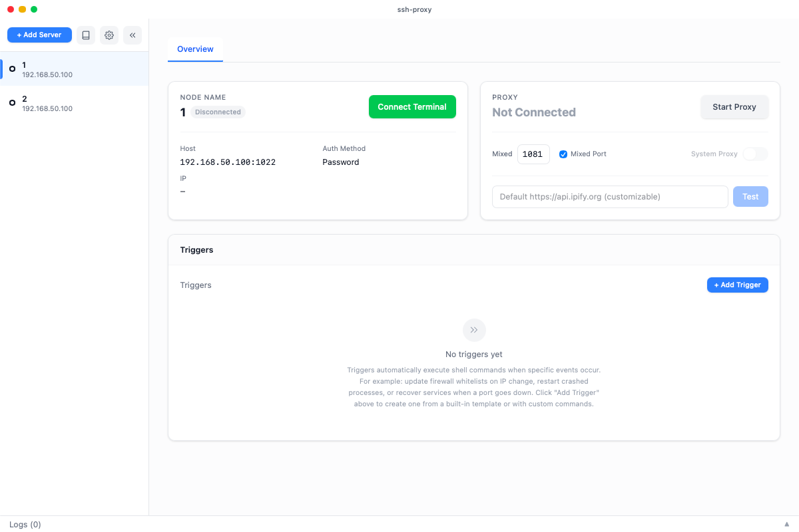

# TermFast

> 开箱即用的 SSH 终端软件

<p align="center">
  
</p>

**TermFast 是一个轻量桌面工具，把 SSH 终端、代理上网和远程服务器自动化三件事做在一起。**

你只要有一台能 SSH 登录的服务器（VPS、树莓派、家里的软路由等），无需在服务器上安装任何额外软件，就能：

- 像使用本地终端一样快速连上服务器
- 一键把这台服务器变成你的 SOCKS5 / HTTP 代理
- 让服务器在你 IP 变化、服务掉线时自动执行修复命令

支持 macOS、Windows、Linux，界面自动跟随系统语言切换中文/英文。

---

## 它解决什么问题？

如果你遇到过下面这些情况，TermFast 就是为你设计的：

**1. 买了 VPS 不会配代理**

网上教程教你 `ssh -D 1080 root@xxx`，还要配浏览器插件、改系统代理。TermFast 里点一下「启动代理」就能用，还能一键设为系统代理。

**2. 家里宽带 IP 一变，VPS 防火墙就把你挡在外面**

很多运维用户会把服务端口锁成只有自己家 IP 能访问，但运营商 IP 每天变。TermFast 能在连接 SSH 时自动拿到你的公网 IP，并帮你更新服务器上的防火墙白名单。

**3. 远端服务挂了要人工重启**

Web 面板、数据库、爬虫、下载服务等进程异常退出时，TermFast 可以自动检测并执行 `systemctl restart xxx` 等命令，不用你半夜爬起来登录服务器。

---

## 它能做什么？

### ① 快速 SSH 终端

- 真正的交互式终端（PTY），vim、htop、tmux 都能正常用
- 一个服务器可以同时开多个终端标签
- 支持 `rz` / `sz` 传文件，带进度条
- 点「连接终端」即可进入，关闭后回到服务器详情

### ② 一键代理上网

- 自动在本地开启 SOCKS5 + HTTP 混合代理
- 代理端口显示在界面上，点击就能复制
- 「设为系统代理」让整台电脑流量走 VPS（macOS/Windows/Linux 都支持）
- 内置「测试代理」按钮，一键看出口 IP 和延迟

### ③ 自动触发器

- 内置模板库：IP 变化更新防火墙、进程掉了自动重启、定时检查服务状态等
- 你也可以自己写 shell 命令，编辑器带语法高亮和占位符提示
- 触发器执行过程实时显示，日志面板里能看到每条命令的输出

### ④ 多服务器管理

- 左侧列表一眼看到每台服务器是否在线、代理是否开启
- 异常的服务器自动置顶
- 添加服务器有「快速模式」，3 步就能连上
- 配置和触发器模板可以导入导出，换电脑时方便迁移

---

## 适合谁用？

| 用户类型 | 典型需求 | 能获得的帮助 |
|---------|---------|-------------|
| **普通用户 / 小白** | 买了 VPS 想代理上网，不想研究命令行 | 点几下就能连上并启用系统代理，出错时给出大白话提示 |
| **运维 / 开发者** | 有多台 VPS，需要防火墙白名单、服务自愈 | 多服务器统一管理、触发器自动化、详细日志和调试信息 |

---

## 界面速览

主界面分为左中右三块：

- **左侧**：服务器列表，显示连接状态和代理开关
- **中间**：当前服务器的概览，包括主机地址、认证方式、代理端口、触发器
- **底部**：实时日志，可按服务器和类型筛选

右上角可以进入设置、模板库和系统托盘菜单。

---

## 快速开始

### 下载安装

1. 前往 Releases 页面下载对应系统的安装包
2. 安装后打开，点击「添加服务器」
3. 填入主机地址、用户名、密码或 SSH 密钥
4. 点「连接终端」进入 SSH，或点「启动代理」开始上网

### 从源码运行

如果你希望参与开发或自行构建：

```bash
# 安装依赖
npm install

# 启动开发环境（热更新）
npm start
```

构建发布包：

```bash
npm run tauri build
```

完整开发依赖与检查命令见 [AGENTS.md](./AGENTS.md)。

---

## 与其他工具的区别

| 需求 | TermFast | Cloudflare Tunnel | Tailscale | 手动 ssh -D |
|-----|----------|-------------------|-----------|-------------|
| 服务器上是否需要装东西 | 不需要 | 需要 cloudflared | 需要 Tailscale | 不需要 |
| 代理上网 | 内置，一键开启 | 不适用 | 不适用 | 需要手动配置 |
| IP 变化自动更新防火墙 | 支持 | 不支持 | 不支持 | 自己写脚本 |
| 服务异常自动修复 | 支持触发器 | 不支持 | 不支持 | 自己写脚本 |
| 图形界面 | 有 | 无 | 有 | 无 |
| 多服务器管理 | 有 | 需要多个隧道 | 需要多个网络 | 不方便 |

---

## 主要技术栈

- 前端：React 19 + TypeScript + Tailwind CSS + xterm.js + CodeMirror 6
- 桌面框架：Tauri 2
- 后端核心：Rust（russh、tokio）
- 测试：Vitest + Playwright

---

## 项目结构

```
ssh-proxy/
├── src/          # 前端界面与组件
├── src-tauri/    # Tauri 应用入口
├── crates/       # Rust 核心库（SSH、代理、触发器等）
├── e2e/          # 端到端测试
└── docs/         # 设计文档
```

---

## 许可证

[Apache-2.0](./LICENSE)
