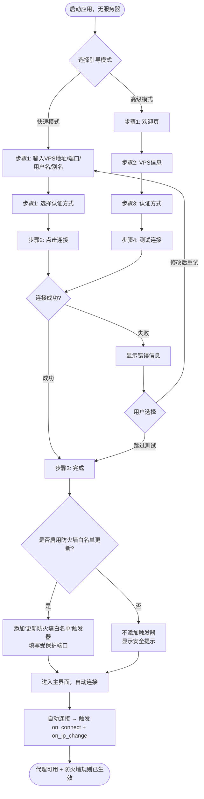
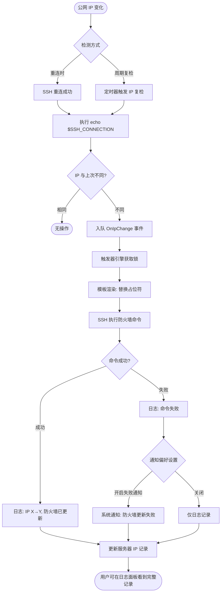
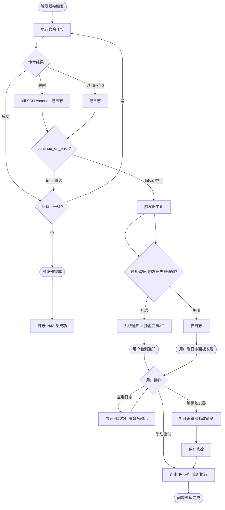
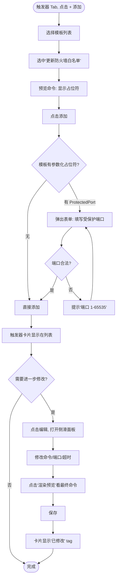
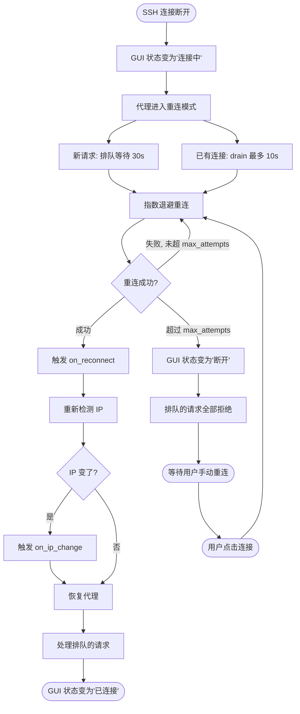

# TermFast — 项目设计文档

> 通过 SSH 连接提供本地代理上网，并在连接建立 / IP 变化 / 远程服务异常时自动执行用户预设的远程命令。VPS 侧零部署。

## 1. 项目概述

### 1.1 解决什么问题

在海外 VPS 上部署了只允许自己访问的服务后，需要解决两个问题：

1. **代理上网**：本地通过 VPS 的 SSH 连接做 SOCKS5 / HTTP 代理出海
2. **防火墙白名单自动更新**：VPS 上的服务端口不暴露给公网，只允许本地公网 IP 访问；本地公网 IP 变化时自动更新 VPS 防火墙规则

当本地公网 IP 变化时（运营商动态分配、路由器重启等），需要自动更新 VPS 防火墙白名单，无需人工干预。

### 1.2 核心设计原则

| 原则 | 说明 |
|------|------|
| VPS 零部署 | 服务器不装任何 agent、脚本或依赖。唯一要求：SSH 可达 + 有 shell 权限 |
| IP 检测不依赖外部服务 | 连接建立后在 VPS 执行 `echo $SSH_CONNECTION` 获取客户端 IP，不请求 ipify 等海外服务（代理连通性测试除外，见 §10.2 test_proxy） |
| 代理是核心，命令执行是顺带 | SOCKS5/HTTP 代理是核心功能；触发器系统是附加价值 |
| 多服务器独立运行 | 每个服务器独立连接、独立代理端口、独立触发器配置，互不影响 |
| 触发器可复用 | 模板库 + 实例引用，一次编写多服务器复用 |

### 1.3 工作原理

```
本地客户端                              海外 VPS
    │                                       │
    │──── SSH 连接 (port 22) ──────────────→│  ← SSH 端口开放（唯一要求）
    │                                       │
    │  ① SOCKS5 代理                        │
    │     127.0.0.1:1080                    │  → 任意远程站点
    │                                       │
    │  ② HTTP 代理（直接走 SSH channel）      │
    │     127.0.0.1:8080                    │  → 任意远程站点
    │                                       │
    │  ③ IP 检测                            │
    │     SSH 执行 echo $SSH_CONNECTION     │  → 获取客户端公网 IP
    │                                       │
    │  ④ 触发器命令执行                      │
    │     IP 变化 / 进程死亡 / 定时检查       │  → SSH 执行用户预设命令
    │                                       │
    │  ⑤ 访问 VPS 上的受保护服务             │
    │     http://<vps-ip>:<port>            │  ← 防火墙已由触发器更新
    └───────────────────────────────────────┘
```

一个 SSH 连接承载所有功能（代理 + exec），无需额外端口暴露。如果 russh spike（20.0 节 S5）发现代理 channel 与 exec channel 混合存在严重问题，则降级为双连接方案（见 §5.1）。

### 1.4 与替代方案对比

| 维度 | TermFast | Cloudflare Tunnel | Tailscale | autossh + 手写脚本 |
|------|-----------|-------------------|-----------|-------------------|
| VPS 暴露端口 | 22（已有） | 0 | 0 | 22（已有） |
| 需要检测 IP 变化 | 自动（VPS 侧获取） | 否 | 否 | 需手动实现 |
| 代理上网 | 内置 SOCKS5/HTTP | 不适用 | 不适用 | `ssh -D` |
| 触发器系统 | 内置 | 无 | 无 | 需手写 |
| VPS 侧部署 | 零 | 装 cloudflared | 装 Tailscale | 零 |
| 依赖第三方服务 | 无 | 依赖 Cloudflare | 依赖 Tailscale | 无 |
| GUI | 有 | 无 | 有 | 无 |
| 多服务器管理 | 内置 | 需多个隧道 | 需多个网络 | 需多个进程 |

TermFast 适合的场景：已有 VPS、SSH 端口已开、不想在 VPS 装额外服务、需要代理上网 + 自动化运维触发器。

### 1.5 目标用户

产品面向两类用户，功能优先级和 UX 复杂度均围绕这两类 persona 设计：

| 维度 | Persona A：运维型用户 | Persona B：代理小白用户 |
|------|----------------------|------------------------|
| **画像** | 在海外 VPS 上部署了只允许自己访问的服务（Web 面板、数据库、监控等），会基础运维命令（firewalld/ufw/systemctl/pgrep），日常需要 SSH 登录 VPS 做简单运维 | 拿到一台海外 VPS 主要为了代理上网，不关心 VPS 上跑了什么服务，不会写 shell 命令，只想"一键翻墙" |
| **技术水平** | 会写简单 shell 命令，懂防火墙基本概念，能看懂触发器模板里的命令 | 不懂 shell，不懂防火墙，只会点 GUI 按钮 |
| **核心目标** | ① 代理上网 ② 防火墙白名单自动更新（IP 变了不用手动改） ③ 服务异常时自动重启 | ① 代理上网 ② 装好就能用，不想看到任何技术细节 |
| **典型服务器数** | 1–5 台（不同地区的 VPS） | 1 台（够用就行） |
| **触发器使用** | 会自定义触发器命令，会从模板修改端口号/服务名 | 只用内置模板，甚至不用触发器 |
| **引导模式偏好** | 快速模式（3 步完成），之后手动微调 | 快速模式（3 步完成），不碰高级选项 |
| **对错误消息的期望** | 需要技术细节（退出码、stderr 输出）用于排查 | 需要大白话 + "怎么办"按钮，不要看到 stderr |
| **高频操作** | 切换代理、查看日志、手动触发触发器、编辑触发器命令 | 开关代理、看连接状态（绿点就行） |

**设计决策依据**：

| 决策 | 依据 |
|------|------|
| 首次引导分快速/高级双模式 | A 用快速模式快速完成，B 用快速模式不被吓退；少数 A 用高级模式精细配置 |
| 触发器编辑器用 CodeMirror + shell 高亮 | A 需要写/改命令；B 不打开编辑器，只用模板 |
| 内置模板开箱即用 | B 勾选即用，不需要写命令；A 也可在此基础上改 |
| 错误消息分"用户文案"+"调试细节"两层 | B 看用户文案 + 点恢复按钮；A 展开 detail 排查 |
| 代理端口做成点击复制 chip | A 粘贴到浏览器/终端；B 粘贴到系统代理设置（或一键配置） |
| 托盘菜单做子菜单而非状态相关动态菜单 | A 高频操作（连接/断开/代理开关）；B 只看绿点/红点 |

### 1.6 用户故事

以下 U1–U20 是 GUI 设计（第 9 节）的需求依据，每个用户故事标注目标 persona 和验收标准。

| 编号 | 用户故事 | Persona | 验收标准 |
|------|---------|:---:|---------|
| **U1** | 作为运维用户，我想从系统托盘快速连接/断开某个服务器，而不需要打开主窗口 | A | 托盘右键 → 服务器子菜单 → 连接/断开，1 次点击完成 |
| **U2** | 作为运维用户，我想在一个界面看到所有服务器的连接状态和实时日志，快速判断哪台出了问题 | A | 主界面左侧列表显示 5 态状态，底部日志面板可按服务器筛选 |
| **U3** | 作为运维用户，我想添加/删除服务器，删除时自动清理密钥和钥匙串条目 | A | 添加走引导流程；删除有二次确认 + 提示"将删除密钥文件"，确认后自动清理 |
| **U4** | 作为运维用户，我想在触发器卡片上看到触发器类型、关联命令摘要和"已修改"标记 | A | 卡片显示类型 tag + 命令首行摘要 + 已修改时显示黄色 tag |
| **U5** | 作为运维用户，我想手动触发一次触发器来测试命令效果 | A | 卡片上 [▶ 运行] 按钮 → 二次确认 → 执行 → 日志面板实时显示结果 |
| **U6** | 作为代理用户，我想一键开关代理，不需要分别控制 SOCKS5 和 HTTP | B | 服务器列表项内联代理 toggle，1 次点击控制 SOCKS5+HTTP。代理 Tab 保留总开关（双向同步）+ 高级选项可单独控制 |
| **U7** | 作为用户，我想通过服务器列表的视觉标识一眼看出哪台服务器有问题 | A+B | 5 态用颜色+形状+图标区分（非仅颜色，支持色盲），异常项置顶 |
| **U8** | 作为运维用户，我想点击代理端口直接复制到剪贴板，方便粘贴到浏览器配置 | A | 端口显示为 chip，点击复制 `127.0.0.1:1080`，悬停提示 |
| **U9** | 作为运维用户，我想导入/导出服务器配置和触发器模板，方便在多台电脑间迁移 | A | 模板库有导入/导出按钮，服务器管理有导出/导入，导出不包含凭据 |
| **U10** | 作为运维用户，我想按类型和服务器筛选日志，快速找到相关条目 | A | 日志面板筛选条：类型（全部/连接/触发器/错误）+ 服务器 + 搜索框 |
| **U11** | 作为运维用户，我想在触发器编辑器里写 shell 命令，有语法高亮和占位符提示 | A | CodeMirror 6 shell 高亮 + 占位符补全 + 条件块折叠 + 渲染预览 |
| **U12** | 作为运维用户，我想查看和切换服务器的认证方式（密钥/密码），知道当前安全级别 | A | 认证 Tab 显示认证方式 + 安全级别 + 重试/切换按钮 |
| **U13** | 作为用户，我想在设置页调整通用偏好（自启、主题、日志、通知） | A+B | 设置页分通用/代理默认值/通知/关于，所有偏好持久化 |
| **U14** | 作为用户，我想用 Tab 分层查看服务器的不同维度信息，避免界面拥挤 | A+B | 状态/代理/触发器/认证 4 个 Tab，切换时不丢失上下文 |
| **U15** | 作为用户，我想在无数据时看到引导文案，知道下一步该做什么 | A+B | 无服务器/无触发器/无日志/无模板 4 种空状态，每种都有引导链接 |
| **U16** | 作为运维用户，我想用键盘快捷键完成高频操作，不依赖鼠标 | A | Cmd+1/2/3 切换服务器、Cmd+N 添加、Cmd+, 设置、Cmd+L 聚焦日志等 |
| **U17** | 作为用户，我想通过托盘图标颜色一眼看出整体健康度，不需要打开窗口 | A+B | 绿/黄/红 + badge 数字，状态变化时按通知偏好发送系统通知 |
| **U18** | 作为代理用户，我想一键将代理设为系统代理，不用手动去系统设置里配 | B | 代理 Tab [设为系统代理] 按钮 + 主界面全局指示器显示当前出口，多服务器时可一键切换。macOS 弹授权框，失败时回退为复制命令 |
| **U19** | 作为运维用户，我想看到触发器执行的实时进度，知道执行到第几条命令 | A | 卡片显示进度条 "2/3"，日志面板实时推送每条命令结果 |
| **U20** | 作为运维用户，我想管理触发器模板库，分组查看内置和自定义模板 | A | 模板库紧凑列表，内置/用户分组，点击行展开命令预览，支持导入导出 |

### 1.7 核心任务流

以下 5 个任务流覆盖两类 persona 的高频场景。每个任务流标注正常路径、错误路径、用户决策点。

#### 任务流 1：添加新服务器并使其可用（Persona A + B）



**关键设计点**：
- 快速模式完成后**必须**询问是否启用防火墙白名单更新（修正原设计的安全缺口，见 §18.2）
- 测试连接失败不阻塞，用户可跳过
- 进入主界面后自动连接，首次 on_ip_change 的 OldIP 为空，模板条件块自动跳过 remove 命令

#### 任务流 2：IP 变化后用户能看到什么、需要做什么



**关键设计点**：
- 用户无需任何操作，全自动
- 用户通过日志面板或系统通知得知 IP 变化
- 命令失败时按通知偏好决定是否系统通知（见 9.5 通知偏好设置）

#### 任务流 3：触发器执行失败后用户的处理路径



#### 任务流 4：从模板添加触发器并自定义端口号（Persona A 高频场景）



**关键设计点**：
- 模板用 `{{.ProtectedPort}}` 参数化端口，添加时弹出表单而非让用户去 shell 里找硬编码端口（见 6.3 占位符扩展）
- 添加后可进一步编辑，编辑器有渲染预览功能（见 9.6）

#### 任务流 5：代理断连时的用户体验



**关键设计点**：
- 重连期间新请求排队而非立即拒绝，SSH 恢复后自动处理
- 大文件下载可能中断（SSH 隧道固有限制），在代理 Tab 的帮助提示中说明
- 超过最大重连次数后停止自动重连，等用户介入，避免无限重试消耗资源

---

## 2. 功能清单

### 2.1 核心功能

| 功能 | 说明 |
|------|------|
| SSH SOCKS5 代理 | 本地 `127.0.0.1:<port>`，通过 SSH 动态转发到 VPS 出口 |
| HTTP 代理 | 本地 `127.0.0.1:<port>`，直接通过 SSH `direct-tcpip` channel 连接目标 |
| SSH 自动重连 | 心跳检测，断线后指数退避重连，重连后恢复代理 + 触发器 |
| 多服务器 | 同时连接多个 VPS，每个独立代理端口、独立触发器 |
| 凭据存储 | SSH 密钥 / 密码存 OS 钥匙串，启动自动读取，无感连接 |
| 触发器系统 | 用户预设条件和命令，条件满足时通过 SSH 在 VPS 上执行 |
| 触发器模板复用 | 模板库 + 实例引用，一次编写多服务器复用 |

### 2.2 触发器类型

| 触发条件 | 触发时机 | 典型用途 |
|----------|---------|---------|
| `on_connect` | SSH 连接建立 | 初始化环境、记录连接日志 |
| `on_ip_change` | 连接建立 / 重连 / 周期性复检时检测到 IP 与上次不同 | 更新防火墙白名单 |
| `on_reconnect` | 断线后重连成功 | 重启依赖服务、发通知 |
| `on_process_dead` | 定时检查 VPS 上某进程不存在了 | 重启进程 |
| `on_port_closed` | 定时检查 VPS 上某端口不通了 | 重启服务、告警 |

每个触发器可绑定多条 shell 命令，按顺序在 VPS 上执行。支持占位符替换（`{{.NewIP}}`、`{{.OldIP}}` 等）。

### 2.3 GUI 功能

| 功能 | 说明 |
|------|------|
| 服务器列表 | 显示所有服务器，5 态状态可视化（已连接/连接中/重连中/认证失败/断开），全局健康度指示 |
| 服务器详情 | Tab 分层：状态 / 代理 / 触发器 / 认证，日志面板常驻底部 |
| 代理控制 | 主开关一键开/关 SOCKS5+HTTP，高级选项可单独控制 |
| 触发器管理 | 增删改触发器，从模板库添加，查看/编辑命令，手动触发，执行进度条 |
| 触发器模板库 | 全局模板管理，分组显示（内置/用户），新建/编辑/删除/导入导出 |
| 凭据管理 | 认证信息 Tab，显示当前认证方式 + 安全级别 + 重试/切换 |
| 手动触发 | 触发器卡片上的运行按钮，二次确认后执行 |
| 日志查看 | 连接日志、触发器执行日志。内存环形缓冲实时显示 + 筛选条（类型/服务器）+ 可选落盘 |
| 端口复制 | 代理端口做成点击复制 chip，悬停提示 |
| 空状态 | 无服务器/无触发器/无日志时有引导文案 |
| 键盘快捷键 | Cmd+1/2/3 切换服务器、Cmd+N 添加、Cmd+, 设置、Cmd+L 聚焦日志、Space 切换连接 |
| 开机自启 | macOS launchd / Windows 注册表 |
| 系统托盘 | 多态图标（绿/黄/红 + badge），右键子菜单操作 |
| 暗色模式 | 跟随系统主题 |
| 设置页 | 通用设置 + 代理默认值 + 关于 |

### 2.4 CLI 功能（v1 包含）

v1 同时提供 GUI 和 CLI。CLI 通过 daemon socket 协议与 GUI 共享同一运行时状态，CLI 的所有操作实时反映在 GUI 中。

**三种运行模式**：
- `termfast`（无参数）→ Tauri 进程内嵌 daemon + 打开 GUI 窗口
- `termfast --daemon` → 独立 daemon 进程，无 GUI（无头服务器/自动化场景）
- `termfast <command>` → CLI 客户端，连已运行的 daemon socket

```bash
# 启动无 GUI daemon（无头服务器）
termfast --daemon

# 显示所有服务器状态
termfast status

# 连接/断开服务器
termfast connect "东京节点"
termfast disconnect "东京节点"

# 开关代理
termfast proxy "东京节点" on
termfast proxy "东京节点" off

# 手动触发触发器（位置参数风格）
termfast trigger "东京节点" "更新防火墙"
termfast trigger "东京节点" "更新防火墙" --async   # 异步模式，立即返回

# 暂停/恢复触发器
termfast pause-triggers
termfast pause-triggers --server "东京节点"
termfast resume-triggers

# 查看日志
termfast logs --tail 20
termfast logs -f                    # 实时监听

# 列出服务器/触发器/模板
termfast list
termfast triggers "东京节点"
termfast templates

# daemon 控制
termfast daemon-status
termfast shutdown

# 指定配置文件
termfast --config ~/.config/termfast/config.json status

# JSON 输出（供脚本集成）
termfast status --json
```

#### CLI UX 设计

| 维度 | 规范 |
|------|------|
| 输出格式 | 默认人类可读表格，`--json` 切换为 JSON 输出（供脚本集成） |
| 退出码 | `0` = 成功；`1` = 通用错误；`2` = 认证失败；`3` = 连接失败；`4` = 配置错误 / daemon 未运行；`5` = 触发器执行失败 |
| `--help` | 列出所有子命令 + 常用参数 + 示例 |
| `status` 输出 | 表格：服务器名 / 状态 / IP / 代理端口 / 触发器数。`--json` 输出完整状态对象 |
| `trigger` 执行 | 默认同步等待执行完成并输出结果；`--async` 立即返回不等待 |
| 错误输出 | stderr 输出错误消息，stdout 输出正常结果。`--verbose` 输出调试细节 |
| 配置文件 | `--config` 指定路径，默认用平台标准路径 |
| 信号处理 | `SIGINT`/`SIGTERM` 优雅退出（断开连接、保存配置） |

`status` 输出示例（人类可读）：
```
SERVER        STATUS    CLIENT_IP     SOCKS5  HTTP   TRIGGERS
东京节点      已连接    1.2.3.4       1080    8080   2
美西节点      重连 3/10 -             1081    8081   1
韩国节点      断开      -             1082    8082   0
```

`status --json` 输出示例：
```json
[
  {"name":"东京节点","status":"connected","ip":"1.2.3.4","socks5_port":1080,"http_port":8080,"triggers":2},
  {"name":"美西节点","status":"reconnecting","retry":3,"max_retry":10,"socks5_port":1081,"http_port":8081,"triggers":1}
]
```

---

## 3. 技术栈

### 3.1 整体选型

| 层 | 技术 | 选型理由 |
|----|------|---------|
| 桌面框架 | **Tauri v2** | 体积小（~3-5MB）、系统托盘内置、移动端支持、稳定版 |
| 后端语言 | **Rust** | 性能、安全、Tauri 原生支持 |
| 前端框架 | **React 19 + TypeScript** | 生态最大、shadcn/ui 原生支持 |
| UI 组件 | **shadcn/ui** | 体积小（只打包用到的）、完全掌控源码、原生感定制 |
| 样式 | **Tailwind CSS v4** | shadcn/ui 标配，原子化 CSS |
| 图标 | **Lucide React** | 轻量、tree-shakeable |
| 表单 | **react-hook-form + zod** | 行业标准，类型安全 |
| 通知 | **Sonner** | shadcn 生态推荐，轻量 |
| 表格 | **TanStack Table** | 无头表格，配 shadcn 样式 |
| 国际化 | **react-i18next** | React 生态最成熟的 i18n 方案，支持命名空间、插值、复数 |

### 3.2 Rust 后端依赖

| 依赖 | 用途 | 说明 |
|------|------|------|
| `russh` | SSH 连接 + 动态端口转发 + 远程命令执行 | 纯 Rust async SSH 库，0.61.x。未到 1.0，并发 direct-tcpip channel 有已知边界 case（见 §20.0 spike 验证）。**Feature 选择**：`default-features = false`，只启用 `ring` crypto 后端（`russh/ring`），禁用 `openssl`。`ring` 是纯 Rust 实现，移动端兼容（交叉编译必需）；`openssl` 需要系统 libssl，移动端不可用。spike 20.0 S9 验证 ring-only 编译通过 |
| `tokio` | 异步运行时 | Rust 异步标准 |
| `keyring` | OS 钥匙串（macOS Keychain / Windows Credential Manager） | 跨平台 |
| `window-vibrancy` | macOS 毛玻璃 / Windows Mica 效果 | Tauri 官方库 |
| `serde` + `serde_json` | 配置文件序列化 | Rust 标配 |
| `tauri` | 桌面框架核心 | v2 稳定版 |
| `tauri-plugin-autostart` | 开机自启 | 官方插件 |
| `tauri-plugin-notification` | 系统通知 | 官方插件（HostKey 不匹配告警等） |
| `tauri-plugin-log` | 日志 | 官方插件 |

### 3.3 为什么选 Tauri v2 + Rust

| 对比项 | Tauri v2 (Rust) | Wails v3 (Go) | Fyne (Go) |
|--------|:---:|:---:|:---:|
| 稳定性 | 正式版 2.9.6 | alpha.112 | 稳定 |
| 体积 | ~3-5 MB | ~8-10 MB | ~10-15 MB |
| 系统托盘 | 内置稳定 | v3 新增 alpha | 需第三方库 + CGO |
| 移动端 | Android + iOS stable | 不支持 | 支持（gomobile） |
| UI 美观度 | 最好（Web 前端） | 最好（Web 前端） | 一般（自绘） |
| 社区生态 | 90k+ stars | 较小 | 中等 |
| SSH 库 | `russh`（0.61.x，见 §20.0风险） | `x/crypto/ssh`（顶级） | 同 Wails |

Tauri v2 在稳定性、体积、系统托盘、移动端、UI 美观度上全面领先。主要的 tradeoff 是 Rust 的 SSH 库 `russh`（0.61.x，未到 1.0）不如 Go 的 `x/crypto/ssh` 成熟，并发 direct-tcpip channel 有已知边界 case（Issue #44/#329/#571），需在 v1 通过 spike 验证（见 §20.0）。选择纯 russh 的理由：移动端（iOS 无法 spawn 子进程）必须用嵌入式 SSH 库，桌面端统一用 russh 可保持 `core` crate 单一实现，避免维护两套 SSH 路径。

### 3.4 为什么选 shadcn/ui

| 维度 | shadcn/ui | Mantine | Base UI |
|------|-----------|---------|---------|
| 体积 | 最小（只打包用到的） | 中（npm 整包） | 小 |
| 组件数量 | ~50 | 100+ | ~40 |
| 定制自由度 | 最高（源码在仓库里） | 中等 | 高 |
| 原生感定制 | 完全可控 | 要 fight 库默认值 | 可控 |
| Tauri 模板 | 有（tauri-ui，2k+ stars） | 无 | 无 |
| 暗色模式 | 内置 | 内置 | 内置 |

shadcn/ui 的"复制粘贴"模式意味着组件源码完全在项目仓库里，可以自由修改以贴近系统原生外观。体积只包含实际用到的组件，适合本项目这种组件数量不多的场景。

### 3.5 原生感实现

Web UI 不可能 100% 像原生，但可以做到用户无违和感。关键要素：

| 要素 | 实现方式 | 与 UI 库关系 |
|------|---------|-------------|
| 窗口标题栏 | macOS 保留红绿灯按钮，隐藏原生标题栏，Web 内容延伸到顶部 | Tauri 配置 |
| 毛玻璃效果 | macOS `apply_vibrancy`，Windows `apply_mica` | `window-vibrancy` 库 |
| 系统字体 | macOS `-apple-system`，Windows `Segoe UI` | CSS |
| 圆角/间距 | 跟系统一致（macOS 8px，Windows 4px） | CSS 变量 |
| 暗色模式 | 跟随系统切换 | CSS media query |
| 控件风格 | 按钮/开关/输入框贴近系统 | shadcn/ui 定制 |
| 禁用网页行为 | 禁用橡皮筋滚动、桌面式选中、外链在浏览器打开 | tauri-ui 模板内置 |

原生感 80% 来自窗口配置和 CSS，20% 来自组件库定制。

### 3.6 国际化（i18n）

#### 语言策略

| 维度 | 方案 |
|------|------|
| 支持语言 | 简体中文（`zh-CN`）、繁体中文（`zh-TW`）、英文（`en`） |
| 默认语言 | 跟随系统语言：系统为 `zh-CN` 或 `zh-TW` → 显示中文；其他 → 显示英文 |
| 手动切换 | 设置页提供语言选择器，用户可覆盖系统默认 |
| 语言持久化 | 用户手动选择后存入配置 `general.language`（值如 `zh-CN` / `en` / `system`），默认 `system` |
| 后端文案 | Rust 后端**不做 i18n**，只返回语言无关的 `ErrorCode` + 英文 `detail`。前端根据 `ErrorCode` 用 i18next 渲染对应语言的文案。翻译只维护一份（前端 JSON），不出现前后端两套翻译不同步的问题 |

#### 技术方案

**react-i18next**（前端）+ 后端错误消息 i18n：

```
src/                                 # 前端目录（Tauri 惯例，与 4.2 节项目结构一致）
  ├── i18n/
  │   ├── config.ts          # i18next 初始化配置
  │   ├── locales/
  │   │   ├── zh-CN.json     # 简体中文
  │   │   ├── zh-TW.json     # 繁体中文
  │   │   └── en.json        # 英文
  │   └── hooks/
  │       └── useTranslation.ts  # 封装 useTranslation hook
  └── ...
```

**命名空间**按功能模块拆分，避免单个 JSON 过大：

```
zh-CN.json:
{
  "common": { "connect": "连接", "disconnect": "断开", "save": "保存", "cancel": "取消" },
  "server": { "add": "添加服务器", "port_conflict": "端口 {{port}} 已被其他服务器使用" },
  "trigger": { "manual_fire": "手动触发", "paused": "已暂停" },
  "settings": { "language": "语言", "auto_start": "开机自启" },
  "wizard": { "quick_mode": "快速模式", "advanced": "高级配置" }
}
```

**系统语言检测**：

```typescript
// i18n/config.ts
import i18n from 'i18next';
import { initReactI18next } from 'react-i18next';

const systemLang = detectSystemLanguage();
const savedLang = config.general.language;  // 'system' | 'zh-CN' | 'zh-TW' | 'en'
const lang = savedLang === 'system' ? systemLang : savedLang;

function detectSystemLanguage(): string {
  const locale = navigator.language;  // Tauri WebView 提供
  if (locale.startsWith('zh-CN') || locale.startsWith('zh-Hans')) return 'zh-CN';
  if (locale.startsWith('zh-TW') || locale.startsWith('zh-Hant')) return 'zh-TW';
  return 'en';
}

i18n.use(initReactI18next).init({
  resources: { 'zh-CN': { translation: zhCN }, 'zh-TW': { translation: zhTW }, en: { translation: en } },
  lng: lang,
  fallbackLng: 'en',
  interpolation: { escapeValue: false },
});
```

**后端不做 i18n**：Rust 后端只返回语言无关的 `ErrorCode` + 英文 `detail`（调试用），不返回翻译后的 message。前端根据 `ErrorCode` 用 i18next 渲染对应语言的文案。翻译只维护一份（前端 JSON），避免前后端两套翻译不同步。

```typescript
// 前端：根据 ErrorCode 渲染翻译文案
function renderError(error: IpcError): string {
  return t(`errors.${error.code}`, { detail: error.detail });
}

// zh-CN.json
{
  "errors": {
    "PortConflict": "端口 {{port}} 已被其他服务器使用",
    "AuthFailed": "认证失败，请检查用户名和密钥/密码",
    "SshConnectFailed": "无法连接到 {{host}}:{{port}}，请检查网络和防火墙",
    "HostKeyMismatch": "服务器指纹已变更，可能存在中间人攻击",
    "ConfigCorrupt": "配置文件损坏，已备份并重置",
    "DecryptionFailed": "主密码错误或文件已损坏",
    "NeedsPrivilege": "需要管理员权限，已复制命令到剪贴板",
    "Internal": "内部错误，请重启应用"
  }
}
```

```rust
// 后端：只返回 ErrorCode + 英文 detail，不返回翻译文案
pub struct IpcError {
    pub code: ErrorCode,       // 语言无关
    pub detail: String,        // 英文调试信息，如 "port 1080 already used by srv_uswest"
    // 不再有 message 字段
}
```

**v1 范围**：v1 实现中英文双语，繁体中文可由社区贡献翻译（i18next 支持运行时加载语言包，不需要发版）。所有用户可见的文案都走 i18n，不硬编码字符串。

---

## 4. 架构设计

### 4.1 设计原则：核心逻辑与平台壳分离

项目的跨平台目标（桌面 + 移动端）要求**核心逻辑必须与平台壳分离**。设计原则：

1. **`crates/core` 不依赖 `tauri`** — 这是复用的硬性前提。任何要用 Tauri API 的代码（IPC、托盘、窗口、autostart）都必须在 `crates/desktop` 里
2. **core 暴露纯 Rust API** — 桌面端在 `crates/desktop` 里包一层 Tauri IPC，移动端在 Kotlin/Swift 里包一层 FFI 调用
3. **平台差异用 trait 抽象** — `credential` 和 `config` 用 trait 定义接口，各平台提供实现
4. **v1 就验证交叉编译** — 不是"等移动端启动再验证"，而是 v1 开发时就把 `crates/core` 用 `cargo build --target aarch64-linux-android` 和 `--target aarch64-apple-ios` 跑 CI，确保核心 crate 始终能交叉编译

### 4.2 项目结构

```
termfast/                            # 仓库目录名 termfast，产品名 TermFast
├── Cargo.toml                         # workspace 根
├── crates/
│   ├── core/                          # 平台无关核心逻辑（桌面+移动端共用）
│   │   ├── Cargo.toml                 # 只依赖 russh/tokio/serde，不依赖 tauri
│   │   └── src/
│   │       ├── lib.rs                 #   模块导出
│   │       ├── ssh/                   #   SSH 协议层
│   │       │   ├── client.rs          #     连接、心跳、重连
│   │       │   ├── auth.rs            #     密钥/密码认证
│   │       │   ├── exec.rs            #     远程命令执行
│   │       │   └── channel_opener.rs  #     SshChannelOpener（实现 ChannelOpener trait）
│   │       ├── proxy/                 #   本地代理协议层
│   │       │   ├── channel.rs         #     ChannelOpener trait（共享 SSH channel 开启接口）
│   │       │   ├── socks5.rs          #     SOCKS5 服务器（解析 SOCKS5 → ChannelOpener）
│   │       │   └── http.rs            #     HTTP 代理（两阶段处理 → ChannelOpener）
│   │       ├── trigger/               #   触发器引擎
│   │       │   ├── engine.rs          #     事件队列消费 + 命令执行调度（per-server Mutex）
│   │       │   ├── ipcheck.rs         #     IP 变化检测（连接时 + 周期性复检）
│   │       │   ├── health.rs          #     进程/端口存活检查（v1 每检查独立 exec，不合并）
│   │       │   └── template.rs        #     模板渲染（占位符 + 条件块）
│   │       ├── config/                #   配置读写（平台无关逻辑 + trait 抽象）
│   │       │   ├── config.rs          #     配置结构定义 + 序列化/反序列化
│   │       │   ├── storage.rs         #     ConfigStorage trait（抽象存储后端）
│   │       │   └── migration.rs       #     配置版本迁移
│   │       └── server/                #   多服务器管理
│   │           ├── manager.rs         #     ServerManager：管理多个 Server 实例的容器
│   │           ├── instance.rs        #     ServerInstance：单个服务器的所有运行时状态
│   │           └── lifecycle.rs       #     连接/断开/重连状态机
│   │
│   ├── credential/                    # 凭据抽象 + 平台实现
│   │   ├── Cargo.toml                 # 依赖 keyring（feature="desktop"），不依赖 tauri
│   │   └── src/
│   │       ├── lib.rs                 #   CredentialStore trait + 统一接口
│   │       ├── keychain.rs            #   桌面实现（feature = "desktop"，用 keyring crate）
│   │       ├── android.rs             #   Android Keystore（feature = "android"，JNI 调用）
│   │       └── ios.rs                 #   iOS Keychain（feature = "ios"，Swift FFI）
│   │
│   ├── daemon/                        # daemon 进程（持有 core 运行时，socket server）
│   │   ├── Cargo.toml                 # 依赖 core + credential，不依赖 tauri
│   │   └── src/
│   │       ├── lib.rs                 #   daemon 启动/关闭入口
│   │       ├── server.rs              #   socket server（UnixListener / named_pipe）
│   │       ├── handler.rs             #   请求处理（Action → core API 映射 + 事件广播）
│   │       ├── proto.rs               #   IPC 协议定义（消息帧 + Action/EventType 枚举）
│   │       └── lock.rs                #   daemon.lock 管理（PID + socket 路径）
│   │
│   ├── cli/                           # CLI 客户端（独立二进制，连 daemon socket）
│   │   ├── Cargo.toml                 # 依赖 daemon（proto 类型）+ clap，不依赖 tauri
│   │   └── src/
│   │       ├── main.rs                #   clap 入口 + 子命令分发
│   │       ├── client.rs              #   daemon socket 客户端
│   │       └── output.rs              #   输出格式化（人类可读表格 + JSON）
│   │
│   └── desktop/                       # 桌面平台壳 = Tauri 应用（内嵌 daemon）
│       ├── Cargo.toml                 # 依赖 core + credential + daemon + tauri + keyring + window-vibrancy
│       └── src/
│           ├── main.rs                #   Tauri 入口（启动内嵌 daemon + 打开 GUI）
│           ├── daemon_embed.rs        #   内嵌 daemon 管理（启动 socket server + 事件转发给前端）
│           ├── ipc.rs                 #   Tauri IPC 命令（前端 → 内嵌 daemon 的桥接层）
│           ├── tray.rs                #   系统托盘
│           ├── autostart.rs           #   开机自启
│           ├── config_file.rs         #   FileConfigStorage（实现 core::config::ConfigStorage）
│           └── platform/              #   平台适配层（Mac/Win 差异）
│               ├── mod.rs             #     统一 trait + cfg 分发
│               ├── macos.rs           #     cfg(target_os = "macos")
│               └── windows.rs         #     cfg(target_os = "windows")
│
├── src/                               # React 前端（桌面）
│   ├── App.tsx                        #   根组件
│   ├── components/
│   │   ├── ui/                        #   shadcn/ui 组件（复制粘贴）
│   │   ├── shared/                    #   平台无关组件（桌面+移动端复用）
│   │   │   ├── ServerList.tsx         #     列表（响应式，桌面横向、移动纵向）
│   │   │   ├── ServerDetail.tsx       #     详情（桌面右侧面板、移动端全屏页面）
│   │   │   ├── ProxyPanel.tsx         #     代理控制面板
│   │   │   ├── TriggerList.tsx        #     已启用触发器列表
│   │   │   ├── TriggerEditor.tsx      #     触发器编辑器（侧滑面板 + CodeMirror 6）
│   │   │   ├── TriggerTemplatePicker.tsx  #  模板选择器
│   │   │   ├── TemplateLibrary.tsx    #     模板库管理（紧凑列表 + 分组）
│   │   │   ├── CredentialPanel.tsx    #     认证信息面板
│   │   │   ├── LogViewer.tsx          #     日志查看器（筛选条 + 常驻底部）
│   │   │   └── SettingsPage.tsx       #     设置页
│   │   └── desktop/                   #   桌面专属组件
│   │       ├── TitleBar.tsx           #     标题栏（按平台条件渲染）
│   │       ├── MacTitleBar.tsx        #     macOS 红绿灯
│   │       ├── WindowsTitleBar.tsx    #     Windows 自绘按钮
│   │       ├── TrayMenu.tsx           #     托盘菜单 UI 逻辑
│   │       └── SplitLayout.tsx        #     左右分栏布局
│   ├── hooks/
│   │   ├── useServers.ts              #   服务器状态 hook
│   │   ├── useTriggers.ts             #   触发器状态 hook
│   │   └── useTauriCommand.ts         #   Tauri IPC 调用封装
│   ├── lib/
│   │   ├── tauri.ts                   #   Tauri API 封装
│   │   └── utils.ts                   #   工具函数（cn 等）
│   ├── styles/
│   │   └── global.css                 #   全局样式（字体、原生感 CSS）
│   └── main.tsx                       #   React 入口
│
├── android/                           # Tauri Android 项目（v3/v4）
├── ios/                               # Tauri iOS 项目（v3/v4）
├── package.json
└── README.md
```

#### 关键约束

| 约束 | 说明 |
|------|------|
| `crates/core` 不依赖 `tauri` | Cargo.toml 只能有 `russh`、`tokio`、`serde`、`serde_json` 等平台无关依赖 |
| `crates/core` 不依赖 `keyring` | 凭据存储通过 `CredentialStore` trait 抽象，由 `crates/credential` 提供实现 |
| `crates/core` 不依赖 `crates/daemon` | daemon 依赖 core，但 core 不依赖 daemon。保持 core 可交叉编译到移动端 |
| `crates/core` 可交叉编译 | v1 开发时 CI 就跑 `cargo build --target aarch64-linux-android` 和 `--target aarch64-apple-ios` |
| `crates/daemon` 不依赖 `tauri` | daemon 可独立运行（`--daemon` 无头模式），不依赖 Tauri |
| `crates/cli` 不依赖 `tauri` | CLI 是独立二进制，只依赖 daemon 的 proto 类型 + clap |
| 平台壳只做胶水 | `crates/desktop` 内嵌 daemon + Tauri IPC 桥接层，不含业务逻辑（业务逻辑在 core） |
| 前端 `shared/` 不引用 Tauri API | 平台无关组件通过 props/callback 交互，不直接调 `@tauri-apps/api`。Tauri 调用在 `hooks/` 层 |

### 4.3 模块依赖关系

```
┌──────────────────────────────────────────────────────────────┐
│                      crates/desktop                          │
│  (Tauri 应用 = 内嵌 daemon + GUI + tray + autostart)          │
│       + platform/ 适配层                                      │
└──────┬──────────────┬──────────────┬─────────────────────────┘
       │              │              │
       │     ┌────────▼─────────┐    │
       │     │  crates/daemon   │    │
       │     │ (socket server   │    │
       │     │  + proto 协议)   │    │
       │     └────┬──────┬──────┘    │
       │          │      │           │
┌──────▼──────┐   │      │   ┌───────▼──────────┐
│ crates/cli  │   │      │   │ crates/credential │
│ (独立二进制 │   │      │   │ (trait + 实现)    │
│  连 daemon  │   │      │   │  feature flag     │
│  socket)    │   │      │   └───────────────────┘
└─────────────┘   │      │
       │          │      │
       │    ┌─────▼──────▼────┐
       │    │  crates/core    │
       └───►│  (纯 Rust API)  │◄──── cli 只用 proto 类型
            │  不依赖 tauri   │
            │  不依赖 daemon  │
            └────┬────────────┘
                 │
    ┌────────────┼──────────────┐
    │            │              │
┌───▼───┐  ┌────▼─────┐  ┌─────▼─────┐
│ ssh/  │  │  proxy/  │  │ trigger/  │
│client │  │  socks5  │  │  engine   │
│auth   │  │  http    │  │  ipcheck  │
│exec   │  │  channel │  │  health   │
│channe │  │  (trait) │  │  template │
│l_open │  └────┬─────┘  └───────────┘
└───┬───┘       │
    │     ChannelOpener trait
    └───────────┘  ← ssh 实现 ChannelOpener，proxy 调用它

┌──────────────────────────────┐
│       crates/core            │
│  ┌────────────────────────┐  │
│  │   server/              │  │
│  │  manager  instance     │  │  ← 持有 ssh/proxy/trigger 的运行时实例
│  │           lifecycle    │  │
│  └───────────┬────────────┘  │
│              │               │
│  ┌───────────▼────────────┐  │
│  │   config/              │  │  ← ConfigStorage trait（抽象存储后端）
│  │  config  storage       │  │
│  │          migration     │  │
│  └────────────────────────┘  │
└──────────────────────────────┘
```

**关键解耦**：
- `proxy/` 通过 `ChannelOpener` trait 调用 SSH 层，不直接依赖 `ssh/` 的具体实现
- `config/` 通过 `ConfigStorage` trait 抽象存储后端，桌面用文件、移动端用 SharedPreferences/UserDefaults
- `credential` crate 通过 `CredentialStore` trait 抽象，桌面用 keyring、移动端用 JNI/Swift FFI
- `server/` 持有所有运行时实例，但不感知平台（不知道自己是被 Tauri 还是 Kotlin 调用）
- **`crates/core` 不依赖 `crates/daemon`**：daemon 依赖 core（持有 core 运行时），但 core 不知道 daemon 的存在。这保证 core 可交叉编译到移动端（移动端不用 daemon，直接 FFI 调 core）
- **`crates/cli` 只依赖 `crates/daemon` 的 proto 类型**：不依赖 core 的运行时逻辑，只是消息格式定义

### 4.4 平台适配层

桌面端 Mac/Win 差异通过 `crates/desktop/src/platform/` 模块处理，用 `#[cfg(target_os)]` 条件编译分发：

| 差异点 | macOS | Windows | 处理位置 |
|--------|-------|---------|---------|
| 标题栏 | 红绿灯按钮，内容延伸到顶部 | 标准标题栏或自绘最小化/最大化/关闭 | 前端 `TitleBar.tsx` 按平台条件渲染 |
| 毛玻璃 | `apply_vibrancy` | `apply_mica` | `platform/macos.rs` / `platform/windows.rs` |
| 系统托盘 | 菜单栏图标 | 系统托盘图标 | `tray.rs` + Tauri 配置 |
| 开机自启 | launchd plist | 注册表 Run 键 | `autostart.rs` + `tauri-plugin-autostart` |
| 钥匙串 | Keychain（首次弹窗授权） | Credential Manager（不弹窗） | `crates/credential/keychain.rs`（keyring crate 内部处理） |
| 代理配置 | `networksetup -setsocksfirewallproxy`（需 sudo） | 写 `HKCU\...\Internet Settings`（无需管理员） | `platform/macos.rs` / `platform/windows.rs` |
| 配置文件路径 | `~/Library/Application Support/termfast/` | `%APPDATA%\termfast\` | `config_file.rs`（实现 ConfigStorage trait） |
| SSH 密钥默认路径 | `~/.ssh/` | `%USERPROFILE%\.ssh\` | `config_file.rs` 路径展开 |
| 快捷键 | `Cmd` | `Ctrl` | 前端 `hooks/` 检测平台 |

```rust
// crates/desktop/src/platform/mod.rs
pub trait PlatformAdapter {
    fn set_system_proxy(&self, host: &str, port: u16, proto: &str) -> Result<()>;
    fn clear_system_proxy(&self, proto: &str) -> Result<()>;
    fn apply_window_effect(&self, window: &Window) -> Result<()>;
}

#[cfg(target_os = "macos")]
mod macos;
#[cfg(target_os = "macos")]
pub use macos::MacOsAdapter as PlatformAdapterImpl;

#[cfg(target_os = "windows")]
mod windows;
#[cfg(target_os = "windows")]
pub use windows::WindowsAdapter as PlatformAdapterImpl;
```

### 4.5 运行时架构

#### 桌面端（混合 daemon 架构）

```
┌──────────────────────────────────────────────────────────────┐
│                    桌面端运行时（GUI 模式）                     │
│                                                              │
│  ┌─────────────────────────────────────────────────────────┐ │
│  │              crates/desktop（Tauri 进程）                 │ │
│  │                                                         │ │
│  │  ┌───────────────────────────────────────────────────┐  │ │
│  │  │  内嵌 daemon（daemon_embed.rs）                     │  │ │
│  │  │  监听 socket（UnixListener / named_pipe）           │  │ │
│  │  │  权限 600，只有当前用户可连接                         │  │ │
│  │  └──────┬──────────────────────────────┬──────────────┘  │ │
│  │         │ 前端 Tauri IPC 桥接           │ socket 连接      │ │
│  │  ┌──────▼──────────────────┐    ┌──────▼──────────────┐  │ │
│  │  │  Tauri IPC (ipc.rs)     │    │  CLI 客户端           │  │ │
│  │  │  前端 → daemon 桥接层    │    │  (crates/cli 独立进程) │  │ │
│  │  │  SystemTray (tray.rs)   │    │  termfast status...  │  │ │
│  │  │  PlatformAdapter        │    └──────────────────────┘  │ │
│  │  └──────┬──────────────────┘                              │ │
│  │         │ Action → core API                               │ │
│  │  ┌──────▼──────────────────────────────────────────────┐  │ │
│  │  │              crates/core                              │  │ │
│  │  │  ┌─────────────────────────────────────────────────┐ │  │ │
│  │  │  │           ServerManager                          │ │  │ │
│  │  │  │  ┌──────────┐ ┌──────────┐ ┌──────────┐        │ │  │ │
│  │  │  │  │ Server A │ │ Server B │ │ Server C │        │ │  │ │
│  │  │  │  │ SSH 连接  │ │ SSH 连接  │ │ SSH 连接  │        │ │  │ │
│  │  │  │  │ SOCKS5   │ │ SOCKS5   │ │ SOCKS5   │        │ │  │ │
│  │  │  │  │  :1080   │ │  :1081   │ │  :1082   │        │ │  │ │
│  │  │  │  │ HTTP     │ │ HTTP     │ │ HTTP     │        │ │  │ │
│  │  │  │  │  :8080   │ │  :8081   │ │  :8082   │        │ │  │ │
│  │  │  │  │ Triggers │ │ Triggers │ │ Triggers │        │ │  │ │
│  │  │  │  └────┬─────┘ └────┬─────┘ └────┬─────┘        │ │  │ │
│  │  │  └───────┼────────────┼────────────┼───────────────┘ │  │ │
│  │  │  ┌───────▼────────────▼────────────▼───────────────┐ │  │ │
│  │  │  │  ConfigStorage (trait)  CredentialStore (trait) │ │  │ │
│  │  │  └──────────────────────────────────────────────────┘│  │ │
│  │  └──────────────────────────────────────────────────────┘  │ │
│  └─────────────────────────────────────────────────────────────┘ │
│  ┌─────────────────────────────────────────────────────────────┐ │
│  │  crates/credential (keyring)  crates/desktop (config_file)   │ │
│  │  桌面平台实现                                               │ │
│  └─────────────────────────────────────────────────────────────┘ │
│                                                              │
│  ┌──────────────────┐    ┌─────────────────────────┐          │
│  │  SystemTray      │    │  WebView (Tauri 窗口)    │          │
│  │  (原生托盘菜单)   │    │  (React + shadcn/ui)    │          │
│  └──────────────────┘    └─────────────────────────┘          │
└──────────────────────────────────────────────────────────────┘
         │ SSH (port 22)
         ▼
┌──────────────────┐  ┌──────────────────┐  ┌──────────────────┐
│     VPS A        │  │     VPS B        │  │     VPS C        │
│  SSH 服务 (已有)  │  │  SSH 服务 (已有)  │  │  SSH 服务 (已有)  │
│  shell 执行环境   │  │  shell 执行环境   │  │  shell 执行环境   │
│  $SSH_CONNECTION │  │  $SSH_CONNECTION │  │  $SSH_CONNECTION │
│  出口网络        │  │  出口网络        │  │  出口网络        │
└──────────────────┘  └──────────────────┘  └──────────────────┘
```

**混合 daemon 架构**：
- **GUI 模式**（`termfast` 无参数）：Tauri 进程内嵌 daemon（监听 socket），同时打开 GUI 窗口。CLI 连这个 socket，操作实时推送给 GUI。GUI 退出 → daemon 也退出
- **无头模式**（`termfast --daemon`）：独立 daemon 进程，无 GUI。CLI 连这个 socket。适合无头服务器/自动化场景
- **CLI 模式**（`termfast status/trigger/...`）：独立 CLI 进程，连已运行的 daemon socket（GUI 内嵌的或 `--daemon` 启动的）

**为什么选混合 daemon 而非独立 daemon 子进程**：
- GUI 模式下 daemon 就是 Tauri 进程的一部分，无需"自动启动 daemon 子进程 + 等待 socket 就绪"的复杂流程
- CLI 操作通过 socket → daemon 执行 → 事件广播给所有连接的客户端（含 GUI）→ UI 实时更新
- 无头模式下 daemon 独立运行，CLI 全功能可用

**为什么用本地 socket 而非 HTTP**：
- 无端口占用（用文件路径 `daemon.sock`，不占 TCP 端口）
- 文件权限 600 隔离（只有当前用户能连接，其他用户/进程无法访问）
- 零网络暴露（外部电脑物理上不可能访问，不走网络栈）

每个 Server 实例独立持有：SSH 连接、SOCKS5/HTTP 代理监听、触发器引擎、IP 记录。某个服务器断线不影响其他服务器。

#### 移动端运行时（v3/v4，不用 daemon）

```
┌──────────────────────────────────────────────────────────┐
│                    移动端运行时                            │
│                                                          │
│  ┌─────────────────────────────────────────────────────┐ │
│  │  Kotlin/Swift 平台层                                  │ │
│  │  VpnService/NetworkExtension (TUN 虚拟网卡)          │ │
│  │  tun2socks (TUN → SOCKS5)                            │ │
│  │  FFI 调用 core API                                    │ │
│  └──────────────────────┬──────────────────────────────┘ │
│                         │ FFI                             │
│  ┌──────────────────────▼──────────────────────────────┐ │
│  │              crates/core (同一份代码)                  │ │
│  │  ServerManager + ssh + proxy + trigger + config      │ │
│  └──────────────────────┬──────────────────────────────┘ │
│                         │                                 │
│  ┌──────────────────────▼──────────────────────────────┐ │
│  │  crates/credential (android.rs / ios.rs)              │ │
│  │  Android Keystore / iOS Keychain (JNI/Swift FFI)     │ │
│  └──────────────────────────────────────────────────────┘ │
└──────────────────────────────────────────────────────────┘
```

**移动端不用 daemon 架构**：
- 移动端没有 CLI 需求（无头服务器场景不存在）
- 移动端没有多客户端并发问题（只有一个 App 实例）
- 移动端 UI 直接通过 FFI 调 core API，无需 socket 中间层
- `crates/core` 不依赖 `crates/daemon`，保证移动端交叉编译不受影响

桌面端和移动端共享 `crates/core` 和 `crates/credential` 的 trait 定义，只是平台实现不同。daemon 架构是桌面端独有的 IPC 层，移动端不使用。

---

## 5. 核心数据流

### 5.1 代理流量

```
本地 App
  → 127.0.0.1:1080 (SOCKS5)  ──┐
  → 127.0.0.1:8080 (HTTP)    ──┤
                                 │
                    各自解析协议（SOCKS5 / HTTP）
                                 │
                    共用 ChannelOpener trait
                                 │
                    SSH direct-tcpip channel
                    (russh channel)
                                 │
                                 ▼
                    VPS 出口网络
                                 │
                                 ▼
                    目标网站
```

SOCKS5 和 HTTP 代理各自实现协议解析，共享一个 `ChannelOpener` trait，都直接通过 SSH `direct-tcpip` channel 连接目标地址。不经过本地 SOCKS5 中转，少一层 hop。

```rust
/// 共享的 SSH channel 开启接口
trait ChannelOpener {
    async fn open(&self, host: &str, port: u16) -> Result<Channel>;
}

/// SOCKS5 代理：解析 SOCKS5 协议 → 调 open()
/// HTTP 代理：解析 HTTP 请求行 → 调 open()
```

#### HTTP 代理两阶段处理

HTTP 代理内部按请求类型分两阶段处理：

**阶段 1：解析请求行**
- `CONNECT host:port HTTP/1.1` → 解析 host:port → 调 `open()` → 回复 `200 Connection Established` → 进入阶段 2a（纯字节透传，同 SOCKS5，用于 HTTPS TLS 透传）
- `GET http://host:port/path HTTP/1.1` → 解析 URL 提取 host:port → 调 `open()` → 改写请求行为 `GET /path HTTP/1.1` → 转发 headers + body → 进入阶段 2b（应用层转发）

**阶段 2：数据转发**
- 阶段 2a（CONNECT 后）：纯 TCP 字节流透传，不感知应用层协议（和 SOCKS5 完全一样）
- 阶段 2b（普通 HTTP）：应用层感知，需要处理 HTTP 语义

**Connection 策略**：代理侧强制 `Connection: close`，删除 `Proxy-Connection` header。避免在 SSH channel 上维护 HTTP keep-alive 状态机，简化实现。

**HTTPS 流量**：浏览器配 HTTP 代理访问 HTTPS 站点会发 `CONNECT`，建立后是纯 TCP 透传 TLS，这部分和 SOCKS5 行为完全一致。

**HTTP/2 支持**：HTTP/2 over CONNECT 自然支持。CONNECT 建立的是纯 TCP 隧道，HTTP/2 协议在 TLS 内协商（ALPN h2），代理层不感知。浏览器到代理的 CONNECT 请求本身是 HTTP/1.1（RFC 7231），代理只需处理 HTTP/1.1 的 CONNECT，隧道内的 HTTP/2 多路复用由浏览器和目标服务器直接处理。

**WebSocket 支持**：WebSocket over CONNECT 自然支持。浏览器发 `CONNECT` 建立隧道后，在隧道内完成 WebSocket 握手（HTTP/1.1 Upgrade），之后是 WebSocket 帧透传。代理层只处理 CONNECT，不感知 WebSocket 协议。如果浏览器直接对代理发 WebSocket Upgrade 请求（不经过 CONNECT，明文场景），代理按阶段 2b 应用层转发处理，但此场景极少见（绝大多数 WebSocket 走 wss:// 即 CONNECT + TLS）。

#### SSH channel 开销模型

**channel 生命周期与 HTTP 请求的关系**：

| 场景 | channel 生命周期 | 实际 channel 数量 |
|------|-----------------|------------------|
| **HTTPS（CONNECT）** | 1 channel = 1 TLS 连接（浏览器复用 TLS，多个 HTTP 请求共享同一 channel） | 每 origin 约 6-8 个并发 channel（浏览器 TLS 连接数上限） |
| **明文 HTTP（GET http://...）** | 1 channel = 1 请求（`Connection: close`，不复用） | 等于并发 HTTP 请求数，但明文 HTTP 现在很少见 |
| **SOCKS5** | 1 channel = 1 TCP 连接 | 等于并发 TCP 连接数 |

**关键结论**：HTTPS 是现代流量主体，CONNECT 后 channel 生命周期 = TLS 连接生命周期，不是每 HTTP 请求开 channel。浏览器对同一 origin 复用 6-8 个 TLS 连接，所以实际并发 channel 数量远低于 HTTP 请求总数。

**MaxSessions 不限制 direct-tcpip**：OpenSSH 的 `MaxSessions`（默认 10）只限制 shell/login/subsystem（如 sftp）session 数量，**不限制 direct-tcpip channel（端口转发）**。`MaxSessions 0` 甚至可以专门用来"禁止登录但允许端口转发"。代理的 direct-tcpip channel 不受此参数影响。

**channel 创建开销**：每个 channel open 需要一次 SSH 协议往返（open request + confirmation），约 1 个 RTT。对于 HTTPS，这个开销分摊到整个 TLS 连接生命周期（多个请求共享），可忽略。对于明文 HTTP 的 `Connection: close`，每请求 1 RTT 开销，但：
- 明文 HTTP 现在极少（大部分站点强制 HTTPS）
- channel 创建在 SSH 连接内完成，不走 TCP 握手，比新建 TCP 连接快得多
- v1 不做 channel 池复用（channel 绑定固定 host:port，复用收益有限，复杂度不划算）

**服务端实际限制**：direct-tcpip channel 不受 MaxSessions 限制，但受限于：
- 服务端进程文件描述符上限（`ulimit -n`，通常 1024+）
- 服务端内存（每个 channel 占用缓冲区）
- 我们的 `max_channels: 64` 限制（见下文 channel 管理策略，客户端侧主动限流）

#### SSH channel 管理策略

russh 0.61.x 在并发 direct-tcpip channel 场景有已知边界 case（见 §20.0），代理层必须主动管理 channel 生命周期：

| 策略 | 配置 | 说明 |
|------|------|------|
| **并发上限** | `max_channels: 64`（默认，可配，**per-server**） | 每个服务器的 SOCKS5/HTTP 代理层用 `Semaphore` 限制同时打开的 direct-tcpip channel 数量，超出时排队等待，避免内存爆炸（PR #412 作者指出的风险）。多服务器场景下每服务器独立计数，不共享 |
| **空闲超时** | `channel_idle_timeout: 300s`（默认，可配，代理 Tab 高级选项可调） | channel 无数据传输超过此时间自动关闭，防止 channel 累积。300s（5 分钟）覆盖绝大多数 SSE 心跳间隔（部分服务端 5 分钟）、WebSocket ping/pong（30-60s）、long-polling（60-180s）、慢速流式响应（大 JSON 流两次数据块间隔可能 >120s）。设太短会静默断开正常连接（用户表现为"网页加载到一半卡住"），设太长则 channel 累积。SSH 连接级别的心跳检测（`heartbeat_interval: 15s`）独立于 channel 空闲超时，连接断开时所有 channel 自然关闭 |
| **channel_buffer_size** | `100`（russh 默认） | 利用 PR #412 引入的背压配置，spike 后根据结果调优 |
| **exec 连接策略** | - | **v1 默认**：exec 与代理共享同一 SSH 连接（单连接模式）。**spike S5 失败时降级**：exec 走独立 SSH 连接（双连接模式），完整设计见 §20.0"双连接方案详细设计" |
| **活跃 channel 监控** | - | 运行时监控活跃 channel 数量，超过 `max_channels * 0.8` 时日志告警 |

```rust
/// 代理层 channel 管理器
struct ChannelManager {
    opener: Arc<dyn ChannelOpener>,
    semaphore: Arc<Semaphore>,        // 并发上限
    idle_timeout: Duration,           // 空闲超时
}

impl ChannelManager {
    async fn open(&self, host: &str, port: u16) -> Result<ManagedChannel> {
        let _permit = self.semaphore.acquire().await?;  // 超出上限时等待
        let channel = self.opener.open(host, port).await?;
        Ok(ManagedChannel::new(channel, self.idle_timeout, _permit))
    }
}
```

#### 流量统计

v1 不实现流量统计功能。`tokio::io::copy` 的返回值虽可累加字节数，但需要在 copy 路径上加计数器、做 IPC 推送、前端展示，属于 v2 backlog。v1 的日志查看器只显示连接日志和触发器执行日志。

### 5.2 IP 变化 → 触发命令

IP 变化检测有两个触发源：

**触发源 1：连接建立 / 重连**
```
SSH 连接建立 / 重连成功
  │
  ▼
执行 echo $SSH_CONNECTION（通过 SSH exec）
  │
  ▼
解析输出，提取客户端 IP
  │
  ▼
与该服务器配置中的 last_known_ip 对比
  │
  ├─ 相同 → 无操作
  │
  └─ 不同 → 更新 last_known_ip（保存到配置文件）→ 触发 on_ip_change（见下方执行流程）
```

**触发源 2：周期性复检（应对 CGNAT 盲区）**

某些运营商 CGNAT 场景下，TCP keepalive 保持 SSH 连接不断，但公网 IP 已被悄悄轮换。VPS 看到的源 IP 已变，但客户端无感知。周期性复检补上这个盲区：

```
定时循环（默认每 5 分钟，可配置）
  │
  ▼
通过 SSH exec 执行 echo $SSH_CONNECTION
  │
  ▼
解析输出，提取当前客户端 IP
  │
  ▼
与配置中的 last_known_ip 对比
  │
  ├─ 相同 → 等待下一个周期
  │
  └─ 不同 → 更新 last_known_ip（保存到配置文件）→ 触发 on_ip_change（见下方执行流程）
```

**`$SSH_CONNECTION` 可靠性与前置条件**：

`$SSH_CONNECTION` 由 sshd 在 session 建立时设置，对所有 session 类型（shell/exec/subsystem）都有效，在 shell 启动前就存在于环境中。解析方式：按空格分割为 4 字段，取第 1 字段为客户端 IP。

前置条件（如果不满足，整个触发器系统都无法工作，不只是 IP 检测）：
- SSH 账户的 shell 不能是 `/sbin/nologin` 或 `/bin/false`（否则无法 exec 任何命令）
- SSH 账户不能被配置 `ForceCommand`（否则我们发送的命令会被替换）
- 用户 `.bashrc`/`.profile` 不能 `unset SSH_CONNECTION`（极罕见，属于用户主动破坏）

Fallback：如果 `echo $SSH_CONNECTION` 输出为空或无法解析为 4 字段，依次尝试：
1. `echo $SSH_CLIENT`（sshd 同样设置，只含 `client_ip client_port server_port` 3 字段，取第 1 字段，**无需 root**）
2. `who -m`（解析当前 SSH 会话的源 IP，**无需 root**，但某些精简系统可能无 `who` 命令）
3. `ss -tnp | grep ssh`（解析当前 SSH 连接的源 IP，**需 root** 才能看到远程地址，非 root 用户只能看到本地端）

**非 root 用户场景**：如果 SSH 账户非 root，fallback 1 和 2 通常可用，fallback 3 会失败（`ss` 非 root 只显示本地端）。此时依赖 fallback 1（`$SSH_CLIENT`）即可，绝大多数 sshd 都会设置此环境变量。如果 fallback 1 也为空（极罕见，如用户 `.bashrc` 清了环境变量），记日志告警并跳过本次检测。

**on_ip_change 执行流程**（两个触发源共用）：
```
触发 on_ip_change
  │
  ▼
获取 per-server 触发器锁（串行化，见 6.8）
  │
  ▼
模板渲染：替换占位符
{{.NewIP}} → 当前 IP
{{.OldIP}} → 上次 IP（首次为空，见 6.3 条件块）
{{.VPSHost}} → VPS 地址
  │
  ▼
通过 SSH 依次执行用户预设的命令（见 6.6 执行模型）
  │
  ▼
记录执行日志，更新 GUI 状态
  │
  ▼
更新该服务器的 IP 记录
  │
  ▼
释放触发器锁
```

### 5.3 进程/端口存活检查

**v1 策略：每个检查独立 exec**。同一服务器的多个健康检查触发器，各自独立发一次 SSH exec，不做合并。

```
定时循环（每个检查独立定时器）
  │
  ├─ 检查 1: pgrep nginx          → 退出码非 0 → 入队 OnProcessDead
  ├─ 检查 2: pgrep redis          → 退出码非 0 → 入队 OnProcessDead
  └─ 检查 3: ss -tln 'sport = :3000' | grep -q .  → 退出码非 0 → 入队 OnPortClosed
  │
  ▼
触发器引擎从队列消费事件 → 获取 per-server 锁 → 执行命令
  │
  ▼
通过 SSH 依次执行用户预设的命令（见 6.6 执行模型）
  │
  ▼
记录执行日志，更新 GUI 状态
```

**为什么 v1 不做合并优化**：
- 典型场景只有 2-3 个健康检查触发器，合并省不了多少 exec 次数
- 合并需要分隔符拆分输出，引入分隔符注入风险（进程名/banner 输出含分隔符会误拆分）
- 独立 exec 逻辑简单，每个检查的退出码直接判断，无需解析输出
- v2 可考虑合并优化，用 base64 编码输出等更可靠的分隔策略

**端口检查命令**：使用 `ss` 原生过滤 + `grep -q .` 判断非空，不用 grep 端口号（避免 `:3000` 匹配 `:30000`）：
```bash
ss -tln 'sport = :3000' | grep -q .    # 退出码 0 = 端口在监听，非 0 = 端口未监听
# 不要用 ss -tlnp | grep :3000  # 错误：会匹配 :30000
```

**进程检查命令**：`pgrep <进程名>`，退出码 0 表示存在，非 0 表示不存在。

### 5.4 断线重连

```
心跳超时 / TCP 连接断开
  │
  ▼
GUI 状态变为"连接中"
代理服务进入重连模式：
  - 新连接排队等待（带 30s 超时，超时后拒绝并返回错误）
  - 已有连接尝试 drain（等待数据传输完成，最多 10s），不立即 RST
  │
  ▼
指数退避重连
  第 1 次：等待 1s
  第 2 次：等待 2s
  第 3 次：等待 4s
  ...
  最大等待 30s
  最大尝试 10 次（可配置）
  │
  ├─ 重连成功 → 触发 on_reconnect
  │              │
  │              ▼
  │           重新检测 IP → 可能触发 on_ip_change
  │              │
  │              ▼
  │           恢复代理服务（排队的连接开始处理）
  │              │
  │              ▼
  │           GUI 状态变为"已连接"
  │
  └─ 超过最大尝试次数 → GUI 状态变为"断开"
                        排队的连接全部拒绝
                        等待用户手动重连或网络恢复后自动重试
```

#### 离线/飞行模式处理

笔记本用户频繁遇到飞行模式、网线拔出、Wi-Fi 切换等离线场景。盲目重连会浪费 `max_attempts` 次尝试，用户回到在线后还需手动重连。

**方案**：集成 `tauri-plugin-network`（或平台 API）检测系统在线状态，离线时暂停重连，在线时立即触发重连：

```
系统离线检测：
  ├─ 检测到离线（飞行模式/网线拔出/Wi-Fi 断开）
  │   └─ 暂停所有服务器的重连定时器
  │      GUI 状态显示"离线"（区别于"断开"）
  │      不消耗 max_attempts
  │
  └─ 检测到在线（网络恢复）
      └─ 立即触发所有"离线前已连接"的服务器重连
         重置重连计数器（离线不计入 max_attempts）
         GUI 状态从"离线" → "连接中" → "已连接"
```

**与 macOS 休眠的区别**：休眠是系统级暂停（所有定时器停止），离线是网络层断开但进程仍在运行。两者都通过"暂停重连 + 恢复时立即重连"处理，但检测机制不同：
- 休眠：唤醒后心跳超时触发重连（已有逻辑）
- 离线：`tauri-plugin-network` 事件主动通知（新增）

**代理断连时的用户体验 trade-off**：
- 重连期间新请求排队等待（最多 30s），SSH 恢复后自动处理
- 已有连接尝试 drain（最多 10s），但大文件下载仍可能中断——这是 SSH 隧道断开的固有限制
- 排队超时的请求返回 `503 Service Unavailable`（HTTP）或连接被拒（SOCKS5）

### 5.5 优雅关闭

用户退出 App 时需要正确处理正在进行的操作，避免 VPS 上留下不一致状态（如半更新的防火墙规则）。

**关闭流程**：

```
用户点击退出（托盘菜单 / 窗口关闭按钮 / Cmd+Q）
  │
  ▼
1. 停止所有检测定时器（IP 复检、健康检查）→ 不再产生新事件
  │
  ▼
2. 等待正在执行的触发器命令完成（drain 超时 15s）
  │  ├─ 15s 内完成 → 正常继续
  │  └─ 15s 超时 → 强制终止（发送 SSH channel close），日志记录"触发器 X 被强制中断"
  │     └─ ⚠️ 防火墙规则可能处于半更新状态（如 add 成功但 remove 未执行）
  │        └─ 下次启动时 on_ip_change 触发器会重新执行全量更新（add 当前 IP），自动修复
  │
  ▼
3. 代理连接 drain（超时 10s）
  │  ├─ 已有的 direct-tcpip channel 尝试 drain（等待数据传输完成）
  │  └─ 10s 超时 → 强制关闭所有 channel，新请求被拒
  │
  ▼
4. SSH 连接优雅关闭
  │  ├─ 发送 SSH_MSG_DISCONNECT（normal disconnect）
  │  └─ 等待对端 ACK（超时 3s），超时则直接 drop TCP
  │
  ▼
5. 配置落盘
  │  ├─ ConfigManager.modify() 确保 last_known_ip 等已持久化
  │  └─ RuntimeStateManager 同步落盘
  │
  ▼
6. 清理钥匙串中的临时凭据（如有）→ 退出进程
```

**超时参数**：

| 阶段 | 超时 | 原因 |
|------|------|------|
| 触发器命令 drain | 15s | 大部分命令 <10s（firewall-cmd、systemctl），apt update 等长命令由 `timeout_secs` 控制 |
| 代理 channel drain | 10s | 已有连接尽量传完，但不能让退出卡太久 |
| SSH disconnect ACK | 3s | 网络正常时 <1s，3s 足够 |
| 总退出超时 | 30s | 15 + 10 + 3 + 余量，超过则强制退出 |

**强制中断后的自愈**：
- 触发器被强制中断 → 下次启动时 `on_ip_change` 触发器重新执行（首次连接触发全量更新），防火墙规则自动修复
- 代理 channel 被强制关闭 → 客户端连接断开，用户重新访问时自动重连
- SSH 连接未优雅关闭 → VPS 侧 sshd 会在心跳超时后自动清理，无残留

**GUI 退出提示**：
- 正常退出（无正在执行的操作）→ 立即退出，无提示
- 有触发器正在执行 → 托盘提示"正在等待触发器完成... (最多 15s)"，进度条
- 超时强制退出 → 日志记录，无弹窗（退出时弹窗用户体验差）

---

## 6. 触发器系统

### 6.1 模板与实例

触发器分两层：

| 层 | 说明 | 存储位置 |
|----|------|---------|
| **模板** | 可复用的触发器定义（条件类型 + 命令列表 + 占位符） | 全局配置 |
| **实例** | 绑定到具体服务器的触发器（从模板复制 commands + 可独立编辑） | 服务器配置内 |

```
触发器模板库（全局）
  ├── "更新防火墙白名单"    ← 在 A 上配置后保存为模板
  ├── "重启 nginx"
  ├── "发送 Telegram 通知"
  └── "自定义脚本"

服务器 A 的触发器实例
  ├── 引用模板 "更新防火墙白名单"  ← 添加时快照复制 commands，可独立编辑
  └── 引用模板 "重启 nginx"

服务器 B 的触发器实例
  └── 引用模板 "更新防火墙白名单"  ← 从模板库选，一键复用
```

### 6.2 快照式复用

| 策略 | 行为 | 选择 |
|------|------|:---:|
| **快照式**（采用） | 添加时复制一份命令到服务器实例，之后模板改了不影响已添加的 | ✓ |
| 引用式 | 服务器只存模板名，模板改了所有服务器跟着变 | ✗ |

快照式更安全：触发器命令通常和具体服务器强相关（端口号、服务名可能不同），用户从模板添加后大概率要微调。如果模板一改全跟着变，容易出意外。

**实现方式**：添加触发器时，总是将模板的 commands **复制**到实例的 `commands` 字段（非 null），同时记录添加时的模板 hash（`template_hash_at_addition`）。两个状态分开计算：

```
添加触发器时：
  1. 复制模板 commands 到实例
  2. 计算模板 hash = sha256(template.commands.join("\n"))
  3. 存储 template_hash_at_addition = hash（持久化到配置）

启动时动态计算两个状态：
  对每个触发器实例：
    1. instance_hash = sha256(instance.commands.join("\n"))
    2. current_template_hash = sha256(template.commands.join("\n"))  // 模板当前版本

  "实例是否被用户修改"（modified_from_template）：
    instance_hash != template_hash_at_addition → true（用户改过实例 commands）

  "模板是否有新版"（template_has_update）：
    current_template_hash != template_hash_at_addition → true（模板在添加后被编辑过）
```

**两个状态语义独立**：
- `modified_from_template = true`：用户改过实例，"同步模板"按钮会覆盖用户的修改（需确认）
- `template_has_update = true`：模板有新版本，"同步模板"按钮可更新到最新版
- 两者都为 false：实例与模板一致，无需操作
- 用户更新了用户模板 → 所有未手动改过的实例 `template_has_update = true` 但 `modified_from_template = false`，GUI 提示"模板有更新，可同步"

**优势**：
- 语义清晰：commands 总是有值，不存在 null 引用的歧义
- 模板删除不影响实例：实例有自己的 commands 副本，模板被删后实例照常工作
- 模板编辑不影响实例：快照式，实例 commands 不会因模板变化而改变
- 两个状态分开，不会因模板更新而误标"用户已修改"

保留"同步模板"按钮：用户主动点才会从模板复制 commands 覆盖实例的 commands。

### 6.3 占位符与条件块

模板里的命令用占位符，执行时替换为当前服务器的实际值：

| 占位符 | 含义 | 示例 |
|--------|------|------|
| `{{.NewIP}}` | 本次连接的客户端 IP | `1.2.3.4` |
| `{{.OldIP}}` | 上次连接的客户端 IP（首次运行时为空） | `5.6.7.8` |
| `{{.VPSHost}}` | VPS 地址 | `104.x.x.x` |
| `{{.VPSUser}}` | SSH 用户名 | `root` |
| `{{.ServerName}}` | 服务器别名 | `东京节点` |
| `{{.Timestamp}}` | 当前时间戳（Unix） | `1720000000` |
| `{{.ProcessName}}` | 健康检查的目标进程名（仅 `on_process_dead`） | `nginx` |
| `{{.ProtectedPort}}` | 受保护服务的端口号（用户添加触发器时填写，见下方"参数化占位符"） | `3000` |

#### 参数化占位符

内置防火墙模板使用 `{{.ProtectedPort}}` 参数化端口号，避免硬编码。用户从模板添加触发器时，GUI 弹出表单让用户填写端口号，而非让用户去 shell 命令里找硬编码端口修改：

```
从模板添加"更新防火墙白名单"触发器：
  ┌──────────────────────────────────────┐
  │ 更新防火墙白名单（firewalld）          │
  │                                       │
  │ 受保护服务端口: [3000    ]             │  ← 用户填写，1-65535
  │                                       │
  │ 预览渲染后的命令:                       │
  │ firewall-cmd --permanent --add-rich-  │
  │   rule='rule family="ipv4" source     │
  │   address="{{.NewIP}}" port protocol  │
  │   ="tcp" port="3000" accept'          │
  │                                       │
  │ [取消]              [添加]             │
  └──────────────────────────────────────┘
```

**参数化占位符与普通占位符的区别**：
- 普通占位符（`{{.NewIP}}`、`{{.OldIP}}` 等）：运行时由引擎自动注入，用户不需要填写
- 参数化占位符（`{{.ProtectedPort}}`）：添加触发器时由用户填写，存储在触发器实例的 `parameters` 字段中，执行时替换

**配置 schema 扩展**：触发器实例增加 `parameters` 字段：

```json
{
  "template_id": "tpl_firewall",
  "enabled": true,
  "parameters": { "ProtectedPort": "3000" },
  "commands": [
    "firewall-cmd --permanent --add-rich-rule='rule family=\"{{.IPFamily}}\" source address=\"{{.NewIP}}\" port protocol=\"tcp\" port=\"{{.ProtectedPort}}\" accept'",
    "{{#if OldIP}}firewall-cmd --permanent --remove-rich-rule='rule family=\"{{.IPFamily}}\" source address=\"{{.OldIP}}\" port protocol=\"tcp\" port=\"{{.ProtectedPort}}\" accept' 2>/dev/null{{/if}}",
    "firewall-cmd --reload"
  ]
}
```

模板定义中增加 `parameters_schema` 描述参数的元信息，供 GUI 渲染表单：

```json
{
  "id": "tpl_firewall_firewalld",
  "parameters_schema": [
    {
      "name": "ProtectedPort",
      "label": "受保护服务端口",
      "type": "port",
      "required": true,
      "default": "3000",
      "validation": "1-65535"
    }
  ]
}
```

**校验规则**：`{{.ProtectedPort}}` 替换时校验为 1–65535 的纯数字，不匹配时跳过该条命令并记日志"端口参数非法"。

同一个"更新防火墙"模板，A 服务器执行时 `{{.NewIP}}` 替换成 A 看到的 IP，B 服务器执行时替换成 B 看到的 IP。模板本身不需要改。

#### 条件块

某些占位符在特定场景下为空（如首次运行时 `{{.OldIP}}` 为空）。为避免渲染出非法命令，支持条件块语法：

```
{{#if OldIP}}firewall-cmd --permanent --remove-rich-rule='rule family="{{.IPFamily}}" source address="{{.OldIP}}" ...'{{/if}}
```

- `{{.IPFamily}}` 占位符：引擎根据 `{{.NewIP}}` 格式自动注入 `ipv4` 或 `ipv6`，用户无需手动判断

- `OldIP` 为空时，整条命令被跳过（不执行、不报错、记日志"跳过：OldIP 为空"）
- `OldIP` 有值时，条件块内容正常渲染执行

#### 引擎层空值防御（双重保护）

即使不用条件块，引擎层也有防御：命令渲染后如果包含空占位符残留（如 `address=""`），该条命令被跳过并记日志。这是对用户未用条件块的兜底保护。

### 6.4 模板来源

| 来源 | 说明 |
|------|------|
| 用户手动创建 | GUI 里编辑触发器时保存为模板 |
| 从现有服务器提取 | A 上配好的触发器，右键"保存为模板" |
| 内置预设 | 软件自带几个常用模板（防火墙更新、服务重启、通知等） |
| 导入/导出 | JSON 文件，用户间可分享 |

### 6.5 GUI 交互

#### 触发器卡片设计（U4 + U5 + U19）

```
服务器详情 → 触发器 Tab

┌──────────────────────────────────────────┐
│  触发器                    [⏸ 暂停本服务器] │  ← 单服务器暂停开关（调试单台 VPS 时用）
│  已启用触发器                              │
│  ┌──────────────────────────────────────┐│
│  │ ✓ 更新防火墙白名单    on_ip_change    ││
│  │   → 端口 3000, firewall-cmd...       ││  ← 点击卡片展开看命令，显示参数值
│  │   已修改        [同步模板] [忽略]  ││  ← "已修改"是 tag（黄色背景），[同步模板]和[忽略]只在有 tag 时显示
│  │   [▶ 运行]  [编辑]              ⋯    ││  ← [▶ 运行]手动触发，⋯ 菜单里有"移除"
│  ├──────────────────────────────────────┤│
│  │ ✓ 重启 nginx       on_process_dead   ││
│  │   → 60s, systemctl restart...        ││
│  │   [▶ 运行]  [编辑]              ⋯    ││  ← 未修改时不显示 tag 和 [同步模板]
│  └──────────────────────────────────────┘│
│                                           │
│  [+ 添加触发器]  ← 点击后弹出选择           │
└──────────────────────────────────────────┘
```

**卡片元素说明**：
- `已修改` 是 tag 样式（圆角小标签，黄色背景），不是按钮，点击无反应
- `[同步模板]` 只在"已修改"时显示，未修改时隐藏（不是禁用，是隐藏）
- `[忽略]` 只在"已修改"时显示，点击后消除"已修改" tag（标记用户已确认差异，不再提示）。`template_hash_at_addition` 更新为当前实例的 hash，使 `modified_from_template` 重新计算为 false。如果之后模板又更新了，`template_has_update` 会变为 true，tag 重新显示为"模板有更新"
- `[▶ 运行]` 手动触发，点击后二次确认"立即执行该触发器的命令？"（低危确认框，含 ☐ 本次会话不再询问 勾选项，Persona A 高频操作可免确认），执行结果在日志面板实时显示
- `[编辑]` 点击后打开侧滑编辑面板（见 9.6）
- `⋯` 菜单包含"移除"（高危操作，二次确认）

**执行中状态（U19）**：触发器执行时卡片显示进度条：
```
│ ✓ 更新防火墙白名单    on_ip_change   执行中 2/3 ▓▓▓░░ │
```

#### 添加触发器流程

点击 [+ 添加触发器] 后：

```
┌─────────────────────────────────────────┐
│  选择触发器模板                            │
│                                          │
│  ┌─────────────────────────────────────┐│
│  │ 更新防火墙白名单    on_ip_change     ││  ← 单击选中
│  │ 重启 nginx         on_process..     ││
│  │ 发送 Telegram 通知  on_reconnect    ││
│  │ 清理磁盘            on_connect      ││
│  │ ──────────────────────────────────  ││
│  │ + 新建自定义触发器                    ││
│  └─────────────────────────────────────┘│
│                                          │
│  参数（模板需要时显示）：                   │
│  受保护服务端口: [3000    ]               │  ← 模板有 parameters_schema 时显示
│                                          │
│  预览渲染后的命令（用示例值）：              │
│  firewall-cmd --permanent --add-rich-   │
│    rule='rule family="ipv4" source      │
│    address="1.2.3.4" port protocol      │
│    ="tcp" port="3000" accept'           │
│  firewall-cmd --permanent --remove-...  │
│  firewall-cmd --reload                  │
│                                          │
│         [取消]      [添加]                │
└─────────────────────────────────────────┘
```

设计要点：
- **选中即预览**：在选择列表里点一个模板，下方立刻显示命令内容
- **参数表单**：模板有 `parameters_schema` 时，选中后显示参数输入表单（如端口号），用户填写后预览区用实际参数值渲染命令
- **渲染预览**：预览区用示例值（NewIP=1.2.3.4, OldIP=5.6.7.8）+ 用户填写的参数值渲染最终命令，让用户在添加前确认命令正确
- **添加后可单独编辑**：从模板添加后，该实例可以单独改命令，不影响模板和其他服务器
- **"已修改"标记**：实例与模板有差异时显示 tag，提示用户
- **"同步模板"按钮**：用户主动点击才从模板更新实例命令（只在已修改时显示）
- **手动触发**：`[▶ 运行]` 按钮一键执行，二次确认防误触

### 6.6 多命令执行模型

| 维度 | 规则 |
|------|------|
| 执行方式 | 每条命令独立 SSH exec channel，互不共享 shell 状态 |
| 执行顺序 | 按命令列表顺序依次执行 |
| 失败处理 | 默认：前一条失败则中止后续命令。可在触发器级别配置 `continue_on_error: true` 跳过失败继续 |
| 共享状态 | 不共享。需要 `cd /app && ./deploy.sh` 这种共享 shell 状态时，写成一条命令 |

**为什么独立 exec 而非合并 `bash -c`**：
- 独立 exec 更安全——一条命令的副作用不会意外影响下一条
- 失败中止符合直觉——防火墙模板里"先加新 IP 再删旧 IP"，如果加失败了不应该继续删
- 每条命令独立超时、独立日志、独立错误处理
- 需要共享状态时用户自己写成一条命令，更显式

**`continue_on_error` 配置**：

```json
{
  "template_id": "tpl_firewall",
  "enabled": true,
  "continue_on_error": false,
  "timeout_secs": 30
}
```

- `continue_on_error: false`（默认）：第一条失败的命令后中止，记日志"触发器中止：命令 N 失败"
- `continue_on_error: true`：所有命令都执行，记日志每条的成功/失败

### 6.7 命令执行超时

每条命令有超时限制，防止命令挂住阻塞触发器引擎：

| 配置 | 默认值 | 说明 |
|------|--------|------|
| `timeout_secs` | 30 | 单条命令最大执行时间，超时后 kill SSH channel |

超时行为：
- 超时后关闭 SSH exec channel（相当于 kill 进程）
- 记日志"命令超时（30s）：xxx"
- 按失败处理，受 `continue_on_error` 控制

触发器级别可覆盖默认超时。例如 Telegram 通知模板可设 `timeout_secs: 10`，防火墙更新可保持默认 30s。

### 6.8 并发触发器串行化

每个 Server 实例的触发器引擎持有 `tokio::Mutex`，所有触发器串行执行。

#### 事件队列架构（防死锁）

检测任务（IP 复检、健康检查）**不持锁**，只负责"发现事件"。触发器执行持锁。两者通过 `tokio::sync::mpsc` channel 解耦：

```
检测任务（无锁）                    触发器引擎（持锁串行执行）
─────────────                    ──────────────────────
IP 周期复检          ──事件──┐
健康检查             ──事件──┼──→ [mpsc channel] ──→  从队列取事件
SSH 重连成功         ──事件──┘                         │
                                                    获取 per-server Mutex
手动触发             ──事件──┐                        │
（GUI/CLI）                ┘                        执行触发器命令
                                                     │
                                                    释放锁
                                                     │
                                                    取下一个事件
```

**为什么检测任务不能持锁**：
- IP 复检持锁 → 检测到 IP 变化 → 需要触发 `on_ip_change` → 需要同一把锁 → `tokio::Mutex` 不可重入 → **死锁**
- 健康检查持锁 → 发现进程死了 → 需要触发 `on_process_dead` → 同样死锁
- 检测任务只发事件，不执行触发器命令，彻底避免自递归获取锁

**事件类型**：
```rust
enum TriggerEvent {
    OnConnect,           // 首次连接成功
    OnReconnect,         // 重连成功
    OnIpChange { new_ip: String, old_ip: Option<String> },
    OnProcessDead { name: String },
    OnPortClosed { port: u16 },
    ManualFire { trigger_id: String },  // 手动触发（UUID，与 IPC 参数一致）
}
```

**为什么串行**：
- 防火墙命令并发执行有竞态（add 和 remove 同时操作 firewalld）
- 同一 SSH 连接上并发 exec channel 理论可行，但触发器命令通常有依赖顺序
- 串行简化错误处理和日志

#### 队列背压与去重

事件队列使用 `tokio::sync::mpsc` 带容量上限（**默认 100**），防止异常场景下队列无限增长。队列满时新事件被丢弃并记日志告警，同时发送系统通知（"触发器事件队列已满，部分事件被丢弃"）+ 托盘图标变黄。队列恢复（消费到 <80% 容量）时自动清除告警状态。

**⚠️ 实现注意：mpsc 无法检查队列内容**。`tokio::sync::mpsc` 的 Sender 端无法查看队列中已有事件，因此去重不能在 mpsc 层面"自然实现"。需要引入额外的同步结构：

```rust
/// 事件入队网关：去重 + cooldown + 背压，串行化所有入队操作
struct EventGateway {
    tx: tokio::sync::mpsc::Sender<TriggerEvent>,     // 真正的 mpsc 队列
    dedup_set: HashSet<DedupKey>,                     // 当前队列中的去重键
    cooldown: TriggerCooldown,                        // cooldown 状态
    // gateway 内部用 tokio::sync::Mutex 串行化入队操作
    // 所有检测定时器通过 gateway.enqueue() 入队，不直接 send
}

impl EventGateway {
    async fn enqueue(&self, event: TriggerEvent) -> EnqueueResult {
        let mut guard = self.lock.lock().await;  // 串行化入队

        // 1. cooldown 检查
        if self.cooldown.should_cooldown(&event.key()) {
            return EnqueueResult::SuppressedByCooldown;
        }

        // 2. 去重检查
        let dedup_key = event.dedup_key();
        if dedup_key.is_some() && self.dedup_set.contains(&dedup_key.unwrap()) {
            return EnqueueResult::DuplicateDropped;
        }

        // 3. OnIpChange 特殊处理：新 IP 覆盖旧 IP（不是丢弃，是替换）
        // 实现方式：IP 变化事件不进 dedup_set，而是用 last_ip 缓存，
        // 新事件比较 new_ip == last_ip 则丢弃，否则入队并更新 last_ip

        // 4. 背压检查 + 入队
        match self.tx.try_send(event.clone()) {
            Ok(()) => {
                if let Some(key) = dedup_key {
                    self.dedup_set.insert(key);
                }
                EnqueueResult::Enqueued
            }
            Err(TrySendError::Full(_)) => EnqueueResult::DroppedFull,
            Err(TrySendError::Closed(_)) => EnqueueResult::ChannelClosed,
        }
    }

    /// 消费端：从队列取出事件后，同步清理 dedup_set
    async fn dequeue(&self) -> Option<TriggerEvent> {
        let event = self.tx.recv().await?;
        let mut guard = self.lock.lock().await;
        if let Some(key) = event.dedup_key() {
            self.dedup_set.remove(&key);
        }
        Some(event)
    }
}
```

**数据结构与锁的关系**：

```
检测定时器（IP 复检/健康检查）          消费者（触发器引擎）
    │                                      │
    │  gateway.enqueue(event)              │  gateway.dequeue()
    │                                      │
    ▼                                      ▼
┌─────────────────────────────────────────────────────┐
│              EventGateway (tokio::Mutex)              │
│                                                       │
│  ┌─────────────┐  ┌──────────────┐  ┌──────────────┐ │
│  │ dedup_set   │  │ cooldown     │  │ last_ip cache│ │
│  │ HashSet     │  │ HashMap      │  │ HashMap      │ │
│  └─────────────┘  └──────────────┘  └──────────────┘ │
│                       │                               │
│                       ▼                               │
│              ┌─────────────────┐                     │
│              │  mpsc Sender    │                     │
│              │  (容量 100)     │                     │
│              └─────────────────┘                     │
└─────────────────────────────────────────────────────┘
```

- `EventGateway` 内部用 `tokio::sync::Mutex` 串行化所有入队和出队操作
- `dedup_set`：入队时插入，出队时删除——保证 set 与队列内容同步
- `cooldown`：入队时检查，触发器执行完毕时更新 `last_fired`
- `last_ip cache`：IP 变化事件的特殊去重（新 IP == 旧 IP 则丢弃，不进 dedup_set）
- 所有检测定时器通过 `gateway.enqueue()` 入队，不直接调用 `mpsc::send`
- 消费者通过 `gateway.dequeue()` 取事件，不直接调用 `mpsc::recv`

**为什么不用 mpsc 中间 actor（方案 B）**：actor 模式需要额外的 spawn 任务和 channel 转发，引入一层间接。`EventGateway + Mutex` 更直接，且锁粒度小（只保护 HashSet 查/插/删 + cooldown 查），持锁时间极短。

**为什么不用 VecDeque + Notify（方案 C）**：`mpsc` 自带唤醒机制（sender 端 send 时唤醒 receiver），不需要手动 Notify。且 `mpsc` 关闭时 receiver 自动返回 None，优雅处理关闭场景。`VecDeque + Notify` 需要手动管理关闭逻辑。

**同类型事件去重**：入队前通过 `dedup_set` 检查是否已有相同类型的事件，有则丢弃（不重复入队）：

| 事件类型 | 去重键 | 说明 |
|---------|--------|------|
| `OnProcessDead { name }` | `(server_id, OnProcessDead, name)` | nginx 持续死亡，队列里只保留一条 |
| `OnPortClosed { port }` | `(server_id, OnPortClosed, port)` | 端口持续关闭，队列里只保留一条 |
| `OnIpChange { new_ip }` | `(server_id, OnIpChange)` | IP 变化用 last_ip cache 去重：新 IP == 旧 IP 则丢弃，否则入队并更新 |
| `OnConnect` / `OnReconnect` | `(server_id, 事件类型)` | 连接/重连事件不重复 |
| `ManualFire` | 不去重 | 用户手动触发允许排队多次 |

**Per-trigger cooldown**：触发器执行完毕后进入冷却期，冷却期内同类型事件不再入队。冷却期 = `3 × check_interval`（健康检查类）或 `3 × ip_check.interval_secs`（IP 变化类）。冷却期防止"进程死了 → 触发器重启 → 重启失败 → 立刻又触发"的快速循环。

**Per-trigger cooldown 覆盖**：默认 cooldown 对关键服务可能太慢（如 `check_interval: 300` → cooldown 15 分钟，服务挂了 15 分钟才重试）。触发器实例可配置 `cooldown_secs` 覆盖默认值：

```json
{
  "cooldown_secs": 60,
  "timeout_secs": 30,
  "commands": [...]
}
```

- `cooldown_secs: null`（默认）：使用 `3 × check_interval` 自动计算
- `cooldown_secs: 60`：固定 60 秒 cooldown，不依赖 check_interval
- GUI 触发器编辑器暴露此配置（"冷却时间"输入框，placeholder 显示默认值"3 × 检查间隔"）
- 最小值 30s（防止快速循环），最大值 3600s（1 小时）

```rust
struct TriggerCooldown {
    last_fired: HashMap<(server_id, trigger_type, target), Instant>,
    cooldown_secs: u64,  // 实例级覆盖值，或 3 × check_interval
}

fn should_cooldown(&self, key: &(server_id, trigger_type, target)) -> bool {
    if let Some(last) = self.last_fired.get(key) {
        last.elapsed().as_secs() < self.cooldown_secs
    } else {
        false
    }
}
```

cooldown 检查在 `EventGateway::enqueue` 中与去重一起在锁内完成，不需要额外的同步。触发器执行完毕后更新 `last_fired` 由消费者在执行完成后调用 `gateway.update_cooldown(key)`，同样走 Mutex 串行化。

**ManualFire 不受 cooldown 限制**：用户手动触发总是立即入队（enqueue 时跳过 cooldown 检查）。

**代理流量完全独立**：代理通过 SSH 连接开 `direct-tcpip` channel，不经过触发器锁，不受触发器执行影响。v1 默认 exec channel 与代理 channel 共享同一 SSH 连接（单连接模式）。如果 russh spike S5（代理 channel + exec channel 混合）未通过，则降级为双连接模式（exec 走独立 SSH 连接），完整设计见 §20.0"双连接方案详细设计"（含连接结构、重连顺序、HostKey 共享、独立心跳、exec 断开时触发器处理）。

不同 Server 之间不共享锁，可以并行执行。

### 6.9 触发优先级与排队顺序

所有触发事件按入队顺序串行消费，不设优先级跳队。这保证同一服务器上的触发器不会乱序执行。

#### 首次连接

```
SSH 连接建立（首次）
  │
  ├─→ 入队 OnConnect 事件
  │
  └─→ 执行 IP 检测 → 入队 OnIpChange（OldIP 为空）
```

- `on_connect` 触发器执行
- `on_ip_change` 触发器**也执行**：首次连接时 OldIP 为空，模板中 `{{#if OldIP}}...{{/if}}` 条件块跳过 remove 命令，add 命令正常执行。这确保首次连接时防火墙白名单等规则立即生效，VPS 上受保护的服务端口可达

**为什么首次连接要触发 on_ip_change**：如果首次连接不触发，防火墙白名单是空的，VPS 上受保护的服务端口完全不可达。用户配完服务器、代理能用了，但"访问 VPS 上受保护服务"这个核心场景用不了。首次连接触发 on_ip_change，OldIP 为空时模板的 `{{#if OldIP}}` 自动跳过 remove 命令，add 命令正常执行，防火墙规则立即添加。

**注意**：首次运行引导中的"测试连接"（步骤 4）不触发任何触发器，仅验证 SSH 连通性。只有用户完成引导、正式连接服务器时才触发 `on_connect` 和 `on_ip_change`。

#### 重连

```
SSH 重连成功
  │
  ├─→ 入队 OnReconnect 事件
  │
  └─→ 执行 IP 检测 → 若与上次记录的 IP 不同 → 入队 OnIpChange 事件
```

- `on_reconnect` 先执行
- `on_ip_change` 后执行（如果 IP 变了）
- 顺序保证：重连相关的恢复操作（如重启服务）先于 IP 相关的操作（如更新防火墙）

#### 周期性 IP 复检

```
定时器触发 IP 复检（无锁）
  │
  └─→ 执行 IP 检测 → 若与上次记录的 IP 不同 → 入队 OnIpChange 事件
```

- 不触发 `on_reconnect`（连接没断过）

#### 健康检查

```
定时器触发健康检查（无锁）
  │
  ├─→ 进程检查发现进程死了 → 入队 OnProcessDead 事件
  │
  └─→ 端口检查发现端口关闭 → 入队 OnPortClosed 事件
```

#### 手动触发

```
GUI/CLI 手动触发（无锁）
  │
  └─→ 入队 ManualFire 事件
```

- 手动触发与自动触发平等排队，不插队
- 如果队列中已有待执行的事件，手动触发排在后面

#### 事件入队与消费的时间线示例

```
时间 →
  t1: 重连成功 → 入队 OnReconnect
  t2: IP 检测完成，IP 变了 → 入队 OnIpChange
  t3: 健康检查定时器到，发现 nginx 死了 → 入队 OnProcessDead
  t4: 用户手动触发 → 入队 ManualFire

引擎消费顺序（严格按入队顺序）：
  1. OnReconnect   ← t1 入队
  2. OnIpChange    ← t2 入队
  3. OnProcessDead ← t3 入队
  4. ManualFire    ← t4 入队
```

---

## 7. 配置结构

### 7.1 配置文件

存储位置：
- macOS: `~/Library/Application Support/termfast/config.json`
- Windows: `%APPDATA%\termfast\config.json`
- Linux: `~/.config/termfast/config.json`

### 7.2 配置 Schema

```json
{
  "version": 1,
  "general": {
    "auto_start": false,
    "minimize_to_tray": true,
    "theme": "system",
    "language": "system",
    "log_level": "info",
    "max_log_entries": 1000,
    "log_to_file": false,
    "log_dir": "",
    "log_max_days": 30,
    "log_max_size_mb": 50,
    "system_proxy_server_id": null,
    "proxy_test_url": "https://api.ipify.org"
  },
  "trigger_templates": [
    {
      "id": "tpl_firewall",
      "name": "更新防火墙白名单",
      "type": "on_ip_change",
      "description": "IP 变化时更新 firewalld 白名单规则",
      "built_in": false,
      "template_version": 1,
      "parameters_schema": [
        {
          "name": "ProtectedPort",
          "label": "受保护服务端口",
          "type": "port",
          "required": true,
          "default": "3000",
          "validation": "1-65535"
        }
      ],
      "commands": [
        "firewall-cmd --permanent --add-rich-rule='rule family=\"{{.IPFamily}}\" source address=\"{{.NewIP}}\" port protocol=\"tcp\" port=\"{{.ProtectedPort}}\" accept'",
        "{{#if OldIP}}firewall-cmd --permanent --remove-rich-rule='rule family=\"{{.IPFamily}}\" source address=\"{{.OldIP}}\" port protocol=\"tcp\" port=\"{{.ProtectedPort}}\" accept' 2>/dev/null{{/if}}",
        "firewall-cmd --reload"
      ]
    },
    {
      "id": "tpl_nginx_restart",
      "name": "重启 nginx",
      "type": "on_process_dead",
      "check_target": "nginx",
      "check_interval": 60,
      "description": "nginx 进程不存在时自动重启",
      "built_in": false,
      "template_version": 1,
      "commands": [
        "systemctl restart nginx"
      ]
    },
    {
      "id": "tpl_telegram_notify",
      "name": "发送 Telegram 通知",
      "type": "on_reconnect",
      "description": "重连后发送 Telegram 通知",
      "built_in": false,
      "template_version": 1,
      "commands": [
        "curl --max-time 8 -s 'https://api.telegram.org/bot{{.TelegramToken}}/sendMessage' --data-urlencode 'chat_id={{.TelegramChatID}}' --data-urlencode 'text=VPS {{.ServerName}} reconnected from {{.NewIP}}'"
      ]
    }
  ],
  "servers": [
    {
      "id": "srv_tokyo",
      "name": "东京节点",
      "ssh": {
        "host": "104.x.x.x",
        "port": 22,
        "user": "root",
        "auth_method": "key",
        "key_path": "~/.ssh/termfast_srv_tokyo_key",
        "key_auto_generated": true
      },
      "proxy": {
        "enabled": true,
        "socks5_port": 1080,
        "http_port": 8080
      },
      "reconnect": {
        "heartbeat_interval": 15,
        "max_attempts": 10,
        "initial_backoff_secs": 1,
        "max_backoff_secs": 30
      },
      "ip_check": {
        "enabled": true,
        "interval_secs": 300
      },
      "last_known_ip": "1.2.3.4",
      "triggers": [
        {
          "id": "trg_abc123",
          "template_id": "tpl_firewall",
          "enabled": true,
          "continue_on_error": false,
          "timeout_secs": 30,
          "notify_on_success": false,
          "notify_on_failure": true,
          "parameters": { "ProtectedPort": "3000" },
          "commands": [
            "firewall-cmd --permanent --add-rich-rule='rule family=\"{{.IPFamily}}\" source address=\"{{.NewIP}}\" port protocol=\"tcp\" port=\"{{.ProtectedPort}}\" accept'",
            "{{#if OldIP}}firewall-cmd --permanent --remove-rich-rule='rule family=\"{{.IPFamily}}\" source address=\"{{.OldIP}}\" port protocol=\"tcp\" port=\"{{.ProtectedPort}}\" accept' 2>/dev/null{{/if}}",
            "firewall-cmd --reload"
          ]
        },
        {
          "id": "trg_def456",
          "template_id": "tpl_nginx_restart",
          "enabled": true,
          "commands": [
            "systemctl restart nginx"
          ]
        }
      ]
    },
    {
      "id": "srv_uswest",
      "name": "美西节点",
      "ssh": {
        "host": "199.x.x.x",
        "port": 22,
        "user": "root",
        "auth_method": "key",
        "key_path": "~/.ssh/termfast_srv_uswest_key",
        "key_auto_generated": true
      },
      "proxy": {
        "enabled": true,
        "socks5_port": 1081,
        "http_port": 8081
      },
      "reconnect": {
        "heartbeat_interval": 15,
        "max_attempts": 10,
        "initial_backoff_secs": 1,
        "max_backoff_secs": 30
      },
      "ip_check": {
        "enabled": true,
        "interval_secs": 300
      },
      "triggers": [
        {
          "id": "trg_def456",
          "template_id": "tpl_firewall",
          "enabled": true,
          "continue_on_error": false,
          "timeout_secs": 30,
          "parameters": { "ProtectedPort": "8080" },
          "commands": [
            "firewall-cmd --permanent --add-rich-rule='rule family=\"{{.IPFamily}}\" source address=\"{{.NewIP}}\" port protocol=\"tcp\" port=\"{{.ProtectedPort}}\" accept'",
            "{{#if OldIP}}firewall-cmd --permanent --remove-rich-rule='rule family=\"{{.IPFamily}}\" source address=\"{{.OldIP}}\" port protocol=\"tcp\" port=\"{{.ProtectedPort}}\" accept' 2>/dev/null{{/if}}",
            "firewall-cmd --reload"
          ]
        }
      ]
    }
  ]
}
```

### 7.3 配置设计说明

| 设计点 | 说明 |
|--------|------|
| `version` 字段 | 配置文件版本号，用于未来 schema 迁移 |
| 触发器实例的 `commands` | 添加时从模板**复制**到实例（总有值，不为 null）。之后模板改了不影响实例（快照式，见 6.2）。模板被删除也不影响实例 |
| 触发器实例的 `id` | UUID（如 `trg_abc123`），添加时自动生成，作为 IPC 命令的稳定标识符。删除触发器后其他触发器的 id 不变，避免 positional index 的脚枪问题 |
| `modified_from_template` | 非存储字段，启动时动态计算：`instance.commands.hash != template_hash_at_addition` → 用户是否改过实例 commands |
| `template_has_update` | 非存储字段，启动时动态计算：`template.commands.hash != template_hash_at_addition` → 模板在添加后是否被编辑过。GUI 据此提示"模板有更新，可同步" |
| `template_hash_at_addition` | 添加触发器时记录的模板 commands hash（sha256），持久化到配置。用于上述两个状态的计算 |
| `continue_on_error` | 触发器级别配置，默认 false（前一条失败则中止） |
| `timeout_secs` | 触发器级别配置，单条命令超时，默认 30s |
| `notify_on_success` | 触发器级别配置，执行成功时是否推送桌面通知，默认 false（跟随全局设置） |
| `notify_on_failure` | 触发器级别配置，执行失败时是否推送桌面通知，默认 true（跟随全局设置） |
| `ip_check` | 周期性 IP 复检配置，应对 CGNAT 盲区，默认每 5 分钟 |
| `last_known_ip` | 上次检测到的客户端 IP，持久化到 `runtime_state.json`（独立于 config.json，避免高频写入磨损）。重启后从此值对比判断 IP 是否变化。首次添加服务器时为 `null`，首次连接后写入。IP 变化时更新此字段并保存 |
| 代理端口全局唯一 | 不同服务器的 SOCKS5/HTTP 端口不能重复，前端和后端都校验（见 10.1） |
| `max_log_entries` | 内存环形缓冲条数，GUI 实时显示用，默认 1000 条 |
| `log_to_file` | 是否落盘日志文件，默认 false。开启后按天轮转（`termfast-2024-01-15.log`），用于审计 |
| `log_dir` | 落盘日志目录，空时用默认路径（macOS: `~/Library/Logs/termfast/`，Windows: `%LOCALAPPDATA%\termfast\logs\`，Linux: `~/.local/share/termfast/logs/`） |
| `log_max_days` | 落盘日志保留天数，默认 30 天。启动时自动清理超过此天数的日志文件。设为 0 表示不自动清理 |
| `log_max_size_mb` | 单个日志文件最大体积，默认 50 MB。超过时当前文件加 `.1` 后缀轮转，当天继续写新文件。最多保留 5 个轮转文件（`.1` ~ `.5`） |
| 日志敏感信息 | **⚠️ 落盘日志会记录触发器命令的输出**。用户命令可能输出 token/密码。TermFast 采取以下措施：1) 参数化占位符（`{{.TelegramToken}}` 等）在日志中显示为占位符而非实际值；2) 日志导出前自动扫描并打码形如 `\d{5,}:[A-Za-z0-9_-]{30,}` 的 Telegram bot token 格式；3) 落盘日志文件权限默认 `600`。**但 TermFast 无法可靠识别所有敏感信息**（如自定义命令输出的密钥），开启 `log_to_file` 时 GUI 明确提示此风险。建议用户不要在触发器命令中输出敏感信息，如需完全避免保持 `log_to_file: false`（默认） |
| `system_proxy_server_id` | 当前作为系统代理出口的服务器 ID，`null` 表示未设置系统代理。**只能有一个服务器作为系统代理出口**（系统代理只支持一个 SOCKS5 + 一个 HTTP 端口）。完整生命周期见下方 |

**`system_proxy_server_id` 完整生命周期**：

| 事件 | 行为 | 说明 |
|------|------|------|
| `set_system_proxy(server_id)` | 如果已有其他服务器为出口，先 `clear_system_proxy(旧)` 再设置新的 | 切换出口时自动清除旧的，不需要用户手动清除 |
| `clear_system_proxy()` | 清除系统代理设置，`system_proxy_server_id` 置 null | 用户主动清除 |
| 删除 `system_proxy_server_id` 指向的服务器 | 自动调用 `clear_system_proxy()` 再删除 | 避免悬空引用 |
| 该服务器断开（非主动） | **保留** `system_proxy_server_id`，系统代理设置保持 | 断开是临时的，重连后代理恢复，系统代理自动可用。清除会让用户每次断线都要重新设置 |
| 该服务器代理被关闭（toggle off） | **保留** `system_proxy_server_id`，但系统代理实际不通 | 代理关闭 ≠ 清除系统代理设置。用户可能只是临时关代理，重新开启后系统代理恢复。GUI 全局指示器显示"系统代理出口已断开"（黄色警告） |
| 该服务器重连成功 | 代理自动恢复，系统代理自动可用 | 无需用户干预 |
| App 启动时 | 读取 `system_proxy_server_id`，校验系统代理设置是否与记录一致 | macOS/Windows 系统代理设置可能被其他 App 修改，启动时校验不一致则更新指示器为"系统代理设置已被外部修改" |
| `proxy_test_url` | 代理测试网址，`test_proxy` IPC 访问此 URL 验证代理连通性，需返回纯文本 IP 地址。默认 `https://api.ipify.org`，用户可自定义为任何返回纯文本 IP 的端点（如 `https://ifconfig.me`、自建端点） |
| SSH 密钥路径 | 支持 `~` 展开，passphrase 存钥匙串（不在配置文件里） |
| `key_auto_generated` | 标记密钥是否由 TermFast 自动生成（用于 GUI 显示和重新配置逻辑） |
| 密码认证 | 密码不在配置文件里，只存钥匙串，配置里只记 `auth_method: "password"` |

---

## 8. 凭据存储

### 8.1 认证方式与优先级

支持三种认证方式，按安全级别优先级排列：

| 优先级 | 方式 | 存储内容 | 安全性 | 说明 |
|:---:|------|---------|--------|------|
| 1 | 用户已有密钥 | 密钥文件路径 + passphrase 存钥匙串 | 最高 | 用户自行管理的密钥，TermFast 只使用 |
| 2 | 自动生成密钥 | 客户端自动生成密钥对 + passphrase 存钥匙串 | 高 | 首次用密码连接后自动配置，之后丢弃密码 |
| 3 | 密码认证 | 密码存钥匙串 | 中 | 密钥配置失败时的 fallback |

三种方式的日常体验完全一致：**启动后自动连接，不需要手动输入密码或 passphrase。** 秘密都存在钥匙串里，无感读取。

### 8.2 自动生成密钥流程

每个服务器独立密钥，互不影响。密钥文件命名：`~/.ssh/termfast_<server_id>_key`。

```
添加服务器（用户选"密码认证"时自动尝试升级）：
  │
  ▼
1. 用户输入用户名 + 密码
  │
  ▼
2. 用密码 SSH 连接 VPS，验证连接成功
  │
  ▼
3. 本地生成 ed25519 密钥对，带随机 passphrase
   └── passphrase 存入钥匙串（termfast::<server_id>::ssh_key_passphrase）
  │
  ▼
4. 通过当前 SSH 会话推送公钥到 VPS：
   └── 备份：cp ~/.ssh/authorized_keys ~/.ssh/authorized_keys.bak
   └── 追加：echo '<公钥>' >> ~/.ssh/authorized_keys（追加，不是覆盖）
   └── 修正权限：chmod 600 ~/.ssh/authorized_keys
  │
  ▼
5. 验证密钥认证可用（新开一个密钥连接测试）
  │
  ├─ 成功 → 丢弃密码，切换到密钥认证
  │           └── 配置记录 auth_method: "key", key_auto_generated: true
  │           └── 提示用户"已切换到密钥认证，建议在 VPS 侧禁用密码登录"
  │
  └─ 失败 → 回退到密码认证
              └── 密码存入钥匙串（termfast::<server_id>::ssh_password）
              └── 配置记录 auth_method: "password"
              └── 提示用户原因：
                   "无法配置密钥认证（原因：xxx），已回退到密码认证"
                   "可能原因：服务器禁用公钥认证 / 权限不足 / 磁盘空间不足"
```

### 8.3 密钥配置失败的处理

密钥配置是"尽力而为"，不是"必须成功"。密码认证始终是保底方案。

| 失败原因 | 处理 | 用户是否需要再输密码 |
|----------|------|:---:|
| VPS 禁用 PubkeyAuthentication | 回退密码，密码存钥匙串 | 否，自动读取 |
| authorized_keys 权限不足 | 回退密码，密码存钥匙串 | 否，自动读取 |
| 磁盘空间不足 | 回退密码，密码存钥匙串 | 否，自动读取 |
| 网络问题导致验证步骤失败 | 回退密码，密码存钥匙串 | 否，自动读取 |
| 用户不想改 VPS 的 authorized_keys | 用户选"密码认证"，密码存钥匙串 | 否，自动读取 |

**无论密钥配置是否成功，密码都存入钥匙串。之后每次启动自动从钥匙串读取，用户无感。** 唯一需要再输密码的情况：用户手动删了钥匙串条目，或换了电脑。

#### 密钥自动配置失败的清理路径

密钥配置流程分 4 步（生成密钥 → 推送公钥 → 验证 → 切换认证），任一步失败需正确清理，避免残留孤立密钥文件和钥匙串条目：

| 失败步骤 | 已产生的资源 | 清理动作 | 用户重试时 |
|---------|------------|---------|-----------|
| 步骤 2：SSH 密码连接失败 | 无 | 无需清理 | 重新输入密码重试 |
| 步骤 3：本地密钥生成失败 | 无 | 无需清理 | 重新生成 |
| 步骤 4：推送公钥失败（authorized_keys 不可写/权限不足/磁盘满） | 本地密钥文件 + 钥匙串 passphrase | **保留**本地密钥文件和 passphrase（公钥未推送成功，但密钥本身有效，用户可能在 VPS 侧修复权限后手动推送） | 复用已生成的密钥，仅重试推送公钥步骤 |
| 步骤 5：验证密钥认证失败（推送成功但密钥登录不通） | 本地密钥文件 + 钥匙串 passphrase + VPS 侧 authorized_keys 条目 | **保留**所有资源，回退密码认证。VPS 侧 authorized_keys 中的公钥不删除（可能只是 PubkeyAuthentication 被禁用，用户修复后可用） | 复用已生成的密钥，用户修复 VPS 侧配置后可手动切换到密钥认证 |

**设计原则**：
- 密钥文件和 passphrase 一旦生成就保留，不因后续步骤失败而删除——生成是幂等的，删除再生成浪费时间
- VPS 侧 authorized_keys 中的公钥不自动回退删除——推送成功说明 VPS 接受了，验证失败可能是临时问题
- 用户删除服务器时才执行完整清理（见 §8.5删除流程）
- GUI 在认证 Tab 显示密钥状态："已生成，待推送" / "已推送，验证失败" / "已配置"，让用户知道当前状态

### 8.4 每服务器独立密钥

```
本地客户端
  ├── ~/.ssh/termfast_srv_tokyo_key       ← 只能登录东京节点
  ├── ~/.ssh/termfast_srv_uswest_key      ← 只能登录美西节点
  └── ~/.ssh/termfast_srv_seoul_key       ← 只能登录首尔节点
```

| 维度 | 共用一个密钥 | 每服务器独立密钥（采用） |
|------|:---:|:---:|
| 密钥泄露影响面 | 所有 VPS 全部沦陷 | 只影响一台 |
| 撤销密钥 | 要改所有 VPS | 只改一台 |
| 安全隔离 | 无 | 一台被攻破不影响其他 |
| 用户管理负担 | - | 无感（自动生成、自动存储、自动使用） |

每个密钥的 passphrase 独立生成（随机字符串），分别存钥匙串：

```
钥匙串条目：
  termfast::srv_tokyo::ssh_key_passphrase    ← 东京密钥的密码
  termfast::srv_uswest::ssh_key_passphrase   ← 美西密钥的密码
  termfast::srv_seoul::ssh_key_passphrase    ← 首尔密钥的密码
```

### 8.5 密钥文件生命周期管理

自动生成的密钥文件（`key_auto_generated: true`）由 TermFast 负责完整生命周期管理。用户已有密钥（`key_auto_generated: false`）由用户自行管理，TermFast 只使用不负责清理。

#### 存储

| 维度 | 方案 |
|------|------|
| 文件位置 | `~/.ssh/termfast_<server_id>_key`（私钥）+ `.pub`（公钥） |
| 文件权限 | `chmod 600`（私钥），`chmod 644`（公钥） |
| passphrase | 随机 32 字节 base64 字符串，存钥匙串 `termfast::<server_id>::ssh_key_passphrase` |
| 配置文件 | 只记录 `key_path` 和 `key_auto_generated`，不记录 passphrase，不记录密钥内容 |
| 备份 | **v1 不做密钥备份**。密钥文件只存一份，丢失后需重新生成（见下方"丢失处理"） |

#### 安全

| 维度 | 措施 |
|------|------|
| 私钥加密 | 私钥文件有 passphrase 加密，即使文件被复制也无法直接使用 |
| passphrase 保护 | passphrase 存 OS 钥匙串（macOS Secure Enclave / Windows TPM），不写入配置文件 |
| 文件权限 | 私钥 `600`，仅当前用户可读 |
| 不上传 | 密钥文件不上传任何服务器，不复制到其他位置 |
| 每服务器独立 | 一台密钥泄露不影响其他服务器 |

#### 通知用户

密钥自动生成成功后，GUI 明确提示：

```
┌─────────────────────────────────────────────┐
│  ✓ 已自动配置密钥认证                        │
│                                              │
│  密钥文件：~/.ssh/termfast_srv_tokyo_key    │
│  passphrase：已存入系统钥匙串                 │
│                                              │
│  ⚠ 请妥善保管此密钥文件：                     │
│  • 丢失后需重新生成密钥并重新配置 VPS         │
│  • 建议在 VPS 侧禁用密码登录（更安全）         │
│  • 密钥文件不要提交到 Git 或分享给他人         │
│                                              │
│  [了解如何备份密钥]  [知道了]                  │
└─────────────────────────────────────────────┘
```

"了解如何备份密钥"展开说明：将 `~/.ssh/termfast_<server_id>_key` 和 `.pub` 文件复制到安全位置（如加密 U 盘、密码管理器附件）。TermFast 不提供内置备份功能（v1），但明确告知用户文件位置和备份建议。

#### 删除服务器时的清理

`remove_server` 时，如果 `key_auto_generated: true`，TermFast 负责：

```
删除服务器：
  1. 断开 SSH 连接前，先检查是否需要清理 authorized_keys（见步骤 5）
  2. 删除钥匙串条目（passphrase / 密码）
  3. 如果 key_auto_generated == true：
     ├─ 删除本地密钥文件（~/.ssh/termfast_<server_id>_key + .pub）
     └─ GUI 提示"已删除本地密钥文件"
  4. 如果 key_auto_generated == false：
     └─ 不删除用户已有密钥文件
  5. 清理 VPS 侧 authorized_keys：
     ├─ 如果服务器仍处于已连接状态 → 自动调用 cleanup_authorized_keys（删除对话框中默认勾选 ☑）
     ├─ 如果服务器已断开 → 跳过，GUI 提示"VPS 侧 authorized_keys 未清理，下次连接后可手动调用 cleanup_authorized_keys"
     └─ 如果 key_auto_generated == false → 跳过（用户已有密钥，不自动清理）
```

**VPS 侧 authorized_keys 清理**：`cleanup_authorized_keys` IPC 命令通过 SSH exec 从 VPS 的 `~/.ssh/authorized_keys` 中删除本应用推送的公钥（按本地 `.pub` 文件内容匹配）。删除服务器时如果仍连接则自动清理，已断开则提示用户后续手动清理。

#### 同一 VPS 多配置策略

用户可能对同一台 VPS 添加多个服务器条目（如不同用户、不同端口、不同用途）。TermFast 的处理策略：

| 场景 | 处理 | 说明 |
|------|------|------|
| 同一 VPS 不同 SSH 用户 | 允许，各自独立 server_id | 如 `root@1.2.3.4:22` 和 `deploy@1.2.3.4:22`，各自独立密钥、代理端口、触发器 |
| 同一 VPS 不同 SSH 端口 | 允许，各自独立 server_id | 如 `1.2.3.4:22` 和 `1.2.3.4:443`（抗封锁场景） |
| 完全相同的配置（host+port+user） | 添加时校验拒绝 | `add_server` 时检查是否已存在相同 `(host, port, username)` 组合，存在则返回 `DuplicateServer` 错误 |
| 代理端口冲突 | 添加时校验拒绝 | SOCKS5/HTTP 端口全局唯一，冲突返回 `PortConflict` |
| 删除其中一个配置 | 只清理该 server_id 的资源 | 密钥文件按 server_id 命名（`termfast_<server_id>_key`），互不影响。`cleanup_authorized_keys` 只删除该 server_id 对应的公钥 |
| 同一 VPS 的 authorized_keys | 每个配置推送各自的公钥 | 两个配置 = 两个公钥在 authorized_keys 中，删除一个不影响另一个 |

**设计原则**：TermFast 以 server_id 为唯一标识，不以 VPS 地址为标识。同一 VPS 的多个配置完全独立，互不影响。

#### 密钥文件丢失处理

如果密钥文件丢失（用户误删、换电脑、磁盘损坏），TermFast 检测到 `key_path` 指向的文件不存在时：

```
启动时检测到密钥文件不存在：
  ├─ key_auto_generated == true：
  │   └─ GUI 提示"服务器 X 的密钥文件丢失"
  │      ┌────────────────────────────────────────┐
  │      │ ⚠ 密钥文件丢失                          │
  │      │ ~/.ssh/termfast_srv_tokyo_key 不存在   │
  │      │                                        │
  │      │ 选项 A: [重新生成密钥]                   │
  │      │   → 需要重新输入 VPS 密码               │
  │      │   → 生成新密钥并推送到 VPS              │
  │      │   → 旧公钥残留在 authorized_keys（可连接后用 cleanup_authorized_keys 清理）│
  │      │                                        │
  │      │ 选项 B: [指定其他密钥文件]               │
  │      │   → 文件选择器选已有密钥                 │
  │      └────────────────────────────────────────┘
  │
  └─ key_auto_generated == false：
     └─ GUI 提示"密钥文件不存在，请检查路径或重新选择"
```

### 8.6 钥匙串行为

| 平台 | 服务 | 用户体验 |
|------|------|---------|
| macOS | Keychain | 首次存/读可能弹一次授权，点"始终允许"后不再弹 |
| Windows | Credential Manager | 完全不弹窗，绑定用户账户 |

**不会每次启动都弹窗或刷脸。** 存一次，之后无感读取。

### 8.7 CredentialStore 接口

```rust
pub trait CredentialStore {
    fn save(&self, key: &str, value: &str) -> Result<()>;
    fn load(&self, key: &str) -> Result<String>;
    fn delete(&self, key: &str) -> Result<()>;
    fn delete_all_for_server(&self, server_id: &str) -> Result<()>;
}
```

Key 命名规则：`termfast::<server_id>::<credential_type>`
- `termfast::srv_tokyo::ssh_password`（密码认证时）
- `termfast::srv_tokyo::ssh_key_passphrase`（密钥认证时）

`delete_all_for_server` 在删除服务器时调用，按前缀 `termfast::<server_id>::` 清理所有相关条目，避免钥匙串孤立条目。同时删除自动生成的密钥文件（见 §8.5）。

### 8.8 配置中的认证字段

```json
// 方式 1：用户已有密钥
{
  "auth_method": "key",
  "key_path": "~/.ssh/my_existing_key"
}

// 方式 2：自动生成的密钥
{
  "auth_method": "key",
  "key_path": "~/.ssh/termfast_srv_tokyo_key",
  "key_auto_generated": true
}

// 方式 3：密码认证（fallback）
{
  "auth_method": "password"
}
```

密码和 passphrase 都不在配置文件里，只存钥匙串。配置文件只记录认证方式和密钥路径。

#### 配置文件明文数据说明

config.json 明文存储以下数据：服务器 host/port/user、触发器命令文本、参数化占位符值（如 `ProtectedPort`）、日志设置等。凭据（密码、passphrase、Telegram token）不在配置文件中。

**明文存储的合理性**：
- 服务器 host/port/user 不是高敏感凭据，SSH 连接信息本身不足以访问 VPS（还需密钥或密码，存在钥匙串中）
- 触发器命令是用户自定义的 shell 脚本，需要可读可编辑，加密存储会增加复杂度且用户需要查看/修改命令
- 参数化占位符值（如 `ProtectedPort: "3000"`）是用户配置的业务参数，非凭据

**文件权限保护**：配置文件创建时设置权限 `600`（仅当前用户可读），与私钥文件一致。`FileConfigStorage` 在首次创建配置文件时调用 `std::os::unix::fs::PermissionsExt::set_mode(0o600)`（Unix）或确保文件在 `%APPDATA%` 用户目录下（Windows 默认仅当前用户可访问）。

**v2 考虑加密存储**：如果用户反馈需要更高安全级别（如共享电脑场景），v2 可考虑用系统钥匙串派生密钥加密整个配置文件（macOS Keychain / Windows DPAPI）。v1 保持明文 + 文件权限 600 的方案，与 SSH 客户端（如 `~/.ssh/config`）的安全模型一致。

### 8.9 GUI 认证信息展示

```
服务器详情 → 认证信息

  认证方式：密钥认证（自动配置）  ✓ 最安全
  密钥路径：~/.ssh/termfast_srv_tokyo_key
  [重新配置密钥]  [切换到密码认证]

  ── 或 ──

  认证方式：密码认证  ⚠ 密钥配置失败
  原因：服务器禁用公钥认证
  [重试密钥配置]  [保持密码认证]
```

用户可随时重试密钥配置或手动切换认证方式。

---

## 9. GUI 设计

### 9.1 主界面布局

```
┌──────────────────────────────────────────────────────────────┐
│  [红绿灯区域]    TermFast                          [设置 ⚙]  │  ← macOS 标题栏
├────────────┬─────────────────────────────────────────────────┤
│            │ [状态] [代理] [触发器] [认证]                     │  ← Tab 栏
│  服务器列表 │─────────────────────────────────────────────────│
│  [3已连接/ │                                                 │
│   1异常]   │  Tab 内容区（只显示当前 Tab）                     │
│            │                                                 │
│  ● 东京节点│  ┌─ 状态 Tab 示例 ──────────────────────────────┐│
│  已连接    │  │  ● 已连接                                     ││
│  127.0.0.1│  │  连接时长: 2h 15m  │  重连次数: 0            ││
│  :1080:8080│  │  客户端 IP: 1.2.3.4  │  VPS: 104.x.x.x:22   ││
│  [代理 ●]  │  │  上次 IP 变化: 14:32 (1.2.3.4 → 5.6.7.8)    ││
│            │  │  触发器: 2 个启用  │  最近执行: 14:32 ✓     ││
│  ● 美西节点│  │  下次健康检查: 14:35  │  下次 IP 复检: 14:37 ││
│  已连接    │  └─────────────────────────────────────────────┘│
│  127.0.0.1│                                               │
│  :1080 :8080│  ┌─ 代理 Tab 示例 ──────────────────────────────┐│
│  [代理 ●]  │  │  代理总开关  [● 开启]                        ││
│            │  │  [设为系统代理]  [复制 SOCKS5 地址]           ││  ← U18 一键配置系统代理
│  ○ 韩国节点│  │  ▸ 高级（单独控制 SOCKS5/HTTP）              ││
│  重连2/10  │  └─────────────────────────────────────────────┘│
│  ⚠         │                                               │
│  [代理 ○]  │─────────────────────────────────────────────────│
│            │  日志面板（常驻底部，可折叠，可拖拽调高度）       │
│            │  默认折叠策略：1 台服务器默认折叠，2+ 台默认展开  │
│  ○ 韩国节点│  [全部][连接][触发器][错误] [当前服务器▼] [清空] │
│  重连2/10  │  14:32:01  SSH connected from 1.2.3.4          │
│  ⚠         │  14:32:02  Trigger "更新防火墙白名单" fired      │
│  [代理 ○]  │  14:32:04  Trigger completed (3 commands)       │
│            │                                                 │
│  [+ 添加]  │
│  ─────────  │
│  [全部连接] │
│  [全部断开] │
│  [模板库]  │                                                 │
│  [设置]    │                                                 │
└────────────┴─────────────────────────────────────────────────┘
```

#### 服务器列表项设计

代理是核心功能（1.2 节），主开关必须 1 次点击可达。每个服务器列表项内联代理 toggle，与状态点同行：

```
┌─────────────────────────────┐
│ ● 东京节点          [代理 ●] │  ← 正常状态：状态点 + 名称 + 代理开关，不显示状态文字
│   127.0.0.1:1080  :8080      │  ← 代理地址（SOCKS5 + HTTP 端口）
└─────────────────────────────┘

┌─────────────────────────────┐
│ ◐ 韩国节点          [代理 —] │  ← 异常状态：显示状态文字（重连中）
│   重连 2/10  ⚠               │  ← 仅异常时显示文字 + ⚠ 图标
│   —                          │  ← 未连接时不显示代理地址
└─────────────────────────────┘

┌─────────────────────────────┐
│ ▲ 美西节点          [代理 —] │  ← 认证失败：显示状态文字
│   认证失败  ⚠                 │
│   —                          │
└─────────────────────────────┘
```

**状态文字显示策略**：
- **正常状态（已连接）**：不显示状态文字，状态点（● 绿色）已足够表达，鼠标悬停 tooltip 显示"已连接 · 2h 15m"
- **异常状态（连接中/重连中/认证失败/断开）**：显示状态文字 + ⚠ 图标，因为异常状态需要用户注意并可能需要介入
- 这样正常服务器列表项更紧凑，异常项通过文字 + 图标突出

**代理 toggle 状态**：
- `[代理 ●]`（蓝色填充）：代理已开启，1 次点击关闭
- `[代理 ○]`（空心）：代理已关闭，1 次点击开启
- `[代理 —]`（灰色禁用）：服务器未连接，不可操作

**代理 Tab 保留高级选项**：主开关上提到列表后，代理 Tab 仍保留：
- 代理总开关（与列表 toggle 同步，双向绑定）
- **当前系统代理出口指示器**（见下方）
- [设为系统代理] 按钮（U18）
- [复制 SOCKS5 地址] / [复制 HTTP 地址]
- [测试代理] 按钮：通过当前代理访问用户配置的测试端点（默认 `https://api.ipify.org`，可在设置页修改），显示出口 IP 和延迟。测试端点应返回纯文本 IP 地址。失败时按 `error_type` 分类提示：
  - `proxy_down`：显示"代理未生效，请检查代理开关" + [开启代理] 按钮
  - `vps_blocked`：显示"VPS 出口无法访问外网，可能被墙" + [切换其他服务器] 按钮
  - `endpoint_unreachable`：显示"测试端点暂时不可用，请稍后重试或修改测试网址" + [重试] 按钮 + [修改测试网址] 按钮
- 高级：单独控制 SOCKS5/HTTP、代理端口配置

#### 当前系统代理出口（多服务器场景）

系统代理只能设一个出口（一个 SOCKS5 端口 + 一个 HTTP 端口）。多服务器场景下用户需要明确知道"当前系统代理走的是哪台服务器"，以及如何切换。

**全局指示器**（主界面顶部 + 代理 Tab 顶部）：

```
┌──────────────────────────────────────────────────────────────┐
│  [红绿灯区域]    TermFast                          [设置 ⚙]  │
│              系统代理 → 东京节点 (SOCKS5:1080)  [切换] [清除] │  ← 全局指示器
├────────────┬─────────────────────────────────────────────────┤
```

- **已设置系统代理**：显示 `系统代理 → 东京节点 (SOCKS5:1080)` + [切换] + [清除]
- **未设置**：显示 `系统代理：未设置` + [设置]
- **切换中**（switching）：显示 `系统代理 切换中... ◌` + 禁用 [切换] [清除] 按钮（spinner 动画）
- **授权失败**（needs_privilege）：显示 `系统代理：授权失败` + [重新授权] + [手动设置]
- **错误**（error）：显示 `系统代理：设置失败` + [重试] + [查看详情]
- [切换]：弹出服务器选择列表，选择后一键切换（先清除旧出口，再设新出口）
- [清除]：清除系统代理设置

**指示器状态机**：

| 状态 | 触发条件 | 显示 | 按钮 |
|------|---------|------|------|
| idle_set | 正常已设置 | `系统代理 → X (SOCKS5:port)` | [切换] [清除] |
| idle_unset | 未设置 | `系统代理：未设置` | [设置] |
| switching | 用户点击 [切换]/[设置]/[清除] 后后端处理中 | `系统代理 切换中... ◌` | 禁用 |
| needs_privilege | macOS 用户拒绝授权 | `系统代理：授权失败` | [重新授权] [手动设置] |
| error | set/clear 失败（非权限问题） | `系统代理：设置失败` | [重试] [查看详情] |
| → idle_set | 操作成功 | 自动回到 idle_set | — |
| → idle_unset | 清除成功 | 自动回到 idle_unset | — |

**切换出口的交互**：

```
用户点击 [切换]
  │
  ▼
弹出服务器选择列表（只显示代理已开启 + 已连接的服务器）：
  ┌─────────────────────────────┐
  │ ● 东京节点  SOCKS5:1080     │  ← 当前出口（标记）
  │ ● 美西节点  SOCKS5:1081     │
  │   韩国节点  （代理未开启）   │  ← 灰色不可选
  └─────────────────────────────┘
  │
  ▼
用户选择"美西节点"
  │
  ▼
后端：clear_system_proxy(旧出口) → set_system_proxy(新出口)
  │
  ▼
Toast 提示（右上角滑入，5s 自动消失）：
  "系统代理已切换到美西节点 (SOCKS5:1081)"
  + 不一致提示卡片（见下方"系统代理 vs 手动配置代理的不一致提示"）
全局指示器更新为"系统代理 → 美西节点 (SOCKS5:1081)"
```

**为什么用 toast 而非仅更新指示器**：
- 切换出口会改变所有走系统代理的应用的网络路径（突然从东京变成美西），用户需要明确知道发生了什么
- 全局指示器在顶部，用户可能没注意到变化
- toast 从右上角滑入，5s 自动消失，既有感知又不阻塞操作
- 如果用户开启了"系统代理切换出口"通知（见 9.5 通知偏好），同时发送桌面通知

**每台服务器的代理 Tab [设为系统代理] 按钮**：
- 如果当前服务器已是系统代理出口：按钮显示"当前系统代理"（禁用）
- 如果其他服务器是当前出口：按钮显示"设为系统代理（将替换美西节点）"，点击后切换
- 如果未设置任何系统代理：按钮显示"设为系统代理"，点击后设置

**为什么需要全局指示器**：
- Persona A 有 1-5 台服务器，多台开代理时容易忘记"系统代理当前走的是哪台"
- 切换出口是高频操作（如东京延迟高时切美西），不应需要去系统设置里手动改端口
- 没有指示器时，用户在浏览器配了 `127.0.0.1:1080`（东京），想切美西（1081）要手动改浏览器配置；有了全局指示器 + [切换] 按钮，App 自动更新系统代理端口，浏览器跟随系统设置自动切换

**系统代理 vs 手动配置代理的不一致提示**：

全局指示器 + [切换] 只更新系统代理设置。但部分应用（如浏览器手动配置、终端 `http_proxy` 环境变量、SSH `ProxyCommand`）不跟随系统代理，而是手动指定端口。切换系统代理出口后，这些应用仍在用旧端口，造成"我明明切换到了美西，为什么 IP 还是东京的"困惑。

**切换出口时的提示**：

```
┌─────────────────────────────────────────────┐
│  系统代理已切换到美西节点 (SOCKS5:1081)       │
│                                              │
│  ⚠ 手动配置了代理端口的应用不会自动切换：      │
│  • 浏览器手动代理: 仍用 1080 (东京)           │
│  • 终端 http_proxy: 仍用 1080 (东京)          │
│                                              │
│  新端口: 1081 (SOCKS5) / 8081 (HTTP)          │
│  [复制 SOCKS5 地址]  [复制 HTTP 地址]  [知道了] │
└─────────────────────────────────────────────┘
```

- 切换成功后弹 toast（5s 自动消失）+ 上述提示卡片
- 提供一键复制新端口按钮，方便用户手动更新应用配置
- 仅在多服务器（2+ 台代理开启）时显示此提示，单服务器无切换场景不显示

**代理 Tab 端口对照表**：

代理 Tab 显示所有已开启代理的服务器端口对照，让用户知道哪个端口对应哪台：

```
┌──────────────────────────────────────────┐
│  代理端口对照                              │
│  ┌────────────────────────────────────┐ │
│  │ ● 东京节点  SOCKS5: 1080  HTTP: 8080 │ │  ← 当前系统代理出口（高亮）
│  │ ● 美西节点  SOCKS5: 1081  HTTP: 8081 │ │
│  │ ● 首尔节点  SOCKS5: 1082  HTTP: 8082 │ │
│  └────────────────────────────────────┘ │
│  [复制选中行地址]                         │
└──────────────────────────────────────────┘
```

- 当前系统代理出口行高亮（蓝色背景）
- 点击任意行可复制该服务器的代理地址
- 帮助用户在手动配置应用时快速找到正确端口

**为什么主开关上提到列表**：
- 代理是核心功能（1.2 节），不应埋在 Tab 深处（选中服务器 → 代理 Tab → 主开关 = 3 次点击）
- 用户最高频操作是"开/关代理"，1 次点击是正确路径
- 触发器是"顺带"功能，反而占据了独立 Tab + 卡片 UI，与核心地位倒挂

#### 服务器列表 5 态可视化（U7）

#### 多服务器批量操作（C10 修复）

主界面左侧列表底部增加"全部连接"/"全部断开"按钮（与托盘菜单的全局操作一致）。多服务器场景下用户不需要逐个点击：

- **全部连接**：依次连接所有断开的服务器，并发上限 3（避免同时握手太多 SSH 连接）
- **全部断开**：断开所有已连接的服务器，二次确认（中危对话框）
- **状态对比视图**：服务器列表支持按状态排序（异常置顶），点击列表顶部 `[3 已连接 / 1 异常]` 可展开状态摘要面板：
  ```
  ┌──────────────────────────┐
  │ 状态摘要                   │
  │ ● 已连接: 东京、美西、首尔  │
  │ ◐ 重连中: 法兰克福 (3/10)  │
  │ ▲ 认证失败: 新加坡          │
  │ ○ 断开: 无                 │
  │                            │
  │ 最近失败事件:               │
  │ • 法兰克福: 防火墙更新失败   │
  │ • 新加坡: 认证失败          │
  └──────────────────────────┘
  ```
- 状态摘要面板让 5+ 服务器的用户快速定位问题，不需要逐个点开查看

#### 5 态可视化详情

每个状态用**颜色 + 形状 + 图标**三重区分，非仅颜色，支持色盲用户（约 8% 男性）：

| 状态 | 颜色 | 形状 | 图标/文字 | 说明 |
|------|------|------|----------|------|
| 已连接 | 绿色 | ● 实心圆 | 无 | SSH 连接正常 |
| 连接中 | 黄色 | ◑ 右半圆 | ↻ 转圈动画 | 正在建立连接 |
| 重连中 | 橙色 | ◐ 左半圆 | ⟳ + "N/M" | 指数退避重连中，显示当前次数/最大次数 |
| 认证失败 | 红色 | ▲ 三角形 | ⚠ 感叹号 | 需用户介入，不自动重连 |
| 断开 | 灰色 | ○ 空心圆 | 无 | 用户主动断开或重连耗尽 |

**a11y 设计**：
- 颜色作为辅助标识，形状和图标作为主要区分（色盲用户可区分 ●◑◐▲○ 五种形状 + ↻⟳⚠ 图标）
- 转圈动画和重连动画遵守 `prefers-reduced-motion: reduce`，开启系统"减少动画"时用静态图标替代
- 每个状态有对应的 `aria-label`（如 `aria-label="服务器已连接"`），屏幕阅读器可读出状态
- 状态变化时通过 ARIA live region (`aria-live="polite"`) 通知屏幕阅读器用户

列表顶部显示全局健康度：`[3 已连接 / 1 异常]`，异常项高亮置顶。

#### 防火墙未配置提示 badge

对"已连接但未配置任何 `on_ip_change` 触发器"的服务器，列表项右侧显示温和提示 badge：

```
● 东京节点  已连接  ⚠ 未配置防火墙更新
```

- 点击 badge 跳转到触发器 Tab 并弹出模板选择器，预选"更新防火墙白名单"
- badge 为黄色背景小标签，不阻塞操作，仅提示
- 用户主动关闭提示或添加了 `on_ip_change` 触发器后消失
- badge 右侧有 ✕ 按钮，点击后弹确认："不再提示防火墙配置？你的 VPS 可能使用 Tailscale/Cloudflare Tunnel 等其他方案保护服务。"确认后该服务器的 badge 永久关闭（存配置 `suppress_firewall_badge: true`）
- 此提示解决快速模式跳过防火墙配置后用户遗忘的问题（见 §18.2安全缺口修复）。对于使用其他安全方案的用户，可永久关闭避免误报噪音

#### 端口点击复制（U8）

代理端口显示为可点击 chip，鼠标悬停提示"点击复制 SOCKS5 地址"：
```
[127.0.0.1:1080]  [127.0.0.1:8080]   ← 点击复制到剪贴板
```

#### 日志面板（U2 + U10）

- 常驻底部，可折叠，可拖拽调高度
- 筛选条：类型（全部/连接/触发器/错误）+ 服务器（当前/全部）+ 搜索框 + 清空/导出
- **全文搜索**：搜索框支持按关键词过滤日志（IP 地址、命令文本、触发器名称等），匹配高亮，支持正则表达式（`.*` 前缀切换为正则模式）
- **自动滚动行为**：新日志到达时，如果用户在日志底部（已滚到底）则自动滚动跟随；如果用户向上滚动查看历史日志则暂停自动滚动，并在右下角显示"↓ 回到最新"悬浮按钮
- **时间戳格式**：默认显示本地时间 `14:32:01`，悬停显示完整时间 + UTC 时间（如 `2026-07-12 14:32:01 CST (06:32:01 UTC)`）。跨时区 VPS 场景下用户可区分本地时间和 VPS 时间
- **执行分组**：一次触发器执行涉及多条日志（fired → command 1 → command 2 → completed），用相同的 `execution_id` 关联。日志面板支持"按执行分组"模式，同一次执行的日志折叠为一组，点击展开看详情。分组模式下显示执行摘要（如"更新防火墙白名单：3/3 成功"）
  - 开关位置：筛选条右侧 [分组 ☐] toggle 按钮
  - 默认关闭（避免新用户困惑，平铺模式更直观）
  - 与"按级别筛选""按服务器筛选"叠加：先按筛选条件过滤，再对结果按 `execution_id` 分组
  - 折叠状态持久化到 `general.log_group_by_execution`（默认 false）
  - 分组折叠时显示摘要（触发器名 + N/M 成功），展开显示每条命令的详细日志

**日志面板默认折叠策略**：
- 1 台服务器：默认折叠（Persona B 单服务器场景，日志几乎无用，折叠释放空间给主内容）
- 2+ 台服务器：默认展开（Persona A 多服务器场景，需要监控多台状态）
- **首次触发器执行后自动展开**（无论服务器数量）：用户添加触发器后第一次执行（自动或手动）时，日志面板自动展开并滚动到执行结果，因为此时用户明确需要看命令执行结果。自动展开仅触发一次，后续遵循用户手动展开/折叠状态
- 用户手动展开/折叠后，状态持久化到配置 `general.log_panel_expanded`（默认 null = 按上述规则自动判断）
- 有新日志且面板折叠时，底部显示未读计数 badge（如 "3 条新日志"），点击展开
- 切换服务器时日志面板不跟随切换（用户可一边看东京日志一边操作美西）

#### Tab 分层（U2 + U14）

| Tab | 内容 |
|-----|------|
| 状态 | 连接状态、当前 IP、VPS 地址、连接时长、重连次数、上次 IP 变化、下次检查时间 |
| 代理 | 主开关 + 高级选项（SOCKS5/HTTP 独立控制）+ 端口复制 chip + 测试代理 + 系统代理出口 |
| 触发器 | 触发器卡片列表 + 添加/编辑/手动触发 + 暂停本服务器开关 |
| 认证 | 认证方式 + 安全级别 + 重试/切换（见 8.9） |

#### U14 上下文保留明细

Tab 切换时以下状态保留（不重置）：

| 保留项 | 说明 |
|--------|------|
| 日志面板筛选条件 | 服务器筛选、级别筛选、执行分组开关 |
| 日志面板滚动位置 | 切 Tab 再回来，滚动位置不变 |
| 日志面板展开/折叠状态 | 不因 Tab 切换而改变 |
| 触发器卡片展开状态 | 展开了哪张卡片，切 Tab 再回来仍展开 |
| 触发器编辑器草稿 | 编辑中切 Tab，草稿保留（不丢失未保存修改） |
| 代理 Tab 高级选项展开状态 | 展开了高级选项，切 Tab 再回来仍展开 |
| 当前选中的服务器 | 切 Tab 不改变选中的服务器 |
| 系统代理出口指示器 | 全局指示器不因 Tab 切换而消失 |

#### GUI 信息架构

```
主窗口
├── 服务器列表（左侧栏）
│   ├── 服务器列表项（状态点 + 名称 + 代理 toggle + 地址）
│   ├── [+ 添加] → 引导流程（快速/高级模式）
│   ├── [全部连接] / [全部断开]
│   ├── [模板库] → 模板库页面
│   └── [设置] → 设置页面
│
├── 全局指示器（顶部）
│   └── 系统代理出口 + [切换] [清除]
│
├── 待处理事件横幅区（全局指示器下方，有告警时显示）
│   └── 需用户介入的告警列表（认证失败、HostKey 不匹配、端口冲突等）
│       └── 点击跳转到对应处理流程，处理后消失
│
├── Tab 内容区（右侧）
│   ├── 状态 Tab → 服务器仪表盘
│   ├── 代理 Tab → 代理控制 + 测试代理 + 系统代理
│   ├── 触发器 Tab → 触发器卡片列表 + 暂停开关
│   │   └── [编辑] → 触发器编辑器（侧滑面板）
│   └── 认证 Tab → 认证方式 + 安全级别
│
└── 日志面板（底部，可折叠）
    ├── 筛选条（级别 + 服务器 + 执行分组）
    └── 日志条目列表

独立页面：
  ├── 引导流程（首次运行 / 添加服务器）
  │   ├── 快速模式（3 步）
  │   └── 高级模式（7 步）
  ├── 模板库页面
  │   ├── 内置模板列表
  │   ├── 用户模板列表
  │   └── [新建模板] → 模板编辑器
  └── 设置页面
      ├── 通用（自启、托盘、主题、语言）
      ├── 日志（级别、落盘、保留策略）
      ├── 通知（哪些事件弹通知）
      └── 关于（版本、更新）

系统托盘（独立于主窗口）
├── 每服务器子菜单（连接/断开 + 代理开关）
├── 全部连接/断开
├── 暂停所有触发器
└── 退出
```

#### 服务器连接状态机

5 态可视化背后的状态转换：

```
                    ┌──────────┐
                    │  断开    │ ← 用户主动断开 / 重连耗尽
                    │  ○ 灰色  │
                    └────┬─────┘
                         │ 用户点击连接
                         ▼
                    ┌──────────┐
              ┌─────│ 连接中   │
              │     │ ◑ 黄色   │
              │     └────┬─────┘
              │          │
         认证失败        │ 连接成功
              │          │
              ▼          ▼
        ┌──────────┐  ┌──────────┐
        │ 认证失败  │  │ 已连接    │ ← 正常运行状态
        │ ▲ 红色   │  │ ● 绿色   │
        └────┬─────┘  └────┬─────┘
             │             │ 心跳超时 / TCP 断开
             │ 用户修正    │
             │ 凭据        ▼
             │       ┌──────────┐
             │       │ 重连中    │ ← 指数退避
             │       │ ◐ 橙色   │
             │       └────┬─────┘
             │            │ 重连成功
             │            │──────────────────→ 已连接
             │            │ 超过 max_attempts
             │            ▼
             └──────────→ 断开
```

**转换条件**：

| 从 | 到 | 条件 |
|----|----|------|
| 断开 | 连接中 | 用户点击连接 / 全部连接 |
| 连接中 | 已连接 | SSH 握手 + 认证成功 |
| 连接中 | 认证失败 | SSH 握手成功但认证被拒绝 |
| 连接中 | 断开 | TCP 连接失败（网络不可达） |
| 已连接 | 重连中 | 心跳超时 / TCP 连接断开 |
| 重连中 | 已连接 | 重连成功 |
| 重连中 | 断开 | 超过 max_attempts |
| 重连中 | 认证失败 | 重连时认证失败（如密钥被撤销） |
| 认证失败 | 连接中 | 用户修正凭据后点击重试 |
| 任意 | 断开 | 用户点击断开 |
| 任意（除认证失败） | 连接中 | 系统从离线恢复在线（见 5.4 离线检测） |

### 9.2 系统托盘

#### 托盘图标多态（U17）

| 图标状态 | 含义 | 触发条件 |
|---------|------|---------|
| 绿色 | 全部正常 | 所有服务器已连接或断开（用户主动断开不算异常） |
| 黄色 | 部分异常 | 有服务器处于重连中/连接中 |
| 红色 | 严重错误 | 有服务器认证失败/HostKey 不匹配/端口冲突 |
| 红点 badge | 异常服务器数 | 图标右下角数字，显示需处理的服务器数量 |

图标状态变化时按用户通知偏好发送系统通知（`tauri-plugin-notification`）。通知偏好可在设置页配置（见 9.5），默认值如下：

| 事件 | 默认通知 | 说明 |
|------|:---:|------|
| 服务器连接成功 | ❌ | 成功是预期行为，默认不打扰 |
| 服务器断开（非主动） | ✅ | 非预期断开，用户应知道 |
| 重连成功（绿→黄→绿） | ❌ | 重连是正常行为，不打扰用户 |
| 认证失败 / HostKey 不匹配（绿→红） | ✅ | 需用户介入，必须通知 |
| 代理开启/关闭 | ❌ | 用户主动操作，不需要通知确认 |
| 系统代理切换出口 | ❌ | 用户主动操作 |
| 代理端口被占用 | ✅ | 代理不可用，需用户处理 |
| 触发器命令执行失败 | ✅ | 防火墙更新失败等意味着 VPS 服务可能不可达 |
| 触发器命令执行成功 | ❌ | 默认不通知（成功是预期行为），用户可在设置中全局开启或按触发器单独开启 |
| 健康检查发现进程/端口异常并自动恢复 | ✅ | 用户应知道服务挂过 |
| IP 变化检测到 | ❌ | 默认不通知（太频繁），用户可在设置中开启 |
| 密钥自动配置完成 | ❌ | 引导流程中的步骤，用户在场 |
| 导入/导出完成 | ❌ | 用户主动操作，GUI 已有反馈 |

#### 托盘菜单（U1 — 子菜单方案）

每个服务器名是子菜单入口，点击展开操作选项，而非根据状态做不同操作：

```
右键托盘菜单：
┌──────────────────────────┐
│ TermFast                 │
│ ──────────────────────── │
│ ● 东京节点  已连接    ▶   │ → 断开
│                          │   代理: 开 (点击切换)
│                          │   查看日志
│ ● 美西节点  已连接    ▶   │ → 断开
│                          │   代理: 开 (点击切换)
│                          │   查看日志
│ ○ 韩国节点  断开      ▶   │ → 连接
│ ──────────────────────── │
│ 全部连接                  │
│ 全部断开                  │
│ ──────────────────────── │
│ 暂停所有触发器  ✓         │  ← 点击切换（调试 VPS 时暂停自动触发）
│ ──────────────────────── │
│ 显示主窗口                │
│ 退出                      │
└──────────────────────────┘
```

**设计原则**：
- 托盘只做高频操作：连接/断开、代理开关
- 代理开关放在每服务器子菜单第 1 层（与连接/断开同级），因为代理是核心功能，不应藏在第 2 层
- 主界面服务器列表项已内联代理 toggle（1 次点击），托盘菜单的代理开关是"不打开主窗口时的快捷路径"
- 每个菜单项的操作语义固定，不随状态变化
- "查看日志"点击后显示主窗口并聚焦日志面板

**多服务器退化策略**：

每个服务器子菜单占 3 行（连接/断开 + 代理开关 + 查看日志）。服务器数量多时菜单可能超出屏幕高度。退化策略：

| 服务器数量 | 托盘菜单策略 |
|-----------|-------------|
| 1–5 台 | 完整子菜单，每个服务器 3 行操作 |
| 6–10 台 | 按状态分组：异常服务器（认证失败/断开/重连中）置顶展开完整操作；正常服务器折叠为"已连接 (N 台) ▶"二级菜单，展开后每台 2 行（连接/断开 + 代理开关）。"查看日志"移到主窗口 |
| 10+ 台 | 同 6–10 台分组策略，但正常服务器折叠组内最多显示 5 台，超出部分显示"... 及 N 台，打开主窗口查看"。全局操作（全部连接/断开）保留在顶层 |

**按状态分组示例**（8 台服务器，2 台异常）：

```
┌──────────────────────────┐
│ TermFast                 │
│ ──────────────────────── │
│ ⚠ 需要介入 (2)            │  ← 异常组置顶展开
│   ▲ 韩国节点  认证失败  ▶ │ → 连接/重新认证
│   ○ 巴西节点  断开      ▶ │ → 连接
│ ──────────────────────── │
│ ● 已连接 (6)           ▶ │  ← 正常组折叠
│   ┌────────────────────┐ │
│   │ ● 东京节点  代理:开 │ │  ← 展开后 2 行/台
│   │   代理: 开 (点击切换)│ │
│   │ ● 美西节点  代理:开 │ │
│   │   ... 及 4 台        │ │
│   └────────────────────┘ │
│ ──────────────────────── │
│ 全部连接                  │
│ 全部断开                  │
│ 暂停所有触发器            │
│ 退出                      │
└──────────────────────────┘
```

**为什么按状态分组**：
- 异常服务器需要用户介入，置顶展开确保用户第一时间看到
- 正常服务器无需操作，折叠减少视觉噪音和菜单高度
- 6 台正常服务器折叠为 1 行"已连接 (6 台) ▶"，菜单高度从 18 行降到 5 行
- 用户需要操作正常服务器时展开折叠组即可

macOS NSStatusItem 和 Windows 系统托盘对超长菜单的渲染不同，分组 + 折叠策略确保菜单在任何数量下都不超出屏幕。

### 9.3 触发器模板库

模板库用紧凑列表（信息密度高，扫视快），分组显示内置模板和用户模板（U20）：

```
模板库                              [+ 新建] [导入] [导出]

┌──────────────────────────────────────────────────────────┐
│ 内置模板（不可删除）                                       │
├──────────────────────────────────────────────────────────┤
│ 名称                 类型            命令数    操作       │
│ 更新防火墙白名单(fw)  on_ip_change    3        [编辑]     │  ← 内置模板只有编辑
│ 更新防火墙白名单(ufw) on_ip_change    2        [编辑]     │
│ 重启进程             on_process_dead 1        [编辑]     │
│ 重连通知(Telegram)   on_reconnect    1        [编辑]     │
│ 端口存活检查         on_port_closed  1        [编辑]     │
├──────────────────────────────────────────────────────────┤
│ 我的模板                                                  │
├──────────────────────────────────────────────────────────┤
│ 自定义脚本 1         on_connect      2        [编辑] [删除]│
│ 自定义脚本 2         on_ip_change    5        [编辑] [删除]│
└──────────────────────────────────────────────────────────┘

点击行可展开看命令预览：
  ▸ 更新防火墙白名单(fw)  on_ip_change  3
    firewall-cmd --permanent --add-rich-rule='rule family=...'
    firewall-cmd --permanent --remove-rich-rule=...
    firewall-cmd --reload
```

**设计要点**：
- 内置模板不可删除（升级时由软件更新，见 §19）
- 用户模板可编辑可删除
- 点击行展开命令预览，不需要打开编辑器就能看内容
- 列表式比卡片网格信息密度高，10+ 模板时扫视更快

### 9.4 原生感 CSS 要点

```css
/* 系统字体 */
html {
  font-family: -apple-system, BlinkMacSystemFont, "Segoe UI", system-ui, sans-serif;
}

/* 平台特定圆角：Tauri v2 在 <html> 上注入 data-tauri-platform 属性 */
html[data-tauri-platform="macos"] {
  --radius: 8px;
}
html[data-tauri-platform="windows"] {
  --radius: 4px;
}
html[data-tauri-platform="linux"] {
  --radius: 6px;
}

/* 禁用网页行为 */
body {
  overscroll-behavior: none;       /* 禁用橡皮筋滚动 */
  user-select: none;                /* 桌面式选中行为 */
  -webkit-user-select: none;
}

/* 允许输入框选中 */
input, textarea {
  user-select: text;
  -webkit-user-select: text;
}
```

> **注意**：`@media (platform: macos)` 不是合法 CSS，浏览器会直接忽略。Tauri v2 通过 `<html data-tauri-platform="macos">` 属性区分平台，用属性选择器匹配。tauri-ui 模板会自动注入该属性，若未使用模板则在 `main.tsx` 中手动设置。

### 9.5 设置页（U13）

设置页顶部加搜索框（类似 macOS 系统设置 / VS Code 设置），输入关键词高亮匹配项并自动滚动定位。30+ 设置项中快速找到目标。

```
设置
├── [搜索设置项...]                    ← 顶部搜索框，输入关键词高亮匹配
├── 通用
│   ├── 开机自启 [开关]
│   ├── 最小化到托盘 [开关]
│   ├── 主题 [跟随系统 / 浅色 / 深色]
│   ├── 语言 [跟随系统 / 简体中文 / English]（见 3.6 i18n）
│   ├── 日志级别 [info ▼]
│   ├── 内存日志条数 [1000]
│   ├── 落盘日志 [开关]（默认关）
│   ├── 落盘日志目录 [路径选择器]（落盘开启时可编辑）
│   ├── 日志保留天数 [30]（0 = 永不清理）
│   ├── 单文件最大体积 [50 MB]
│   └── 恢复默认设置 [按钮]（二次确认，不影响已配置的服务器和凭据）
├── 通知
│   ├── ── 连接类 ──
│   ├── 服务器连接成功 [开关]（默认关）
│   ├── 服务器断开（非主动） [开关]（默认开）
│   ├── 重连成功 [开关]（默认关）
│   ├── 认证失败 / HostKey 不匹配 [开关]（默认开）
│   ├── ── 代理类 ──
│   ├── 代理开启/关闭 [开关]（默认关）
│   ├── 系统代理切换出口 [开关]（默认关）
│   ├── 代理端口被占用 [开关]（默认开）
│   ├── ── 触发器类 ──
│   ├── 触发器命令执行失败 [开关]（默认开）
│   ├── 触发器命令执行成功 [开关]（默认关，可按触发器单独开启）
│   ├── 健康检查发现异常并自动恢复 [开关]（默认开）
│   ├── IP 变化检测到 [开关]（默认关）
│   ├── ── 配置类 ──
│   ├── 密钥自动配置完成 [开关]（默认关）
│   ├── 导入/导出完成 [开关]（默认关）
│   └── 通知方式 [系统通知 + 托盘变色 / 仅托盘变色 / 仅日志]（默认系统通知+托盘）
├── 代理默认值
│   ├── SOCKS5 默认端口 [1080]
│   ├── HTTP 默认端口 [8080]
│   └── 代理断连时排队超时 [30s]
│   └── 代理测试网址 [https://api.ipify.org]（测试代理连通性时访问，需返回纯文本 IP）
├── 触发器默认值
│   ├── 默认命令超时 [30s]
│   ├── 默认 continue_on_error [开关]（默认关）
│   └── IP 复检全局默认间隔 [300s]（每服务器可单独覆盖）
└── 关于
    ├── 版本号
    ├── 检查更新
    ├── GitHub 链接
    └── 反馈问题 [按钮]（打开 issue 模板）
```

**通知偏好设计**（B4 修复）：
- 后台常驻型应用，用户大部分时间不在 GUI 前。通知偏好让用户控制哪些事件触发系统通知
- 默认开启"需用户介入"和"执行失败"类通知，关闭"正常行为"类通知
- 通知方式三档：系统通知（最醒目）、仅托盘变色（不打扰）、仅日志（最安静）
- 触发器卡片上也有单独的通知开关（默认跟随全局设置，可单独覆盖）：
  - **执行成功时通知**：默认关。开启后触发器命令全部执行成功时推送桌面通知（如"防火墙白名单已更新：1.2.3.4 → 5.6.7.8"）。适用于用户想确认每次 IP 变化都成功更新了防火墙
  - **执行失败时通知**：默认开。触发器命令执行失败时推送桌面通知（如"防火墙更新失败：命令 2 退出码 1"）

**通知覆盖范围**：所有执行动作都可配置桌面通知，按类别分组在设置页：

| 类别 | 动作 | 默认 | 通知示例 |
|------|------|:---:|---------|
| 连接 | 服务器连接成功 | ❌ | "✓ 东京节点 已连接 (IP: 1.2.3.4)" |
| 连接 | 服务器断开（非主动） | ✅ | "✗ 东京节点 已断开" |
| 连接 | 重连成功 | ❌ | "↻ 东京节点 重连成功" |
| 连接 | 认证失败 / HostKey 不匹配 | ✅ | "⚠ 东京节点 认证失败，需介入" |
| 代理 | 代理开启/关闭 | ❌ | "代理已开启 → 东京节点 (SOCKS5:1080)" |
| 代理 | 系统代理切换出口 | ❌ | "系统代理已切换 → 美西节点 (SOCKS5:1081)" |
| 代理 | 代理端口被占用 | ✅ | "⚠ 端口 1080 被占用，代理不可用" |
| 触发器 | 命令执行成功 | ❌ | "✓ 更新防火墙白名单 执行成功 (3/3)" |
| 触发器 | 命令执行失败 | ✅ | "✗ 更新防火墙白名单 执行失败 (2/3)" |
| 触发器 | 健康检查异常并恢复 | ✅ | "↻ nginx 已自动重启" |
| 触发器 | IP 变化检测到 | ❌ | "IP 变化：1.2.3.4 → 5.6.7.8" |
| 配置 | 密钥自动配置完成 | ❌ | "✓ 密钥已配置，后续连接免密" |
| 配置 | 导入/导出完成 | ❌ | "✓ 已导入 3 台服务器配置" |

**设计原则**：
- 用户主动操作的动作（开代理、切出口、导入导出）默认不通知——GUI 已有即时反馈
- 非预期的异常事件（断开、认证失败、端口占用、命令失败）默认通知——用户可能不在 GUI 前
- 所有事件都可由用户开启通知——给需要"确认动作已执行"的用户（如想确认代理已开、防火墙已更新）
- 通知方式三档：系统通知（最醒目）、仅托盘变色（不打扰）、仅日志（最安静）

### 9.6 触发器编辑器（U11）

触发器编辑用**侧滑面板**（从右侧滑入，占详情区 50% 宽度），而非模态弹窗。触发器命令是多行 shell 脚本，弹窗空间太小看不清长命令。

```
┌────────────────────────┬──────────────────────────┐
│  触发器列表              │  编辑：更新防火墙白名单    │  ← 侧滑面板
│                         │                          │
│  ✓ 更新防火墙白名单      │  名称: [更新防火墙白名单]  │
│    on_ip_change         │  类型: [on_ip_change ▼]   │
│                         │  超时: [30] 秒            │
│  ✓ 重启 nginx           │  冷却: [  ] 秒 (默认3×间隔) │
│    on_process_dead      │  失败继续: [ ]            │
│    on_process_dead      │  ── 通知 ──               │
│                         │  执行成功时通知 [ ]        │
│                         │  执行失败时通知 [✓]        │
│                         │                          │
│                         │  命令编辑器:              │
│  [+ 添加触发器]          │  ┌──────────────────────┐│
│                         │  │1 firewall-cmd --perm.││  ← CodeMirror 6
│                         │  │2   --add-rich-rule...││     shell 语法高亮
│                         │  │3 {{#if OldIP}}...    ││     占位符高亮
│                         │  │4 {{/if}}             ││     条件块可折叠
│                         │  │5 firewall-cmd --reload││
│                         │  └──────────────────────┘│
│                         │                          │
│                         │  [取消]      [保存]       │
└────────────────────────┴──────────────────────────┘
```

**编辑器特性**：
- CodeMirror 6（轻量，~100KB）
- Shell 语法高亮
- 占位符 `{{.NewIP}}` / `{{#if OldIP}}` 用不同颜色高亮
- 条件块 `{{#if}}...{{/if}}` 可折叠/展开
- 行号显示
- Tab 缩进

### 9.7 空状态设计（U15）

| 场景 | 显示 |
|------|------|
| 无服务器 | 居中："还没有服务器，[点击添加你的第一台 VPS]" |
| 无触发器 | 触发器 Tab 居中："还没有触发器，[从模板添加]" |
| 无日志 | 日志面板："等待事件..."（灰色文字） |
| 无模板（我的模板区） | "还没有自定义模板，在服务器触发器里点击"保存为模板"" |

### 9.8 键盘快捷键（U16）

| 快捷键 | 功能 |
|--------|------|
| `Cmd/Ctrl + 1...9` | 切换到第 1–9 个服务器 |
| `Cmd/Ctrl + 0` | 切换到第 10 个服务器（超过 10 台时用 `Cmd/Ctrl + Shift + L` 打开服务器列表搜索） |
| `Cmd/Ctrl + N` | 添加服务器 |
| `Cmd/Ctrl + ,` | 打开设置 |
| `Cmd/Ctrl + L` | 聚焦日志面板 |
| `Cmd/Ctrl + Shift + L` | 聚焦日志搜索框 |
| `Cmd/Ctrl + Shift + P` | 切换当前服务器的代理开关（Proxy） |
| `Cmd/Ctrl + Shift + T` | 暂停/恢复所有触发器（Trigger） |
| `Cmd/Ctrl + Shift + Space` | 切换当前服务器连接（连→断 / 断→连），需二次确认 |
| `Cmd/Ctrl + E` | 折叠/展开日志面板 |
| `Cmd/Ctrl + Shift + R` | 刷新当前服务器状态（重新检测 IP + 健康检查） |
| `F5` | 刷新当前服务器状态（同上，备用） |
| `Esc` | 关闭侧滑面板 / 取消选中 / 关闭对话框 |
| `Tab` / `Shift + Tab` | 在可聚焦元素间导航（遵循平台 Tab 顺序） |

**Space 键误触修复**：原设计 `Space` 切换连接极易误触（用户在列表项上按空格想滚动页面却意外断开 SSH，中断代理和下载）。改为 `Cmd/Ctrl + Shift + Space` 组合键，组合键本身已防误触，不再加二次确认（二次确认会让快捷键失去速度优势）。

### 9.9 可访问性（a11y）规范

| 维度 | 规范 |
|------|------|
| 状态可视化 | 颜色 + 形状 + 图标三重区分（见 9.1 5 态可视化），非仅颜色 |
| 动画 | 遵守 `prefers-reduced-motion: reduce`，开启系统"减少动画"时转圈用静态图标替代 |
| 焦点可见性 | 所有可交互元素有清晰的 `:focus-visible` 样式（蓝色 outline），不用 `outline: none` |
| Tab 导航 | 遵循逻辑 Tab 顺序：服务器列表 → Tab 栏 → Tab 内容 → 日志面板。跳过纯装饰元素 |
| 模态/侧滑面板 | 打开时焦点陷阱（focus trap），Tab 不跳出面板。关闭后焦点回到触发元素 |
| ARIA live region | 服务器状态变化、日志新增、触发器执行进度通过 `aria-live="polite"` 通知屏幕阅读器 |
| 键盘可达 | 所有操作可通过键盘完成，不依赖鼠标 hover |
| 对比度 | 文本与背景对比度 ≥ 4.5:1（WCAG AA），暗色模式同（见 9.10 暗色模式色板） |
| 图标 | 纯图标按钮有 `aria-label`（如端口号复制按钮 `aria-label="复制 SOCKS5 地址 127.0.0.1:1080"`） |
| 表单 | 输入框有关联 `<label>`，错误消息用 `aria-describedby` 关联，`aria-invalid="true"` 标记错误状态 |

### 9.10 暗色模式色板规范

暗色模式不只是反转颜色，需要独立色板保证对比度和可读性：

| 语义 | 浅色模式 | 暗色模式 | 用途 |
|------|---------|---------|------|
| 背景 | `#FFFFFF` | `#1A1A1A` | 主背景 |
| 卡片背景 | `#F8F8F8` | `#2A2A2A` | 卡片、面板 |
| 边框 | `#E5E5E5` | `#3A3A3A` | 分隔线、边框 |
| 主文本 | `#1A1A1A` | `#E5E5E5` | 正文 |
| 次文本 | `#666666` | `#999999` | 辅助文字 |
| 状态-已连接 | `#22C55E`（绿） | `#4ADE80`（亮绿） | ● 实心圆 |
| 状态-连接中 | `#EAB308`（黄） | `#FACC15`（亮黄） | ◑ 右半圆 |
| 状态-重连中 | `#F97316`（橙） | `#FB923C`（亮橙） | ◐ 左半圆 |
| 状态-失败 | `#EF4444`（红） | `#F87171`（亮红） | ▲ 三角 |
| 状态-断开 | `#9CA3AF`（灰） | `#6B7280`（暗灰） | ○ 空心圆 |
| 主操作按钮 | `#3B82F6`（蓝） | `#60A5FA`（亮蓝） | 主按钮 |
| 危险操作按钮 | `#EF4444`（红） | `#F87171`（亮红） | 删除、断开 |
| "已修改" tag | `#DBEAFE` 背景 / `#1E40AF` 文字 | `#1E3A8A` 背景 / `#BFDBFE` 文字 | 蓝色小标签（避免与"连接中"黄色冲突） |

**对比度验证**：所有文本与背景组合需通过 WCAG AA 对比度检查（≥ 4.5:1）。暗色模式下状态色适当提亮以保证在深色背景上的可读性。

### 9.11 确认对话框与加载态规范

#### 确认对话框（C7 修复）

所有"二次确认"使用统一对话框组件，按操作危险等级分三档：

| 危险等级 | 视觉 | 按钮文案 | 示例 |
|---------|------|---------|------|
| 低危 | 默认样式 | [取消] [确认] + ☐ 本次会话不再询问 | 手动触发触发器 |
| 中危 | 无确认框，执行后弹 undo toast（Sonner，5-10s 可撤销） | [撤销] | 暂停所有触发器、切换认证方式、移除触发器、切换系统代理出口 |
| 高危 | 红色警示图标 + "此操作不可撤销" | [取消] [删除]（红色按钮） | 删除服务器、删除触发器、删除模板 |

**为什么中危用 undo toast 而非确认框**：Persona A 高频操作时确认框会变成肌肉记忆（闭眼点确认），等于没防护。undo toast 更符合现代 UX——先执行，5-10s 内可撤销，用户不需要每次都点确认。高危操作（删除）不可逆，保留输入名称确认。

**删除服务器对话框示例**（高危）：
```
┌─────────────────────────────────────────────┐
│  ⚠ 删除服务器"东京节点"                        │
│                                              │
│  此操作不可撤销，将执行以下操作：               │
│  • 断开 SSH 连接                              │
│  • 删除钥匙串中的密码/passphrase               │
│  • 删除自动生成的密钥文件                       │
│    ~/.ssh/termfast_srv_tokyo_key             │
│  • ☑ 清理 VPS 侧 authorized_keys（已连接时自动）│
│                                              │
│  输入服务器名称确认：[东京节点           ]      │
│                                              │
│  [取消]                    [删除]（红色）       │
└─────────────────────────────────────────────┘
```

- 高危操作需输入名称确认（类似 GitHub 删除仓库），防止误点
- 明确列出将要执行的操作，让用户知道后果
- 删除按钮用红色 + 动词"删除"（非"确认"），明确操作语义
- "此操作不可撤销"明确标注

#### 加载态与骨架屏（C8 修复）

| 场景 | 加载态设计 |
|------|-----------|
| 添加服务器（含自动生成密钥，3–5 秒） | 按钮 → 转圈 + "正在连接并配置密钥..."，步骤进度条（连接 → 生成密钥 → 推送公钥 → 完成） |
| 导入服务器/模板 | 全屏遮罩 + 进度条 + "正在导入 N/M..." |
| 启动时加载配置 | 服务器列表区域显示骨架屏（灰色占位条），配置加载完成后淡入真实内容 |
| 切换服务器详情 | Tab 内容区短暂闪现骨架屏（<200ms 时不显示，避免闪烁） |
| 触发器执行中 | 卡片显示进度条 "2/3"（见 U19），日志面板实时推送 |
| 连接服务器 | 服务器列表项显示 ◐ + 转圈动画，详情区状态 Tab 显示"正在连接..." |

**骨架屏规范**：
- 用灰色占位条模拟内容布局（shadcn/ui Skeleton 组件）
- 占位条有轻微脉冲动画（遵守 `prefers-reduced-motion`）
- 加载时间 <200ms 时不显示骨架屏（避免快加载时闪烁）
- 加载时间 >3s 时显示"加载时间较长，请稍候..."文字

### 9.12 错误呈现规范

10.0 节定义了错误码和操作按钮，但很多错误发生在后台（用户可能不在 GUI 前）。本节定义错误在不同场景下的呈现时机和形态。

#### 错误严重级与呈现方式

| 严重级 | 用户在 GUI 前 | 用户不在 GUI 前（回来后） | 示例 |
|--------|-------------|-------------------------|------|
| **致命** | 模态弹窗 + 系统通知 | 主界面顶部红色告警条 + 托盘红点 badge，点击展开详情和操作按钮 | HostKey 不匹配、认证失败 |
| **警告** | toast（5s 自动消失）+ 日志 | 状态 Tab 显示"最近失败"卡片 + 托盘黄点 badge | 触发器命令失败、代理端口占用、SSH 非主动断开 |
| **信息** | 仅日志 + 状态点更新 | 仅日志，无主动提示 | IP 变化、重连成功、代理开关 |

#### 用户在 GUI 前时的呈现

**致命错误 → 模态弹窗**：
```
┌─────────────────────────────────────────────┐
│  ⚠ HostKey 不匹配 — 东京节点                  │
│                                              │
│  服务器指纹已变更，可能存在中间人攻击。         │
│  旧指纹: SHA256:abc...                        │
│  新指纹: SHA256:xyz...                        │
│                                              │
│  [信任新指纹]  [忽略（本次）]  [永久跳过校验]   │
└─────────────────────────────────────────────┘
```
- 模态弹窗阻塞操作，用户必须处理
- 同时发送系统通知（`tauri-plugin-notification`），确保即使用户切换了窗口也能看到

**警告错误 → toast**：
```
┌─────────────────────────────────────────────┐
│  ⚠ 触发器"更新防火墙白名单"执行失败 (2/3)     │
│  命令 2 退出码 1                   [查看详情]  │
└─────────────────────────────────────────────┘
```
- toast 从右上角滑入，5s 后自动消失
- 用户可点击 [查看详情] 展开完整错误信息
- 同时记录到日志面板
- 不阻塞操作

**信息事件 → 静默**：
- 仅更新状态点 + 写日志面板
- 不弹窗、不 toast

#### 用户不在 GUI 前时（回来后）的呈现

**未读错误 badge**：
- 托盘图标根据最高严重级变色：致命→红、警告→黄、无未读→绿
- 托盘 badge 显示未读错误数（如 "3"）
- 主窗口标题栏显示未读错误数 badge

**主界面顶部待处理事件横幅区**（全局指示器下方，致命 + 警告错误累积）：
```
┌──────────────────────────────────────────────────────────────┐
│  ⚠ 1 台服务器需要介入：东京节点 HostKey 不匹配  [查看] [×]   │  ← 红色背景（致命）
│  ⚠ 美西节点 触发器"更新防火墙"执行失败 (2/3)    [查看] [×]   │  ← 黄色背景（警告）
├────────────┬─────────────────────────────────────────────────┤
```
- 横幅区在全局指示器下方，有告警时显示，无告警时隐藏（不占空间）
- 致命错误红色背景，警告错误黄色背景，按严重级排序（致命在上）
- 点击 [查看] 跳转到对应服务器的状态 Tab，显示详情 + 操作按钮
- 点击 [×] 关闭单条告警（错误仍记录在日志和状态 Tab 中，不丢失）
- 多条告警时垂直排列，最多显示 3 条，超出显示"... 及 N 条更多 [全部查看]"
- 用户处理后告警自动消失（如认证成功后"认证失败"告警消失）
- 系统通知 + 托盘变色 + 横幅区三层互补：系统通知给不在 GUI 前的用户，横幅区给回到 GUI 的用户

**状态 Tab "最近失败"卡片**（警告错误累积）：
```
┌──────────────────────────────────────────┐
│  最近失败                                  │
│  ┌──────────────────────────────────────┐│
│  │ ⚠ 更新防火墙白名单 执行失败 (2/3)     ││
│  │   14:32  命令 2 退出码 1              ││
│  │                        [查看详情] [▶] ││  ← [▶] 重新执行
│  ├──────────────────────────────────────┤│
│  │ ⚠ 端口 1081 被占用                    ││
│  │   14:35  美西节点代理不可用            ││
│  └──────────────────────────────────────┘│
└──────────────────────────────────────────┘
```
- 最多显示最近 5 条失败，更早的在日志面板查看
- 用户处理后卡片消失（或标记为已读）

#### 多错误聚合规则

多个错误在短时间内累积时，合并呈现而非逐条弹窗：

| 场景 | 聚合规则 | 呈现 |
|------|---------|------|
| 多台服务器同时断线 | 10s 内累积，合并为一条 | toast: "3 台服务器已断开 [查看详情]"，详情展开列出每台 |
| 多个触发器同时失败 | 同一次事件（如 IP 变化）触发的多个触发器，合并为一条 | toast: "2 个触发器执行失败 [查看详情]" |
| 同一服务器连续失败 | 同一错误 30s 内重复，不重复弹 toast | 仅更新日志和状态 Tab 卡片，toast 只弹一次 |
| 致命 + 警告混合 | 致命优先，警告降级为日志 | 模态弹窗只显示致命错误，警告在日志面板查看 |

**聚合实现**：前端维护一个 10s 的错误缓冲窗口，窗口内同级别错误合并展示。致命错误不受聚合限制（每条都弹模态弹窗，但若 5s 内有多个致命错误，第二个起降级为告警条，避免弹窗轰炸）。

---

## 10. IPC 接口（daemon socket 协议）

> **架构说明**：IPC 命令通过 **daemon socket 协议** 传输（本地 Unix socket / named pipe，文件权限 600）。
> GUI 前端通过 Tauri IPC 桥接层 → daemon socket → core API；CLI 客户端直接连 daemon socket。
> §10.1-10.5 的命令列表和 §10.6 的事件类型对 GUI 和 CLI **完全一致**——daemon 不区分请求来源。

### 10.0a 传输协议

**传输层**：
- macOS/Linux：`tokio::net::UnixListener`，socket 路径 `~/Library/Application Support/termfast/daemon.sock`（macOS）/ `~/.local/share/termfast/daemon.sock`（Linux）
- Windows：`tokio::net::windows::named_pipe`，管道名 `\\.\pipe\termfast-daemon`
- socket 文件权限 `600`（Unix），仅当前用户可连接

**消息帧格式**（长度前缀 + JSON）：
```
[4 字节长度（big-endian u32）][JSON payload]

请求：{ "id": "uuid", "action": "connect_server", "params": { "server_id": "srv_xxx" } }
响应：{ "id": "uuid", "ok": true, "data": {...} }
     或 { "id": "uuid", "ok": false, "error": { "code": "AuthFailed", "detail": "..." } }
事件：{ "event": "server:status_changed", "data": { "server_id": "srv_xxx", "status": "connected" } }
```

**连接模型**：
- GUI 模式：Tauri 进程内嵌 daemon，前端通过 Tauri IPC → `daemon_embed.rs` → core API
- 无头模式：`termfast --daemon` 独立进程，CLI 连 socket
- CLI 模式：`termfast <command>` 连已运行的 daemon socket
- daemon 收到请求 → 调用 core API → 返回响应给请求方 + **广播事件给所有连接的客户端**（含 GUI 和 CLI）
- CLI 操作产生的事件 → GUI 收到 → UI 实时更新（无需手动刷新）

**daemon.lock**：
- daemon 启动时写 `daemon.lock`：`{ "pid": 12345, "socket_path": "...", "version": "1.0.0", "started_at": "..." }`
- CLI/GUI 启动时读 `daemon.lock` 找到 socket 路径
- daemon 启动时检测已有 lock → 检查 PID 存活 → 存活则拒绝 / 不存活则覆盖（上次崩溃残留）

### 10.0b 错误类型定义

所有 IPC 命令失败时返回统一的错误结构，前端按 `code` 区分错误类型并展示不同 UI：

```typescript
interface IpcError {
  code: ErrorCode;      // 错误类型枚举（语言无关）
  detail?: string;      // 英文调试细节（供开发者排查，不直接展示给用户）
}
```

| ErrorCode | 含义 | 触发场景 | i18n key（前端渲染） | 恢复操作（UI 按钮） |
|-----------|------|---------|---------------------|-------------------|
| `PortConflict` | 端口被占用 | add_server / update_server 时 SOCKS5/HTTP 端口与其他服务器重复 | `errors.PortConflict` | [修改端口] 聚焦到端口输入框 |
| `AuthFailed` | SSH 认证失败 | connect_server 时密码/密钥被拒绝 | `errors.AuthFailed` | [重新输入密码] / [重新配置密钥] 跳转认证 Tab |
| `SshConnectFailed` | SSH 连接失败 | connect_server 时无法建立 TCP 连接 | `errors.SshConnectFailed` | [检查网络] / [重试连接] |
| `SshDisconnected` | SSH 连接断开 | 运行中断线（非主动断开） | `errors.SshDisconnected` | 自动重连中，[立即重连] / [查看日志] |
| `HostKeyMismatch` | HostKey 不匹配 | connect_server 时 HostKey 与记录不一致 | `errors.HostKeyMismatch` + 系统通知 | [信任新指纹] / [忽略（本次）] / [永久跳过校验（降级）]（见 17.2） |
| `ConfigCorrupt` | 配置文件损坏 | 启动时解析配置失败 | `errors.ConfigCorrupt` | [查看备份文件] / [重新配置] |
| `ConfigMigrationFailed` | 配置迁移失败 | schema 版本迁移出错 | `errors.ConfigMigrationFailed` | [查看迁移日志] / [从备份恢复] |
| `CredentialNotFound` | 钥匙串条目不存在 | 读取凭据时钥匙串中找不到 | `errors.CredentialNotFound` | [重新输入密码/passphrase] |
| `CredentialStoreFailed` | 钥匙串写入失败 | 存储凭据时钥匙串拒绝 | `errors.CredentialStoreFailed` | [检查系统权限] / [重试保存] |
| `TemplateNotFound` | 模板不存在 | sync_trigger_from_template 时模板已被删除 | `errors.TemplateNotFound` | [选择其他模板] / [手动编辑命令] |
| `TriggerNotFound` | 触发器不存在 | 操作的 trigger_id 无效（UUID 不匹配任何触发器） | `errors.TriggerNotFound` | [刷新触发器列表] |
| `ServerNotFound` | 服务器不存在 | 操作的 server_id 无效 | `errors.ServerNotFound` | [刷新服务器列表] |
| `ProxyPortInUse` | 代理端口被系统占用 | 启动代理监听时端口被其他程序占用 | `errors.ProxyPortInUse` | [修改端口] / [查看占用进程]（执行 `lsof -i :<port>`） |
| `NeedsPrivilege` | 需要管理员权限 | macOS set_system_proxy 用户拒绝授权 | `errors.NeedsPrivilege` | [重试授权] / [复制命令到终端手动执行]（见 10.2） |
| `ImportFailed` | 导入失败 | import_servers / import_full 时 JSON 格式错误或数据不合法 | `errors.ImportFailed`（插值 `{{detail}}`） | [查看错误详情] / [重新选择文件] |
| `DecryptionFailed` | 解密失败 | import_full 时主密码错误或文件损坏 | `errors.DecryptionFailed` | [重新输入主密码] / [重新选择文件] |
| `TriggerCommandFailed` | 触发器命令执行失败 | 触发器执行中命令退出码非 0 或超时 | `errors.TriggerCommandFailed` | [查看日志详情] / [编辑触发器] / [手动重试] |
| `Internal` | 内部错误 | 未预期的错误 | `errors.Internal` | [重启应用] / [复制错误信息反馈] |

**恢复操作设计原则**：
- 每个错误消息旁边直接提供 1–2 个操作按钮，不让用户自己去界面里找对应功能
- 按钮文案用动词（"修改端口"而非"确定"），明确告诉用户点击后会发生什么
- 高危操作（如"信任新指纹"）按钮用不同颜色区分（主操作蓝色、危险操作红色）
- 技术细节（`detail` 字段）默认折叠，Persona A 用户可展开查看，Persona B 用户只看消息 + 点按钮

前端统一用 `t('errors.' + error.code)` 渲染，翻译文案只在 `zh-CN.json` / `en.json` 等前端 JSON 中维护一份。

### 10.1 服务器管理

| 命令 | 参数 | 返回 | 说明 |
|------|------|------|------|
| `add_server` | ServerConfig | server_id | 添加服务器（后端校验 SOCKS5/HTTP 端口全局唯一，冲突返回错误） |
| `remove_server` | server_id | - | 删除服务器（同步清理钥匙串条目 + 自动生成的密钥文件，见 §8.5） |
| `update_server` | server_id, ServerConfig | - | 更新服务器配置（后端校验端口唯一性，排除自身） |
| `connect_server` | server_id | - | 连接服务器 |
| `disconnect_server` | server_id | - | 断开服务器 |
| `get_server_status` | server_id | ServerStatus | 获取服务器状态 |
| `list_servers` | - | ServerInfo[] | 列出所有服务器 |
| `export_servers` | server_ids? | json_string | 导出指定服务器配置（不导出凭据）+ 被引用的模板（去重，含内置和用户模板）。不传则导出全部 |
| `import_servers` | json_string, skip_duplicates | { imported, skipped, missing_templates } | 导入服务器配置 + 模板。凭据需用户重新输入，端口冲突时跳过或报错。`missing_templates` 返回目标机器已有但本次导入未覆盖的模板引用。**导入前弹安全提示**："第三方模板可能含恶意命令，请确认来源可信后再导入" |
| `export_full` | master_password | encrypted_blob | 加密完整导出：所有服务器配置 + 模板 + 凭据（密码/passphrase）+ 自动生成的密钥文件内容。用户设主密码，AES-256-GCM 加密。用于换机迁移 |
| `import_full` | encrypted_blob, master_password | { imported, skipped } | 加密完整导入：解密后恢复所有配置 + 凭据 + 密钥文件。主密码错误返回 `AuthFailed`。端口冲突时跳过并报告 |
| `cleanup_authorized_keys` | server_id | { removed, remaining } | 清理 VPS 侧 authorized_keys 中本应用推送的公钥。需服务器处于已连接状态。通过 SSH exec 执行：读取本地公钥（`key_path.pub`），从 VPS 的 `~/.ssh/authorized_keys` 中删除匹配行，返回删除条数和剩余条数 |

#### 加密完整导出/导入（换机迁移）

`export_servers` 只导出配置不含凭据，换机时用户需重新输入每台 VPS 的密码/passphrase，体验差。`export_full` / `import_full` 解决换机迁移：

**导出流程**：
```
用户点击"完整导出（换机用）"
  │
  ▼
GUI 弹窗："请设置导出主密码"
  └── 用户输入主密码（需输入两次确认）
  └── ⚠️ 密码强度检查：最少 12 字符，必须包含字母+数字
      └── 不满足时拒绝导出，提示"主密码太弱，建议使用 12+ 字符含字母和数字"
  └── 弹窗明确告知："此文件包含所有服务器的私钥和密码，请妥善保管，不要分享或上传到云端"
  │
  ▼
Rust 后端收集所有数据：
  ├── 所有服务器配置（含端口、触发器等）
  ├── 所有模板（内置 + 用户）
  ├── 所有凭据（从钥匙串读取：密码、passphrase）
  └── 自动生成的密钥文件内容（key_auto_generated: true 的私钥+公钥）
  │
  ▼
序列化为 JSON → AES-256-GCM 加密（主密码派生密钥）
  │
  ▼
返回加密 blob → 前端触发文件保存对话框
  └── 默认文件名含时间戳：termfast-export-20260115-143200.termfast
  └── 提示用户"建议保存到本地加密磁盘，不要上传云盘或邮件附件"
  │
  ▼
日志记录审计事件："完整导出已执行，包含 N 台服务器凭据"（level: warn）
```

**导入流程**：
```
用户点击"完整导入（换机迁移）"
  │
  ▼
文件选择器选 .termfast 文件
  │
  ▼
GUI 弹窗："请输入导出时设置的主密码"
  └── 用户输入主密码
  │
  ▼
Rust 后端 AES-256-GCM 解密
  ├─ 主密码错误 → 返回 AuthFailed → GUI 提示"主密码错误"
  └─ 解密成功 → 解析 JSON
  │
  ▼
恢复所有数据：
  ├── 写入服务器配置 + 模板（端口冲突时跳过并报告）
  ├── 凭据写入钥匙串
  └── 密钥文件写入 ~/.ssh/termfast_<server_id>_key（如文件已存在则跳过）
  │
  ▼
GUI 显示导入结果："已导入 N 台服务器，跳过 M 台（端口冲突）"
  └── 提示用户："导入完成。建议安全删除源 .termfast 文件（含所有凭据和私钥）"
      └── 提供 [安全删除文件] 按钮（多次覆写后删除，或移到废纸篓）
```

**加密方案**：

| 维度 | 方案 |
|------|------|
| 算法 | AES-256-GCM（认证加密，防篡改） |
| 密钥派生 | Argon2id（主密码 → 256 位密钥，抗暴力破解） |
| 盐 | 随机 16 字节，存入 blob 头部 |
| nonce | 随机 12 字节，存入 blob 头部 |
| 文件格式 | `[magic(4B)][salt(16B)][nonce(12B)][ciphertext]`，magic = `VPG1` |
| 文件扩展名 | `.termfast` |

```rust
// crates/core/src/migration.rs
pub struct EncryptedBlob {
    magic: [u8; 4],        // "VPG1"
    salt: [u8; 16],        // Argon2id salt
    nonce: [u8; 12],       // AES-GCM nonce
    ciphertext: Vec<u8>,   // AES-256-GCM(plaintext)
}

pub fn export_full(master_password: &str, data: &FullExportData) -> Result<Vec<u8>> {
    let salt = generate_salt();
    let key = argon2id_derive(master_password, &salt, 32)?;  // 256-bit key
    let nonce = generate_nonce();
    let plaintext = serde_json::to_vec(data)?;
    let ciphertext = aes_256_gcm_encrypt(&key, &nonce, &plaintext)?;
    Ok(EncryptedBlob { magic: *b"VPG1", salt, nonce, ciphertext }.to_bytes())
}
```

**安全注意事项**：
- 主密码不存储、不缓存，用完即弃
- 导出文件包含所有凭据和密钥，GUI 提醒用户妥善保管
- 导入时主密码错误 3 次后锁定 5 分钟（防暴力破解）
- 自动生成的密钥文件导入后重新设置 `chmod 600`
- 用户已有密钥（`key_auto_generated: false`）不包含在导出中（用户自行管理）

### 10.2 代理控制

| 命令 | 参数 | 返回 | 说明 |
|------|------|------|------|
| `toggle_proxy` | server_id, enabled | - | 开启/关闭代理（主开关，同时控制 SOCKS5+HTTP） |
| `toggle_proxy_advanced` | server_id, proto, enabled | - | 单独控制 SOCKS5 或 HTTP（高级选项） |
| `get_proxy_status` | server_id | ProxyStatus | 获取代理状态 |
| `test_proxy` | server_id, proto, test_url? | { exit_ip?, latency_ms?, error?, error_type? } | 测试代理连通性。**默认方案（VPS 侧 echo）**：通过 SSH exec 在 VPS 上执行 `curl -s --max-time 5 <test_url>`（`test_url` 不传则用配置中的 `general.proxy_test_url`，默认 `https://api.ipify.org`），返回 VPS 出口 IP 和延迟。此方案同时验证 SSH 通道和代理通道，且符合"不依赖外部服务"原则（curl 在 VPS 侧执行，不在客户端执行）。**备选方案（客户端代理访问）**：客户端通过 SOCKS5/HTTP 代理直接访问 test_url，验证代理通道本身。失败时 `error_type` 区分：`proxy_down`（SOCKS5 连不上）、`vps_blocked`（VPS 出口被墙）、`endpoint_unreachable`（测试端点故障） |
| `set_proxy_auth` | server_id, username, password | - | 设置代理认证凭据，存入钥匙串 `termfast::<server_id>::proxy_auth` |
| `clear_proxy_auth` | server_id | - | 清除代理认证凭据 |
| `set_system_proxy` | server_id, proto | { success, needs_privilege? } | 将指定服务器的代理设为系统代理。如果已有其他服务器作为系统代理出口，先清除旧的再设置新的（切换出口）。macOS: `networksetup -setsocksfirewallproxy`（需 sudo）；Windows: 写 `HKCU\Software\Microsoft\Windows\CurrentVersion\Internet Settings`（无需管理员）。macOS 权限策略见下方 |
| `clear_system_proxy` | proto | { success, needs_privilege? } | 清除系统代理设置。同上权限策略 |
| `get_system_proxy` | - | { server_id?, socks5_port?, http_port? } | 查询当前系统代理出口是哪台服务器。`server_id` 为 null 表示未设置系统代理 |

#### macOS 系统代理权限方案

`networksetup` 修改系统代理需要 root 权限。如果每次开/关代理都弹 osascript 密码框，用户体验极差。采用 **sudoers 白名单**方案：首次授权一次，之后永久免密。

**首次设置系统代理时**：

```
用户点击"设为系统代理"
  │
  ▼
检查 /etc/sudoers.d/termfast 是否存在
  │
  ├─ 已存在 → 直接 sudo networksetup（免密）→ 完成
  │
  └─ 不存在 → 首次授权流程：
      │
      ▼
    GUI 弹窗："设置系统代理需要一次性管理员授权"
    "授权后，后续开/关代理无需再输密码"
      │
      ├─ [授权] → osascript 弹系统密码框：
      │           do shell script "echo '<username> ALL = NOPASSWD: /usr/sbin/networksetup' > /etc/sudoers.d/termfast && chmod 0440 /etc/sudoers.d/termfast && visudo -cf /etc/sudoers.d/termfast" with administrator privileges
      │           → 写入 sudoers 白名单（只授权 networksetup，非全权限）
      │           → visudo -cf 校验语法（-c 只校验不编辑，-f 指定文件）
      │           ├─ 校验通过 → sudo networksetup -setsocksfirewallproxy ...（免密执行）→ 完成
      │           └─ 校验失败 → 立即删除 rm /etc/sudoers.d/termfast（避免语法错误导致系统 sudo 失效）
      │                       → 回退到 fallback 方案（见下方）
      │
      └─ [拒绝] → 返回 needs_privilege: true
                  → GUI fallback（见下方）
```

**sudoers 白名单内容**：`/etc/sudoers.d/termfast`
```
<username> ALL = NOPASSWD: /usr/sbin/networksetup
```

只授权 `networksetup` 一个命令，不是全权限 sudo，安全可控。社区验证过的方案（bitbar-dnscrypt-proxy-switcher 等项目使用）。

**⚠️ sudoers 语法校验**：sudoers 文件语法错误会导致系统 sudo 完全失效（用户无法再执行任何 sudo 命令）。写入后必须用 `visudo -cf` 校验：
- `visudo -c`：只校验不编辑，不修改文件
- `-f /etc/sudoers.d/termfast`：指定校验文件
- 校验失败时立即删除该文件（`rm /etc/sudoers.d/termfast`），回退到 fallback 方案
- osascript 命令中用 `&&` 链接写入 + chmod + visudo -cf，任一步失败则不继续

**后续开/关代理**：直接 `sudo networksetup ...`，sudoers 白名单免密，无弹窗。

**卸载时清理**：App 卸载时提示用户删除 `/etc/sudoers.d/termfast`，或提供"撤销授权"按钮（同样通过 osascript 弹一次密码框执行 `rm /etc/sudoers.d/termfast`）。

#### macOS 用户拒绝授权的 fallback

```
┌──────────────────────────────────────────────────────────┐
│  设置系统代理需要管理员权限                                 │
│                                                           │
│  macOS 修改系统代理设置需要管理员权限。你可以：              │
│                                                           │
│  [选项 A] 重新授权                                        │
│    → 再次弹出系统密码框，授权后自动设置                      │
│    → 仅首次需要，之后免密                                  │
│                                                           │
│  [选项 B] 自动打开终端执行                                 │
│    → 自动打开 Terminal.app，预填命令，你只需输入密码         │
│    → 命令：sudo networksetup -setsocksfirewallproxy        │
│             "Wi-Fi" 127.0.0.1 1080                        │
│                                                           │
│  [选项 C] 复制命令手动执行                                 │
│    → 命令已复制到剪贴板，自行在终端粘贴执行                  │
│                                                           │
│  [取消]                                                   │
└──────────────────────────────────────────────────────────┘
```

- 选项 A：重新调用 `osascript` 弹授权框（写入 sudoers 白名单 + 执行 networksetup）
- 选项 B：通过 `open -a Terminal` 打开终端 + AppleScript 预填命令，用户只需输密码
- 选项 C：复制命令到剪贴板 + 显示命令文本供用户核对

### 10.3 触发器管理

| 命令 | 参数 | 返回 | 说明 |
|------|------|------|------|
| `add_trigger` | server_id, template_id, parameters? | - | 从模板添加触发器。`parameters` 为参数化占位符的值（如 `{ "ProtectedPort": "3000" }`），由 GUI 表单收集。模板无参数化占位符时省略 |
| `remove_trigger` | server_id, trigger_id | - | 移除触发器 |
| `update_trigger` | server_id, trigger_id, TriggerConfig | - | 编辑触发器 |
| `sync_trigger_from_template` | server_id, trigger_id | - | 从模板同步命令 |
| `manual_fire_trigger` | server_id, trigger_id | - | 手动触发一次（入队 ManualFire 事件，与自动触发平等排队，不插队） |
| `pause_all_triggers` | - | - | 暂停所有服务器的所有触发器（停止所有检测定时器，不再 SSH exec 检查命令。调试 VPS 时用，避免客户端持续 SSH 进来干扰） |
| `resume_all_triggers` | - | { pending_events } | 恢复所有触发器。恢复时立即执行一次全量检测（IP 复检 + 健康检查），根据当前实际状态决定是否入队事件。`pending_events` 返回恢复后立即检测发现的事件数 |
| `pause_server_triggers` | server_id | - | 暂停指定服务器的触发器（停止该服务器的检测定时器）。多服务器场景下调试单台 VPS 时用，不影响其他服务器 |
| `resume_server_triggers` | server_id | { pending_events } | 恢复指定服务器的触发器。恢复时立即执行一次该服务器的全量检测 |

#### 暂停期间的事件处理策略

暂停期间**停止所有检测定时器**，不执行任何 SSH exec 检查命令。恢复时的处理：

```
暂停期间：
  IP 复检定时器 → 停止
  健康检查定时器 → 停止
  SSH 连接 → 保持（代理流量不受影响，代理走独立 channel）
  手动触发 → 仍可入队，但不执行（触发器引擎也暂停消费）

恢复时：
  ┌─ 不补发历史事件（没有历史事件，因为检测根本没跑）
  │
  └─ 立即执行一次全量检测：
       IP 复检 → 若当前 IP 与暂停前记录的不同 → 入队 OnIpChange
       健康检查 → 若当前进程/端口异常 → 入队 OnProcessDead / OnPortClosed
  │
  └─ 重启所有检测定时器，恢复正常周期运行
```

**为什么暂停期间停止检测而非丢弃事件**：
1. **避免浪费 SSH exec**：既然事件要丢弃，检测任务继续跑就是纯浪费
2. **符合"调试 VPS"语义**：用户在 VPS 上手动操作，不希望客户端一直 SSH 进来执行检查命令干扰
3. **减少 SSH 连接负担**：暂停期间 exec channel 完全静默，代理 channel 不受影响（走同一 SSH 连接但独立 channel）

### 10.4 模板管理

| 命令 | 参数 | 返回 | 说明 |
|------|------|------|------|
| `list_templates` | - | Template[] | 列出所有模板 |
| `create_template` | TemplateConfig | template_id | 新建模板 |
| `update_template` | template_id, TemplateConfig | - | 编辑模板 |
| `delete_template` | template_id | - | 删除模板 |
| `save_trigger_as_template` | server_id, trigger_id, name, overwrite_template_id? | template_id | 把实例保存为模板。`overwrite_template_id` 省略时创建新模板；指定时更新现有模板（用于"将实例改进推回原模板"场景，见下方） |
| `import_templates` | json_string | - | 导入模板 |
| `export_templates` | - | json_string | 导出所有模板 |

#### 触发器实例 → 模板更新流程（C4 修复）

用户在实例上改进了命令（如改了端口、加了日志），想把改进推回原模板。原设计只能创建新模板，不能更新原模板。修复后增加"更新现有模板"选项：

```
触发器卡片 → ⋯ 菜单 → "保存为模板"
  ├── 选项 A: 创建新模板 → 输入名称 → 保存为新模板
  └── 选项 B: 更新原模板"更新防火墙白名单" → 二次确认 → 覆盖原模板命令
       └── 确认提示："这将更新模板'更新防火墙白名单'的命令。
           其他从该模板添加的触发器实例不会自动更新（快照式）。
           [确认更新] [取消]"
```

- 选项 B 只在实例有 `template_id` 且模板仍存在时显示
- 更新模板不影响已添加的实例（快照式，见 6.2），实例仍需用户主动点"同步模板"才会更新
- 更新模板后，模板库中该模板的 `template_version` 递增

### 10.5 凭据管理

| 命令 | 参数 | 返回 | 说明 |
|------|------|------|------|
| `save_credential` | server_id, type, value | - | 保存凭据到钥匙串 |
| `has_credential` | server_id, type | bool | 检查凭据是否存在 |
| `delete_credential` | server_id, type | - | 删除凭据 |
| `configure_key_auth` | server_id, password | { success, reason? } | 用密码连接后自动生成密钥并配置（见 8.2），失败返回原因 |
| `switch_auth_method` | server_id, method, params | - | 切换认证方式（key/password） |

### 10.6 事件推送（daemon → 所有客户端广播）

> daemon 执行请求产生状态变化时，广播事件给**所有**已连接的客户端（GUI 和 CLI）。
> GUI 收到后通过 Tauri `app.emit()` 推给前端；CLI 收到后用于 `trigger` 同步等待、`logs -f` 实时输出等。
> **关键**：daemon 不区分事件来源（GUI 操作还是 CLI 操作），所有状态变化都广播，因此 CLI 操作的结果会实时反映在 GUI 中。

| 事件 | Payload | 说明 |
|------|---------|------|
| `server:status_changed` | { server_id, status, ip? } | 服务器状态变化 |
| `proxy:status_changed` | { server_id, enabled } | 代理开关变化 |
| `trigger:fired` | { server_id, trigger_id, trigger_name, type, total_commands } | 触发器被触发，`total_commands` 供前端显示进度条 "0/N" |
| `trigger:command_executed` | { server_id, trigger_id, command_index, total_commands, command, output, success } | 单条命令执行结果，`command_index` 从 1 开始，供前端更新进度条 "当前/N" |
| `trigger:completed` | { server_id, trigger_id, success, executed_commands, total_commands } | 触发器全部命令执行完毕。后端根据 `notify_on_success` / `notify_on_failure` 配置决定是否推送桌面通知（`tauri-plugin-notification`）。通知内容如"✓ 更新防火墙白名单 执行成功 (3/3)"或"✗ 更新防火墙白名单 执行失败 (2/3)" |
| `log:entry` | { server_id, level, kind, message, timestamp, data? } | 结构化日志条目，`kind` 决定前端渲染样式，`data` 为 kind 对应的结构化字段（见下表） |

#### 日志 kind 与 data schema

前端按 `kind` 渲染不同样式（图标、颜色、可展开详情）：

| kind | data 字段 | 说明 | 前端渲染 |
|------|-----------|------|---------|
| `connect` | `{ ip, host }` | SSH 连接建立/断开/重连 | 连接图标 + IP 地址 |
| `ip_change` | `{ old_ip?, new_ip }` | IP 变化检测 | 变更图标 + old → new 箭头 |
| `trigger_fired` | `{ trigger_id, trigger_name, type }` | 触发器被触发 | 触发图标 + 触发器名 |
| `trigger_command` | `{ trigger_id, command_index, total_commands, command, output?, success }` | 单条命令执行 | 命令文本 + 成功/失败标记 + 可展开输出 |
| `trigger_completed` | `{ trigger_id, success, executed_commands, total_commands }` | 触发器执行完毕 | 汇总：N/M 条成功/失败 |
| `health_check` | `{ check_type, target, alive }` | 健康检查结果 | 状态图标 + 进程名/端口号 |
| `proxy` | `{ proto, port, action }` | 代理开启/关闭 | 代理图标 + 端口 |
| `error` | `{ error_code, detail? }` | 错误日志 | 红色错误图标 + ErrorCode |

`level` 仍为 `debug/info/warn/error`，用于过滤；`kind` 用于渲染样式；`data` 供前端展开详情。

#### 日志 i18n 策略

与错误处理一致（3.6 节），后端不做 i18n。`log:entry` 的 `message` 字段为英文摘要（如 `"IP changed: 1.2.3.4 → 5.6.7.8"`），前端根据 `kind` + `data` 用 i18next 渲染本地化文案：

```typescript
function renderLogEntry(entry: LogEntry): string {
  return t(`logs.${entry.kind}`, entry.data);
}

// zh-CN.json
{
  "logs": {
    "connect": "SSH 已连接 from {{ip}}",
    "ip_change": "IP 变化：{{old_ip}} → {{new_ip}}",
    "ip_change_first": "首次连接，IP：{{new_ip}}",
    "trigger_fired": "触发器 \"{{trigger_name}}\" 已触发",
    "trigger_command": "命令 {{command_index}}/{{total_commands}}：{{success ? '成功' : '失败'}}",
    "trigger_completed": "触发器执行完毕：{{executed_commands}}/{{total_commands}} 条",
    "health_check": "健康检查 {{check_type}} {{target}}：{{alive ? '正常' : '异常'}}",
    "proxy": "代理 {{proto}} {{action}}",
    "error": "错误：{{error_code}}"
  }
}
```

`message` 字段保留供英文日志落盘（`log_to_file: true` 时写入文件），前端 UI 不直接展示 `message`，而是用 i18next 渲染。这样落盘日志始终为英文（便于跨语言环境排查），UI 日志跟随用户语言。

---

## 11. 平台计划

### 11.1 分阶段路线

| 阶段 | 平台 | 代理方式 | GUI | VPN | CLI |
|------|------|---------|-----|-----|:---:|
| **v1** | macOS / Windows | 本地 SOCKS5/HTTP 端口 | Tauri 窗口 + 系统托盘 | 不适用 | ✅ |
| **v2** | Linux | 同上 | 同上 | 不适用 | ✅ |
| **v3** | Android | VpnService + tun2socks | Tauri 移动端 + 前台服务 | VpnService API | ❌ |
| **v4** | iOS | NetworkExtension | Tauri 移动端 | PacketTunnelProvider | ❌ |

> **版本术语说明**：v1 = macOS/Windows 桌面端（含 CLI）；v2 = 补 Linux + 流量统计；v3 = Android；v4 = iOS。
> **发布策略**：Phase 0-9 完成即发布 v1（开发者自构建 `.app`/`.exe`，无签名/自动更新）。Phase 10 = v1.1（签名打包 + 自动更新 + 遥测），在 v1 发布后补充。
> **注意：Phase 10 (v1.1) ≠ v2**（v2 = Linux + 流量统计，是独立的后续计划）。

#### 各版本功能范围

| 功能 | v1 | v2 | v3 | v4 | 说明 |
|------|:--:|:--:|:--:|:--:|------|
| **SSH 连接 + 断线重连** | ✅ | ✅ | ✅ | ✅ | 核心基础 |
| **SOCKS5 代理** | ✅ | ✅ | ✅ | ✅ | v1-2 本地端口，v3-4 作为 tun2socks 下游 |
| **HTTP 代理** | ✅ | ✅ | ❌ | ❌ | 移动端无需（VpnService 接管所有流量） |
| **系统代理一键设置** | ✅ | ✅ | ❌ | ❌ | 桌面端 networksetup/注册表，移动端不需要 |
| **触发器系统** | ✅ | ✅ | ✅ | ✅ | IP 变化/进程死亡/端口关闭/重连/手动 |
| **内置模板** | ✅ | ✅ | ✅ | ✅ | firewalld/ufw/进程重启/Telegram 通知 |
| **触发器手动触发** | ✅ | ✅ | ✅ | ✅ | 入队 ManualFire 事件，平等排队 |
| **全局触发器暂停** | ✅ | ✅ | ✅ | ✅ | 暂停期间丢弃事件，恢复后全量检测 |
| **健康检查（进程/端口）** | ✅ | ✅ | ✅ | ✅ | 定期检测，触发对应事件 |
| **IP 变化检测** | ✅ | ✅ | ✅ | ✅ | echo $SSH_CONNECTION 解析 |
| **HostKey 不匹配告警** | ✅ | ✅ | ✅ | ✅ | 系统通知 + GUI 提示 |
| **密码认证 + 密钥认证** | ✅ | ✅ | ✅ | ✅ | 密码认证时自动配置密钥（8.2 节） |
| **钥匙串存储凭据** | ✅ | ✅ | ✅ | ✅ | macOS Keychain / Win Credential Manager / Android Keystore / iOS Keychain |
| **多服务器管理** | ✅ | ✅ | ✅ | ✅ | 每个服务器独立 SSH 连接 + 代理 + 触发器 |
| **服务器配置导入/导出** | ✅ | ✅ | ✅ | ✅ | 含被引用模板，不含凭据 |
| **加密完整导出/导入** | ✅ | ✅ | ✅ | ✅ | 换机迁移，AES-256-GCM 加密所有凭据+密钥（见 §10.1） |
| **首次运行向导** | ✅ | ✅ | ✅ | ✅ | 快速模式 + 高级模式 |
| **日志查看器** | ✅ | ✅ | ✅ | ✅ | 内存环形缓冲 + 可选文件日志 |
| **高级日志过滤** | ✅ | ✅ | ✅ | ✅ | 按服务器/级别/关键词/时间范围 |
| **系统托盘** | ✅ | ✅ | ❌ | ❌ | 桌面端独有 |
| **开机自启** | ✅ | ✅ | ❌ | ❌ | 桌面端独有 |
| **原生窗口效果** | ✅ | ✅ | ❌ | ❌ | macOS 毛玻璃 / Windows Mica |
| **配置文件 schema 迁移** | ✅ | ✅ | ✅ | ✅ | 版本升级时自动迁移 |
| **国际化（中/英双语）** | ✅ | ✅ | ✅ | ✅ | 跟随系统语言，可手动切换（见 §3.6） |
| **内置模板版本升级** | ✅ | ✅ | ✅ | ✅ | 用户未修改则自动更新，修改过则提示 |
| **CLI 功能** | ✅ | ✅ | ❌ | ❌ | v1 包含（见 §2.4），daemon socket 协议，CLI 操作实时反映在 GUI |
| **daemon 无头模式** | ✅ | ✅ | ❌ | ❌ | `termfast --daemon`，无头服务器/自动化场景 |
| **流量统计** | ❌ | ✅ | ✅ | ✅ | v2 backlog（v1 只显示连接日志） |
| **channel 池复用** | ❌ | ❌ | ❌ | ❌ | 暂不实现（channel 绑定固定 host:port，复用收益有限） |
| **VPN 流量接管** | ❌ | ❌ | ✅ | ✅ | VpnService / NetworkExtension + tun2socks |
| **前台服务保活** | ❌ | ❌ | ✅ | ✅ | 移动端 VPN 隧道系统级保活 |
| **Linux 平台支持** | ❌ | ✅ | - | - | v2 补 Linux（keyring 用 Secret Service） |
| **CI 真实 VPS 冒烟测试** | ✅ | ✅ | ✅ | ✅ | 16.5 节，每次 PR 跑真实 SSH 连接 |

#### v1 范围详解

v1 是 MVP，聚焦 macOS + Windows 桌面端核心功能：

**包含**：
- SSH 连接管理（连接/断开/重连/HostKey 校验）
- SOCKS5 + HTTP 代理（本地端口监听）
- 系统代理一键设置（macOS networksetup / Windows 注册表）
- 触发器系统完整功能（5 种事件类型 + 内置模板 + 手动触发 + 全局暂停）
- 健康检查（进程/端口存活检测）
- IP 变化检测 + 占位符渲染（含 IPv6 支持）
- 密码/密钥认证 + 钥匙串存储 + 自动配置密钥
- 多服务器管理 + 配置导入导出 + 加密完整导出/导入（换机迁移）
- 首次运行向导（快速/高级模式）
- 日志查看器（内存缓冲 + 可选文件 + 高级过滤）
- 系统托盘 + 开机自启 + 原生窗口效果
- **CLI 功能（§2.4）：所有功能命令行可调 + daemon 无头模式 + CLI 操作实时反映在 GUI**
- 配置 schema 迁移 + 内置模板版本升级
- russh 并发 channel spike 验证（20.0 节，开工前必须通过）
- CI 交叉编译检查 + 真实 VPS 冒烟测试

**不包含**：
- 流量统计（v2）
- Linux 平台（v2）
- channel 池复用（暂不实现）
- 移动端（v3/v4）

#### v2 范围详解

v2 补 Linux 平台 + 流量统计：

**新增**：
- Linux 平台支持（keyring 用 Secret Service / GNOME Keyring）
- 流量统计（tokio::io::copy 字节计数 + IPC 推送 + 前端展示）
- Linux 系统代理设置（gsettings / KDE 环境变量）

**不包含**：
- 移动端（v3/v4）

#### v3 范围详解

v3 启动 Android，需先完成第 20 节技术验证 spike：

**新增**：
- Android 平台支持（Tauri mobile）
- VpnService + tun2socks 流量接管
- Android Keystore 凭据存储（需 JNI FFI 实现）
- 前台服务保活
- 移动端 UI（导航栈布局，复用 shared/ 组件）

**不包含**：
- HTTP 代理（移动端 VpnService 接管所有流量，不需要本地 HTTP 端口）
- 系统托盘 / 开机自启 / 原生窗口效果（移动端不适用）
- iOS（v4）

#### v4 范围详解

v4 启动 iOS，需先完成第 20 节技术验证 spike：

**新增**：
- iOS 平台支持（Tauri mobile）
- NetworkExtension / PacketTunnelProvider 流量接管
- iOS Keychain 凭据存储（需 Swift FFI 实现）
- Apple Developer Program $99/年 + Network Extensions capability
- 移动端 UI（复用 v3 的移动端布局）

**不包含**：
- HTTP 代理（同 v3）
- 系统托盘 / 开机自启 / 原生窗口效果（移动端不适用）

### 11.2 v1 聚焦 macOS + Windows

理由：
- 钥匙串方案在这两个平台体验最好（不弹窗、硬件加密）
- Tauri v2 桌面端最成熟
- 系统托盘内置且稳定
- 毛玻璃效果（macOS vibrancy / Windows Mica）原生支持

### 11.3 移动端启动前提

v3/v4 启动前必须先完成第 20 节的技术验证 spike，确认以下问题有解后再投入开发：
- `russh` 在 Android NDK / iOS toolchain 上干净编译
- 密码学 crate（ring/openssl）移动端兼容性
- Tauri mobile iOS 支持成熟度
- tun2socks 实现选择
- NetworkExtension 的 Swift 桥接方案

### 11.4 移动端 VPN 方案

#### Android（v3）

```
所有 App 流量 → Android TUN 虚拟网卡 → tun2socks → 本地 SOCKS5:1080
                                                         ↓
                                                    SSH 隧道
                                                         ↓
                                                    VPS 出海
```

- **VpnService API**：Android 系统 API，创建 TUN 虚拟网卡接管所有 IP 流量
- **tun2socks**：把 TUN 流量转成 SOCKS5，导向本地 SSH 隧道
- **Foreground Service**：前台服务保活，带通知栏图标，Android 允许长期运行网络连接的唯一可靠方式
- **代码复用**：Rust 核心逻辑约 70-80% 复用（`crates/core` 不依赖 tauri，v1 就验证交叉编译，见 §20），前端约 50% 复用（`shared/` 组件可复用，布局需重构为导航栈），需 Kotlin 桥接代码（VpnService + tun2socks + FFI 调用 core API）

#### iOS（v4）

```
所有 App 流量 → NEPacketTunnelProvider → 本地 SOCKS5:1080
                                              ↓
                                         SSH 隧道
                                              ↓
                                         VPS 出海
```

- **NetworkExtension / PacketTunnelProvider**：iOS 系统 API，和 Android VpnService 类似
- **门槛**：Apple Developer Program $99/年，在开发者后台勾选 Network Extensions capability（自助，不需要审批）
- **后台保活**：VPN 隧道本身是系统认可的后台活动，比普通 App 保活好
- **App Store 审核**：上架需说明用途；个人自用不上架则无此问题

### 11.5 移动端代码复用

#### 复用率估算

文档早期估计"80-90% 复用"只对 Rust 核心成立，整体偏乐观。实际复用率重新估算：

| 层 | 桌面端代码 | 移动端能否复用 | 复用率 | 说明 |
|----|-----------|--------------|--------|------|
| `ssh/` | Rust | 直接复用 | 95% | 纯协议层，平台无关 |
| `proxy/socks5+http` | Rust | 作为 tun2socks 下游 | 90% | 移动端不直接监听端口，但 tun2socks 的下游就是本地 SOCKS5 |
| `trigger/` | Rust | 直接复用 | 95% | 纯逻辑，平台无关 |
| `config/` | Rust | 复用逻辑 + 重写存储 | 85% | `ConfigStorage` trait 复用，`FileConfigStorage` 重写为移动端实现 |
| `server/` | Rust | 直接复用 | 90% | 运行时管理逻辑平台无关 |
| `credential/` | Rust + keyring | trait 复用，实现重写 | 30% | `CredentialStore` trait 复用，桌面用 keyring、移动端用 JNI/Swift FFI |
| IPC 层 | Tauri 命令 | 不可复用 | 0% | 移动端 IPC 机制不同（FFI 调用） |
| 托盘/窗口/autostart | Rust + Tauri | 不可复用 | 0% | 桌面专属 |
| VPN 接管 | 不存在 | 移动端独有 | 0%（新增） | VpnService/NetworkExtension + tun2socks，Kotlin/Swift 代码 |
| 前端组件 | React | 布局重构 | 50% | `shared/` 组件可复用，但布局从左右分栏改为导航栈 |

**综合复用率**：Rust 核心约 70-80%，前端约 50%，整体约 60-70%。

#### 架构分层

```
共享层（crates/core，Rust，70-80% 复用）
  ├── ssh/        SSH 连接、代理、命令执行
  ├── proxy/      SOCKS5/HTTP 服务器（移动端作为 tun2socks 下游）
  ├── trigger/    触发器引擎
  ├── config/     配置读写（ConfigStorage trait 抽象存储后端）
  └── server/     多服务器管理

共享 trait（crates/credential，30% 复用）
  └── CredentialStore trait  ← 桌面和移动端各自实现

平台特定层
  ├── 桌面端（crates/desktop）
  │   ├── Tauri 窗口 + 系统托盘
  │   ├── window-vibrancy（毛玻璃）
  │   ├── tauri-plugin-autostart（开机自启）
  │   ├── FileConfigStorage（实现 ConfigStorage trait）
  │   ├── keyring 凭据实现（实现 CredentialStore trait）
  │   └── PlatformAdapter（Mac/Win 差异）
  │
  ├── Android（v3/v4）
  │   ├── VpnService + tun2socks（Kotlin，VPN 接管层）  ← 移动端独有
  │   ├── Foreground Service（Kotlin）
  │   ├── AndroidConfigStorage（SharedPreferences，实现 ConfigStorage trait）
  │   ├── AndroidKeystoreCredential（JNI，实现 CredentialStore trait）
  │   └── Tauri 移动端 UI（复用 shared/ 组件，导航栈布局）
  │
  └── iOS（v3/v4）
      ├── NetworkExtension + tun2socks（Swift，VPN 接管层）  ← 移动端独有
      ├── IOSConfigStorage（UserDefaults，实现 ConfigStorage trait）
      ├── IOSKeychainCredential（Swift FFI，实现 CredentialStore trait）
      └── Tauri 移动端 UI（复用 shared/ 组件，导航栈布局）
```

#### VPN 接管层（移动端独有）

桌面端：`proxy/socks5.rs` 监听 `127.0.0.1:1080`，浏览器/App 手动配置代理指向它。

移动端：Android/iOS 的 App 流量**不会自动走 SOCKS5 代理**。必须用 VpnService（Android）/ NetworkExtension（iOS）创建 TUN 虚拟网卡接管所有流量，再用 tun2socks 把 TUN 流量转成 SOCKS5。

```
移动端流量路径：
  App 流量
    → TUN 虚拟网卡（VpnService / NetworkExtension）
    → tun2socks（TUN 流量 → SOCKS5 协议）
    → 127.0.0.1:1080（crates/core 的 proxy/socks5.rs）
    → SSH direct-tcpip channel（crates/core 的 ssh/）
    → VPS 出口
    → 目标网站
```

这层 VPN 接管逻辑是 Kotlin/Swift 代码，不是 Rust，无法复用。但它的下游 `proxy/socks5.rs` 和 `ssh/` 完全复用 `crates/core`。

#### ConfigStorage trait（M3）

移动端没有桌面文件系统概念（Android sandboxed internal storage / iOS app container）。`config/` 模块用 trait 抽象存储后端：

```rust
// crates/core/src/config/storage.rs
pub trait ConfigStorage: Send + Sync {
    fn load(&self) -> Result<String>;
    fn save(&self, content: &str) -> Result<()>;
}

// crates/desktop/src/config_file.rs
pub struct FileConfigStorage { path: PathBuf }
impl ConfigStorage for FileConfigStorage { ... }

// 移动端（v3/v4）
// Android: SharedPreferencesConfigStorage（通过 JNI 读写）
// iOS: UserDefaultsConfigStorage（通过 Swift FFI 读写）
```

#### 配置并发写保护

多个 IPC 命令可能同时修改配置（如用户快速操作：添加服务器 + 修改触发器 + 改代理端口）。配置写必须串行化，否则并发写会写坏文件。

**方案**：`ConfigManager` 持有 `tokio::sync::Mutex`，所有配置读写都经过它：

```rust
// crates/core/src/config/manager.rs
pub struct ConfigManager {
    storage: Arc<dyn ConfigStorage>,
    lock: tokio::sync::Mutex<()>,
}

impl ConfigManager {
    pub async fn load(&self) -> Result<Config> {
        let _guard = self.lock.lock().await;
        let json = self.storage.load()?;
        Ok(serde_json::from_str(&json)?)
    }

    pub async fn save(&self, config: &Config) -> Result<()> {
        let _guard = self.lock.lock().await;
        let json = serde_json::to_string_pretty(config)?;
        self.storage.save(&json)
    }

    /// 原子性 read-modify-write：读取配置 → 闭包修改 → 写回
    pub async fn modify<F>(&self, f: F) -> Result<()>
    where
        F: FnOnce(&mut Config) -> Result<()>,
    {
        let _guard = self.lock.lock().await;
        let mut config: Config = serde_json::from_str(&self.storage.load()?)?;
        f(&mut config)?;
        let json = serde_json::to_string_pretty(&config)?;
        self.storage.save(&json)
    }
}
```

**`modify` 方法是核心**：所有 IPC 命令修改配置时都走 `modify`，保证 read-modify-write 在锁内原子完成，不会出现"读到旧配置 → 修改 → 写回时覆盖了别人的修改"的竞态。

**并发写入串行化**：`ConfigManager` 内部持有 `tokio::Mutex<()>`，`load` / `save` / `modify` 三个方法都在锁内执行。所有配置修改者必须通过 `ConfigManager` 串行化：

| 修改者 | 修改场景 | 走的路径 |
|--------|---------|---------|
| GUI IPC（用户操作） | 添加/删除服务器、编辑触发器、改设置 | `config_manager.modify()` |
| 触发器引擎 | 更新 `last_known_ip`、记录上次执行时间 | `config_manager.modify()` |
| IP 检测定时器 | 更新 `last_known_ip` | `config_manager.modify()` |
| 代理模块 | 更新 `system_proxy_server_id` | `config_manager.modify()` |

**禁止直接调用 `save`**：所有模块必须用 `modify`（read-modify-write 原子操作），不能先 `load` 再 `save`，否则会丢失并发修改。`save` 方法仅用于配置迁移等一次性场景。

原子写入（`NamedTempFile::persist`）只保证单次写入不撕裂文件，不保证并发修改不丢失。`tokio::Mutex` + `modify` 模式保证逻辑层面的串行化，两者配合才能完整解决并发写入问题。

**高频更新与 SSD 磨损**：`last_known_ip`、触发器 cooldown 时间戳等运行时状态会频繁变化（IP 复检每 5 分钟一次）。如果每次都全量重写 config.json，在低端 VPS 或 SSD 设备上会造成不必要的写入放大。解决方案：

| 数据类型 | 存储位置 | 写入频率 | 说明 |
|---------|---------|---------|------|
| 用户配置（服务器、触发器、设置） | `config.json` | 低频（用户操作时） | 通过 `ConfigManager::modify` 写入 |
| `last_known_ip` | `runtime_state.json` | 中频（IP 变化时） | 单独文件，只存运行时状态，避免全量重写 config.json |
| 触发器 cooldown 时间戳 | 内存 only | 高频（每次执行后） | 不持久化，重启后 cooldown 重置（可接受，重启后全量检测会重新触发） |
| 触发器最近执行时间 | `runtime_state.json` | 中频（每次执行后） | 与 `last_known_ip` 同文件 |

`runtime_state.json` 结构：
```json
{
  "servers": {
    "srv_tokyo": {
      "last_known_ip": "1.2.3.4",
      "last_trigger_executed_at": "2026-01-15T14:32:00Z"
    }
  }
}
```

- `runtime_state.json` 同样走 `ConfigManager` 的原子写入（`NamedTempFile::persist`）
- 但用独立的 `RuntimeStateManager`（自己的 `tokio::Mutex`），不与 config.json 共享锁，避免高频写入阻塞用户配置操作
- 文件损坏时（JSON 解析失败）降级为空状态，触发全量检测重新填充，不影响用户配置

**FileConfigStorage 的写入安全**：除了 Mutex 串行化，`FileConfigStorage.save` 内部采用原子写入策略，避免写到一半崩溃导致配置文件损坏。使用 `tempfile` crate 的 `NamedTempFile::persist()` 跨平台处理原子替换（Windows 上 `std::fs::rename` 到已存在文件会失败，`persist()` 内部用 `MoveFileEx` 带 `MOVEFILE_REPLACE_EXISTING` 标志解决）：

```rust
use tempfile::NamedTempFile;

impl ConfigStorage for FileConfigStorage {
    fn save(&self, content: &str) -> Result<()> {
        let mut tmp = NamedTempFile::new_in(self.path.parent().unwrap())?;
        std::io::Write::write_all(&mut tmp, content.as_bytes())?;
        tmp.persist(&self.path)?;  // 跨平台原子替换（Windows 用 MoveFileEx，Unix 用 rename）
        Ok(())
    }
}
```

`tempfile` 是 Rust 生态标准库，`persist()` 在 Unix 上调用 `rename`（原子），在 Windows 上调用 `MoveFileEx` 带 `MOVEFILE_REPLACE_EXISTING`（原子），无需手动处理平台差异。

#### core 暴露纯 Rust API

core 不暴露 Tauri 命令，而是暴露纯 Rust 函数。桌面端在 `crates/desktop/src/ipc.rs` 里包一层 Tauri IPC，移动端在 Kotlin/Swift 里包一层 FFI：

```rust
// crates/core/src/lib.rs — 纯 Rust API
pub async fn connect_server(manager: &ServerManager, server_id: &str) -> Result<()>;
pub async fn toggle_proxy(manager: &ServerManager, server_id: &str, enabled: bool) -> Result<()>;
pub async fn add_server(manager: &ServerManager, config: ServerConfig) -> Result<String>;
// ... 不依赖 tauri，任何平台都能调

// crates/desktop/src/ipc.rs — Tauri IPC 包装
#[tauri::command]
async fn connect_server(state: State<AppState>, server_id: String) -> Result<(), String> {
    core::connect_server(&state.manager, &server_id).await.map_err(|e| e.to_string())
}
```

---

## 12. 构建与分发

### 12.1 构建命令

```bash
# 开发模式（热重载）
pnpm tauri dev

# 构建生产版本
pnpm tauri build

# 构建指定平台
pnpm tauri build --target aarch64-apple-darwin    # macOS ARM
pnpm tauri build --target x86_64-apple-darwin      # macOS Intel
pnpm tauri build --target x86_64-pc-windows-msvc   # Windows

# 通用二进制（macOS）
pnpm tauri build --target universal-apple-darwin
```

### 12.2 产物体积预估

| 平台 | 产物 | 预估体积 |
|------|------|---------|
| macOS | .app / .dmg | ~5-8 MB |
| Windows | .exe / .msi | ~4-7 MB |
| Linux | .deb / .AppImage | ~4-7 MB |

Tauri v2 使用系统 WebView（macOS WebKit / Windows WebView2 / Linux WebKitGTK），不打包浏览器引擎。

### 12.3 运行时性能预算

| 指标 | 预算上限 | 说明 |
|------|---------|------|
| 内存（idle，无连接） | < 80 MB | Tauri runtime + WebView 基础开销 |
| 内存（1 台服务器已连接 + 代理活跃） | < 200 MB | 含 SSH 连接 + channel 缓冲 + WebView 渲染 |
| 内存（5 台服务器全连接） | < 300 MB | 多服务器场景上限 |
| CPU（idle） | < 1% | 心跳定时器 + IP 复检定时器，大部分时间休眠 |
| CPU（代理活跃流量） | < 15% | SSH 加解密 + SOCKS5 转发，单核 |
| 启动时间（冷启动到托盘显示） | < 2s | 不含自动连接的服务器 |

开发中通过 Activity Monitor / Task Manager 监控，CI 可选跑性能基准测试（v2）。超预算时优先排查内存泄漏（russh channel 未关闭）和 CPU 空转（russh #266）。

### 12.4 分发格式

| 平台 | 格式 | 说明 |
|------|------|------|
| macOS | .dmg + .app | 签名 + 公证（需要 Apple Developer 账号） |
| Windows | .msi + .exe (NSIS) | 签名（需要代码签名证书） |
| Linux | .deb + .AppImage | 无需签名 |

### 12.5 自动更新

使用 Tauri 内置的 updater 插件：

```json
// tauri.conf.json
{
  "plugins": {
    "updater": {
      "active": true,
      "endpoints": ["https://github.com/<owner>/<repo>/releases/latest/download/latest.json"]
    }
  }
}
```

发布新版本时，GitHub Actions 自动构建多平台产物 + 生成 latest.json，客户端自动检查更新。

---

## 13. 安全

### 13.0 daemon socket 安全模型

| 维度 | 措施 |
|------|------|
| 传输方式 | 本地 socket（Unix domain socket / named pipe），不走网络栈 |
| 网络暴露 | **零暴露**——外部电脑物理上不可能访问（socket 不监听任何 TCP/UDP 端口） |
| 文件权限 | socket 文件权限 `600`（Unix），只有当前用户可连接 |
| 多用户系统 | root 用户可访问 socket（root 可访问所有文件）。非 root 用户无法访问其他用户的 socket |
| daemon.lock | 文件权限 `600`，包含 PID + socket 路径，只有当前用户可读 |
| 无认证 | socket 权限 600 已提供用户级隔离，无需额外认证层。如未来需远程管理（不建议），需增加 TLS + token 认证 |

**为什么不用 HTTP**：HTTP 需监听 TCP 端口（端口占用 + 同机其他进程可无认证调用），本地 socket 用文件路径 + 权限隔离更安全。

### 13.1 凭据安全

| 维度 | 措施 |
|------|------|
| 密码存储 | OS 钥匙串（macOS Secure Enclave / Windows TPM） |
| 密码持久化 | 仅密钥配置失败时持久化到钥匙串；密钥配置成功后密码丢弃 |
| 密钥文件 | 存用户本地，不上传，不复制到其他位置 |
| 密钥 passphrase | 随机生成，存钥匙串，不写入配置文件 |
| 每服务器独立密钥 | 一台密钥泄露不影响其他服务器 |
| 配置文件 | 不包含任何密码、passphrase 或密钥内容 |
| 自动生成密钥安全性 | 密钥文件加密（有 passphrase）+ passphrase 存钥匙串 = 双重保护 |

### 13.2 SSH 安全

| 维度 | 措施 |
|------|------|
| HostKey 验证 | 首次连接提示用户确认指纹，后续验证一致性（Trust On First Use） |
| 认证方式 | 优先密钥认证，支持密码认证 |
| 密码登录 | 建议用户在 VPS 侧禁用密码登录，仅用密钥 |
| fail2ban | 建议用户在 VPS 侧安装 fail2ban 防暴力破解 |

### 13.3 代理安全

| 维度 | 措施 |
|------|------|
| 监听地址 | 只监听 127.0.0.1，不暴露到局域网 |
| 认证 | SOCKS5/HTTP 代理可选配置用户名密码（默认无认证，因为只监听本地）。认证凭据存钥匙串 `termfast::<server_id>::proxy_auth`，不写入配置文件。通过 `set_proxy_auth` / `clear_proxy_auth` IPC 设置 |
| DNS 解析 | **远程 DNS**：SOCKS5 收到域名（`ATYP=DOMAINNAME`）时，通过 SSH `direct-tcpip` channel 在 VPS 侧解析，不在本地解析。这是默认且唯一行为，不可配置。避免本地 DNS 污染/泄露导致部分站点解析错误或暴露访问意图 |
| HTTP 代理 DNS | HTTP CONNECT 请求中的域名同样在 VPS 侧解析 |

#### SOCKS5 协议合规性（RFC 1928）

| RFC 要求 | v1 处理 | 说明 |
|----------|---------|------|
| `0x01 CONNECT` | 支持 | 核心功能，TCP 代理 |
| `0x02 BIND` | 不支持 | 返回 `0x07 COMMAND NOT SUPPORTED`，关闭连接 |
| `0x03 UDP ASSOCIATE` | 不支持 | 返回 `0x07 COMMAND NOT SUPPORTED`，关闭连接。SSH channel 是 TCP-only，UDP 无意义 |
| `0x00 NO AUTH` | 支持 | 默认模式 |
| `0x02 USERNAME/PASSWORD` | 支持 | 可选配置，RFC 1929 |
| 其他认证方法 | 不支持 | 返回 `0xFF NO ACCEPTABLE METHODS`，关闭连接 |
| `ATYP=0x01 IPv4` | 支持 | 4 字节地址 |
| `ATYP=0x03 DOMAINNAME` | 支持 | 远程 DNS 解析 |
| `ATYP=0x04 IPv6` | 支持 | 16 字节地址，通过 SSH `direct-tcpip` 连接 IPv6 目标 |

#### IPv6 支持

v1 支持 IPv6 VPS。当 VPS 是双栈或纯 IPv6 时：

- `echo $SSH_CONNECTION` 输出形如 `2001:db8::1 12345 :: 22`，解析时按空格分割为 4 字段，取第 1 字段为客户端 IP，不做进一步 IP 格式假设（如 zone ID `fe80::1%eth0` 等），由占位符校验层（13.4 节）验证 IPv4/IPv6 格式。前置条件和 fallback 见 §5.2
- 占位符 `{{.NewIP}}` / `{{.OldIP}}` 可能是 IPv4 或 IPv6 字符串
- 内置防火墙模板用 `{{.IPFamily}}` 占位符自动适配 IPv4/IPv6，单套命令同时支持（见 14.1 / 14.2）
- IP 格式校验同时支持 IPv4 和 IPv6（见 13.4）

### 13.4 触发器安全

| 维度 | 措施 |
|------|------|
| 命令执行 | 通过 SSH 在 VPS 上执行，使用用户配置的 SSH 用户权限 |
| 命令注入 | 占位符替换时做输入验证（见下表） |
| 命令日志 | 记录执行的命令和输出，用户可审计 |

#### 占位符注入防护

| 占位符类型 | 校验规则 | 不匹配时行为 |
|-----------|----------|-------------|
| `{{.NewIP}}` / `{{.OldIP}}` | 严格 IPv4 或 IPv6 正则校验 | 跳过该条命令，记日志"IP 格式非法" |
| `{{.ServerName}}` / `{{.VPSUser}}` / `{{.ProcessName}}` | 禁止 `'`、`"`、`` ` ``、`$`、`\`、换行、`;`、`|`、`&` | 跳过该条命令，记日志"占位符含非法字符" |
| `{{.Timestamp}}` | 纯数字 | 不会不匹配（引擎生成） |
| `{{.IPFamily}}` | 只允许 `ipv4` 或 `ipv6` | 不会不匹配（引擎生成） |

**说明**：字符串类占位符（ServerName 等）由用户自定义，可能含特殊字符。虽然命令在 VPS 上以用户自己身份执行（用户坑自己），但内置模板（如 Telegram 通知）和模板分享场景下需要防护。v1 采用黑名单过滤，未来可考虑提供 `{{.ServerName \| shell_quote}}` filter 做更精确的 shell 转义。

### 13.5 VPS 侧安全建议（文档提示，不强制）

```bash
# /etc/ssh/sshd_config
Port 22
PermitRootLogin prohibit-password
PasswordAuthentication no
MaxAuthTries 3

# 安装 fail2ban
yum install -y fail2ban
systemctl enable --now fail2ban

# 防火墙只开 SSH，其他端口由 TermFast 动态管理
firewall-cmd --permanent --add-service=ssh
firewall-cmd --reload
```

---

## 14. 内置触发器模板预设

软件自带几个常用模板，用户开箱即用：

### 14.1 更新防火墙白名单（firewalld）

- **类型**：`on_ip_change`
- **参数**：`ProtectedPort`（受保护服务端口，用户添加时填写）
- **命令**：
```bash
firewall-cmd --permanent --add-rich-rule='rule family="{{.IPFamily}}" source address="{{.NewIP}}" port protocol="tcp" port="{{.ProtectedPort}}" accept'
{{#if OldIP}}firewall-cmd --permanent --remove-rich-rule='rule family="{{.IPFamily}}" source address="{{.OldIP}}" port protocol="tcp" port="{{.ProtectedPort}}" accept' 2>/dev/null{{/if}}
firewall-cmd --reload
```
- **说明**：`{{.IPFamily}}` 占位符由引擎根据 `{{.NewIP}}` 的格式自动注入 `ipv4` 或 `ipv6`，单套命令同时支持 IPv4 和 IPv6 VPS。`{{.ProtectedPort}}` 由用户添加触发器时填写（默认 3000），避免硬编码端口。用户无需关心 IP 协议版本。

### 14.2 更新防火墙白名单（ufw）

- **类型**：`on_ip_change`
- **参数**：`ProtectedPort`（受保护服务端口，用户添加时填写）
- **命令**：
```bash
ufw allow from {{.NewIP}} to any port {{.ProtectedPort}}
{{#if OldIP}}ufw delete allow from {{.OldIP}} to any port {{.ProtectedPort}} 2>/dev/null{{/if}}
```
- **说明**：ufw 自动识别 IPv4/IPv6 地址格式，不需要 `{{.IPFamily}}` 占位符。`{{.ProtectedPort}}` 由用户添加触发器时填写。

### 14.3 重启进程

- **类型**：`on_process_dead`
- **参数**：`check_target`（进程名）、`check_interval`（秒）
- **命令**：
```bash
systemctl restart {{.ProcessName}}
```

### 14.4 重连通知（Telegram）

- **类型**：`on_reconnect`
- **超时**：`timeout_secs: 10`（网络请求不应阻塞太久）
- **参数**：`TelegramToken`（Bot Token）、`TelegramChatID`（Chat ID）
- **命令**：
```bash
curl --max-time 8 -s 'https://api.telegram.org/bot{{.TelegramToken}}/sendMessage' --data-urlencode 'chat_id={{.TelegramChatID}}' --data-urlencode 'text=VPS {{.ServerName}} reconnected from {{.NewIP}}'
```
- **说明**：使用 `--data-urlencode` 而非拼 URL 参数，避免 `{{.ServerName}}` 含特殊字符时 URL 注入。`{{.TelegramToken}}` 和 `{{.TelegramChatID}}` 为参数化占位符（与 `{{.ProtectedPort}}` 一致），用户添加触发器时填写，存储在触发器实例的 `parameters` 字段中。**不使用 `<TOKEN>` 纯文本**，避免敏感信息出现在命令文本、日志和配置文件中。

### 14.5 端口存活检查

- **类型**：`on_port_closed`
- **参数**：`check_target`（端口号）、`check_interval`（秒）
- **命令**：
```bash
systemctl restart <service-name>
```

---

## 15. 注意事项

1. **SSH 密钥安全**：密钥文件是访问 VPS 的钥匙，不要泄露
2. **端口冲突**：不同服务器的 SOCKS5/HTTP 端口不能重复，前端添加时校验
3. **firewalld vs ufw vs iptables**：内置模板覆盖 firewalld 和 ufw，用户可自定义 iptables/nftables 命令
4. **macOS 休眠**：合盖会断 SSH，醒来后心跳检测自动重连，重连后触发器自动执行
5. **多设备**：如果局域网多台设备需要访问，防火墙只认出口 IP，所有设备自动覆盖
6. **UPX 压缩**：Tauri 不建议用 UPX（可能触发杀毒误报），体积已足够小
7. **VPS 侧零部署**：所有逻辑在客户端，VPS 只需要 SSH 可达 + shell 权限
8. **IP 检测不依赖外部服务**：通过 `$SSH_CONNECTION` 获取，本地不需要能访问 ipify 等
9. **CGNAT 盲区**：某些运营商 CGNAT 场景下 SSH 连接不断但公网 IP 悄悄轮换。项目通过周期性 IP 复检（默认每 5 分钟）应对此场景，但仍有最多 5 分钟的检测延迟窗口。如果防火墙白名单在这段时间内失效，依赖防火墙保护的服务会短暂不可达。这是 IP 白名单安全模型的固有限制
10. **代理断连时大文件下载**：SSH 隧道断开时已有连接尝试 drain（最多 10s），但大文件下载仍可能中断。新连接排队等待（最多 30s），SSH 恢复后自动处理
11. **SSH 抗封锁**：在 GFW 间歇性阻断 SSH 的场景下，端口 22 可能被阻断或 QoS。TermFast v1 不内置 obfuscation/SSH over WebSocket 等抗封锁方案（这些需要 VPS 侧部署额外组件，违反"VPS 侧零部署"原则）。建议用户在 VPS 侧自行配置：1) SSH 监听 443 端口（`Port 443` in sshd_config），客户端配置 `port: 443`；2) 使用 443 端口的 SSH 不易被识别和阻断。v2 可考虑集成 SSH over WebSocket 透传方案（需 VPS 侧部署 websocket relay）
12. **不读取 `~/.ssh/config`**：TermFast v1 不读取用户的 `~/.ssh/config`，不使用 SSH agent forwarding，不继承用户的 SSH 配置。所有连接参数从 App 配置中读取。这避免与用户现有 SSH 配置冲突，也避免 agent forwarding 的安全风险
13. **不转发 SSH agent**：TermFast 的 SSH 连接不启用 agent forwarding（`-A`），避免 VPS 侧被攻破时攻击者通过 agent 转发访问用户本地密钥

---

## 16. 测试策略

SSH 依赖代码是项目最大的实现风险点，必须有系统的测试策略。

### 16.1 SSH 层集成测试

用 `russh` 的 server 模式起 mock SSH server，不依赖真实 VPS：

```rust
// 测试中启动一个 mock SSH server
let addr = "127.0.0.1:0";
let server = MockSshServer::new(addr);
server.on_exec(|cmd| {
    match cmd {
        "echo $SSH_CONNECTION" => Ok("1.2.3.4 12345 127.0.0.1 22"),
        "pgrep nginx" => Ok(""),  // 进程不存在
        _ => Ok(""),
    }
});
```

测试场景：
- 连接 / 断开 / 重连
- 认证成功 / 失败
- 命令执行成功 / 失败 / 超时
- IP 变化检测
- 健康检查

### 16.2 触发器引擎单元测试

用 trait 抽象 SSH exec 接口，单元测试 mock：

```rust
#[async_trait]
trait SshExec {
    async fn exec(&self, command: &str, timeout: Duration) -> Result<ExecOutput>;
}

// 生产环境
struct RusshExec { client: russh::Client }
// 测试环境
struct MockExec { responses: HashMap<String, ExecOutput> }
```

测试场景：
- 占位符渲染（含空值条件块）
- 多命令执行（失败中止 / continue_on_error）
- 超时处理
- 并发触发器串行化

### 16.3 代理层回环测试

本地起 SOCKS5/HTTP 客户端，通过 mock SSH server 的 `direct-tcpip` channel 做回环：

```rust
// 测试 SOCKS5
let socks5 = Socks5Server::new("127.0.0.1:1080", channel_opener);
let client = Socks5Client::new("127.0.0.1:1080");
let response = client.connect("example.com", 80).await?;
assert_eq!(response.status(), 200);

// 测试远程 DNS
let request = Socks5Request::domain("example.com", 80);  // ATYP=DOMAINNAME
// 验证域名被传到 SSH channel，而非本地解析
```

### 16.4 配置层测试

- 版本迁移测试：v1 → v2 → v3 链式迁移，每步验证
- 损坏配置恢复：写入非法 JSON，验证备份 + 重置逻辑
- 模板快照测试：从模板添加触发器后修改，验证独立性

### 16.5 CI 集成

CI 使用 GitHub Actions 平台矩阵，在 macOS / Windows / Ubuntu 上各自验证。`keyring`、`window-vibrancy`、`autostart` 的平台行为差异需要各自平台 CI 验证。

```yaml
# GitHub Actions — 平台矩阵
strategy:
  matrix:
    os: [macos-latest, windows-latest, ubuntu-latest]
runs-on: ${{ matrix.os }}
steps:
  - uses: actions/checkout@v4
  - uses: actions-rust/setup-rust@v1
  - uses: pnpm/action-setup@v2

  # Rust 测试 + lint
  - name: Test
    run: cargo test --all
  - name: Clippy
    run: cargo clippy -- -D warnings

  # 前端测试
  - name: Frontend test
    run: pnpm test
```

#### 前端测试策略

前端使用 **Vitest + React Testing Library**，覆盖范围：

| 测试类型 | 覆盖范围 | 目标 |
|---------|---------|------|
| 组件单元测试 | shadcn/ui 组件封装、表单验证（zod）、i18n 渲染 | 每个自定义组件有测试 |
| 状态管理测试 | 服务器列表 CRUD、触发器列表、日志面板筛选 | 核心 store/hook 有测试 |
| IPC mock 测试 | mock Tauri IPC 调用，验证前端正确处理成功/错误响应 | 每个 IPC 命令的错误码分支有测试 |
| 快照测试 | 关键页面（主界面、设置页、向导）的渲染快照 | 防止意外 UI 回归 |

```typescript
// 示例：IPC mock 测试
test('add_server 端口冲突时显示错误', async () => {
  mockIPC('add_server', () => { throw { code: 'PortConflict', detail: 'port 1080' } });
  render(<AddServerForm />);
  await userEvent.click(screen.getByText('添加'));
  expect(screen.getByText(/端口 1080 已被其他服务器使用/)).toBeInTheDocument();
});
```

#### 交叉编译检查（v1 就开始）

确保 `crates/core` 始终能交叉编译到移动端 target，不等 v3 启动时才发现问题：

```yaml
# 交叉编译检查（只在 Ubuntu runner 跑，因为 NDK 安装最方便）
cross-compile:
  runs-on: ubuntu-latest
  steps:
    - uses: actions/checkout@v4
    - uses: actions-rust/setup-rust@v1

    # 安装 Android NDK
    - name: Setup Android NDK
      run: |
        rustup target add aarch64-linux-android
        # NDK standalone toolchain 配置...

    # 安装 iOS toolchain（在 macOS runner 跑）
    - name: Setup iOS toolchain
      run: rustup target add aarch64-apple-ios

    - name: Core cross-compile (Android)
      run: cargo build -p termfast-core --target aarch64-linux-android

    - name: Core cross-compile (iOS)
      run: cargo build -p termfast-core --target aarch64-apple-ios
```

如果交叉编译失败，CI 立即报红。这确保 `crates/core` 从 v1 开始就保持移动端可编译，避免技术债积累。

### 16.6 真实 VPS 冒烟测试（可选）

mock 测试无法覆盖 russh 与真实 OpenSSH 的行为差异、CGNAT 场景、防火墙命令实际执行效果。提供可选的真实 VPS 冒烟测试：

**触发方式**：CI 中通过环境变量 `TERMFAST_SMOKE_TEST=1` 开启，默认跳过（避免每次 PR 都消耗 VPS 资源）。

**前置条件**：
- 一台测试 VPS（可用 GitHub Actions self-hosted runner 或专用测试机）
- SSH 凭据通过 CI Secrets 注入，不硬编码

**测试项**：

| 测试 | 验证点 |
|------|--------|
| SSH 连接 + 认证 | russh 与真实 OpenSSH 握手、密钥认证、密码认证 |
| IP 检测 | `echo $SSH_CONNECTION` 解析正确（IPv4 和 IPv6 各一台） |
| 触发器执行 | 防火墙命令实际执行成功，`firewall-cmd --list-rich-rules` 验证规则生效 |
| 代理流量 | SOCKS5/HTTP 代理通过真实 SSH channel 访问外部网站 |
| 重连 | 主动断开 SSH（`kill sshd`）后验证自动重连 |
| HostKey 变化 | 重装 VPS 后验证 HostKey 不匹配告警 |

**CI 配置示例**：
```yaml
- name: Smoke test (optional)
  if: env.TERMFAST_SMOKE_TEST == '1'
  env:
    VPS_HOST: ${{ secrets.SMOKE_VPS_HOST }}
    VPS_KEY: ${{ secrets.SMOKE_VPS_KEY }}
  run: cargo test --features smoke-test -- --ignored
```

测试函数标记 `#[ignore]`，只在 `--features smoke-test` + `--ignored` 时运行。

### 16.7 E2E 测试（端到端）

16.1-16.6 覆盖了 Rust 后端单元/集成/冒烟测试，但没有测"前端 UI → IPC → 后端 → SSH → VPS"的完整链路。E2E 测试补上这个缺口。

#### 技术方案

| 维度 | 方案 |
|------|------|
| 框架 | **Playwright**（Tauri v2 官方推荐 E2E 方案，支持 WebView 自动化） |
| 启动方式 | `tauri dev` 起开发服务器 → Playwright 连接 WebView 窗口 |
| SSH 后端 | 连接 mock SSH server（16.1 节的 MockSshServer），不依赖真实 VPS |
| 运行环境 | CI 中跑（macOS + Windows 矩阵），本地可手动跑 |

#### 测试场景

| # | 场景 | 步骤 | 验证点 |
|---|------|------|--------|
| E1 | 首次运行向导（快速模式） | 启动 App → 填入 VPS 信息 → 点击连接 → 进入主界面 | 主界面显示服务器卡片，状态为"已连接" |
| E2 | 添加服务器（端口冲突） | 主界面 → 添加服务器 → 输入已占用的端口 → 提交 | 显示 `errors.PortConflict` 错误提示 |
| E3 | 代理开关 | 点击代理开关 → 验证 SOCKS5 端口可连接 | `curl --socks5 127.0.0.1:1080` 通过 mock channel 访问成功 |
| E4 | 触发器手动触发 | 点击触发器卡片的"手动触发"按钮 → 等待执行完成 | 进度条显示 "1/3 → 2/3 → 3/3"，日志面板显示执行结果 |
| E5 | 触发器全局暂停/恢复 | 托盘菜单 → 暂停所有触发器 → 手动触发 → 恢复 | 暂停时手动触发不执行，恢复后全量检测 |
| E6 | 日志过滤 | 日志面板 → 按服务器过滤 → 按级别过滤 | 只显示匹配的日志条目 |
| E7 | 配置导入/导出 | 导出服务器配置 → 删除所有服务器 → 导入 → 验证恢复 | 服务器列表恢复，触发器配置恢复 |
| E8 | 加密完整导出/导入 | 设置导出主密码 → 导出 .termfast → 导入 → 输入主密码 | 所有服务器 + 凭据 + 密钥恢复，可正常连接 |
| E9 | 密钥丢失处理 | 删除密钥文件 → 重启 App → GUI 提示"密钥丢失" → 重新生成 | 重新生成后可正常连接 |
| E10 | 断线重连 | mock SSH server 主动断开 → 等待自动重连 | GUI 显示"重连中" → "已连接"，on_reconnect 触发器执行 |

#### CI 集成

```yaml
  # E2E 测试（只在 macOS 和 Windows 跑，Linux 桌面端是 v2）
  - name: E2E test
    run: |
      pnpm tauri dev &
      sleep 10  # 等待 WebView 启动
      pnpm playwright test --project=tauri
```

#### v1 范围

v1 实现 E1-E10 全部场景。E2E 测试在 CI 中每次 PR 跑，确保前端 UI 变更不破坏 IPC 链路。mock SSH server 作为 Tauri 进程的子进程启动，测试结束后自动清理。

### 16.8 代理性能基准测试

代理是核心功能，需要量化性能指标确保可用性。v1 在 spike 20.0 通过后、代理代码实现完成后跑基准测试：

| 指标 | 测试方法 | 合格标准 |
|------|---------|---------|
| 吞吐量 | 通过代理下载 100MB 文件，测速率 | > 80% of 直连速率（SSH 加解密开销 < 20%） |
| 并发连接 | 100 个并发 TCP 连接通过代理，测建立时间和稳定性 | 100 连接全部成功，建立时间 < 5s |
| 延迟 | 通过代理 ping 目标（TCP connect 时间），对比直连 | 延迟增加 < 20ms |
| 长连接稳定性 | SSE 连接保持 30 分钟，检查是否被 channel idle timeout 断开 | 30 分钟不断开 |
| 内存 | 100 并发连接 + 持续 10 分钟，监控内存增长 | 内存增长 < 50MB（无泄漏） |
| CPU | 100 并发连接 + 50Mbps 流量，监控 CPU | < 30% 单核 |

**测试工具**：`curl`（吞吐量）、`hey` 或 `wrk`（并发连接）、自定义 Rust 基准测试（内存/CPU 监控）。

**CI 集成**：基准测试不进每次 PR CI（太慢），在 release 前手动跑一次，结果记录到 `docs/benchmark-results.md`。

### 16.9 UX 测试计划

技术测试覆盖功能正确性，UX 测试覆盖用户体验质量。v1 UX 测试分三个阶段：

#### 阶段 1：内部走查（开发完成后）

开发团队按 top 5 任务流（见 §1.7）逐一走查，检查：
- 每个任务流能否在预期时间内完成（目标：快速模式引导 < 60 秒，添加触发器 < 30 秒）
- 错误路径是否有明确的恢复指引（见 10.0 错误恢复操作）
- 空状态、加载态、错误态是否都有设计且实现
- 键盘快捷键是否可用（不依赖鼠标完成核心操作）

#### 阶段 2：小范围 beta 测试（v1 发布前）

招募 5–8 名目标用户（混合 Persona A 和 B），完成以下任务并记录：
- 添加第一台服务器（快速模式）
- 启用防火墙白名单更新（填写端口号）
- 开启代理并设为系统代理
- 查看日志、手动触发触发器
- 模拟 IP 变化（重连 VPS）观察自动更新

**关键指标**：
| 指标 | 目标 |
|------|------|
| 快速模式引导完成率 | ≥ 95% |
| 防火墙白名单配置完成率 | ≥ 80%（原设计无此步骤时接近 0%） |
| 添加触发器任务完成率 | ≥ 90% |
| 错误恢复成功率 | ≥ 85%（用户遇到错误后能自行恢复） |
| 用户主观满意度（1–5 分） | ≥ 4.0 |

#### 阶段 3：发布后反馈（v1 发布后）

- GitHub Issues 收集用户反馈，按 UX 问题分类
- 关键 UX 问题在 v1.1/v1.2 修复
- 每月统计 top 5 用户问题，指导后续优化优先级
- App 内反馈通道（见 §22），Persona B 用户不使用 GitHub 也能反馈

---

## 17. 错误处理与降级

### 17.1 触发器命令失败

| 场景 | 处理 |
|------|------|
| 命令退出码非 0 | 记日志，按 `continue_on_error` 决定是否继续 |
| 命令超时 | kill SSH channel，记日志，按失败处理 |
| SSH exec channel 开不起来 | 视为 SSH 连接断开，触发重连流程 |
| 占位符渲染后有空值残留 | 跳过该条命令，记日志"跳过：空值" |

### 17.2 SSH 连接异常

| 场景 | 处理 |
|------|------|
| 连接被拒 / 超时 | 指数退避重连，最多 `max_attempts` 次 |
| 认证失败 | 不重连，GUI 提示"认证失败，请检查凭据" |
| HostKey 不匹配 | 不重连，不自动接受新 key。触发三重通知（见下） |
| 重连超过最大次数 | GUI 状态变为"断开"，等待用户手动重连 |

#### HostKey 不匹配时的三重通知

自动重连是后台行为，用户可能不在 GUI 前。HostKey 不匹配时触发：

1. **系统通知**：通过 `tauri-plugin-notification` 发送 OS 级通知，标题"TermFast 安全告警"，内容"服务器 {name} 的 HostKey 发生变化，自动重连已暂停"
2. **托盘图标变红**：系统托盘图标变为红色（或带感叹号），提示用户有需要处理的安全事件
3. **日志记录**：记录新指纹和旧指纹到日志，用户可在 GUI 日志查看器中看到完整信息

用户在 GUI 中可看到"HostKey 变化"告警卡片，提供三个操作：
- **信任新指纹**：将新 HostKey 写入已知主机列表，恢复自动重连
- **忽略（本次）**：保持断开，不信任新指纹。下次连接时仍会弹告警（不降级安全级别）
- **永久跳过 HostKey 校验（降级）**：将此服务器标记为 `skip_hostkey_verify: true`，后续连接不再校验 HostKey。⚠️ 高危操作，需二次确认 + 明确告知"降级后无法检测中间人攻击"。仅适用于用户确认 VPS 频繁重装系统导致指纹经常变化的场景。可在服务器设置中恢复校验

### 17.3 钥匙串异常

| 场景 | 处理 |
|------|------|
| 读取被拒（macOS 用户拒绝授权） | GUI 弹窗提示"请允许访问钥匙串"，提供手动输入密码选项 |
| 钥匙串条目不存在 | GUI 提示"请输入 SSH 密码/密钥密码"，输入后保存 |
| 钥匙串服务不可用 | 降级为运行时内存存储（不持久化），GUI 提示"钥匙串不可用，密码仅本次有效" |

### 17.4 配置文件异常

| 场景 | 处理 |
|------|------|
| 文件不存在 | 创建默认配置，进入首次运行引导（见 §18） |
| JSON 解析失败 | 备份损坏文件为 `config.json.corrupt.{timestamp}`，创建默认配置，GUI 提示"配置文件损坏，已重置" |
| 版本号不兼容 | 执行 `migration.rs` 链式迁移（见 17.5） |
| 版本号高于当前软件 | 拒绝加载，GUI 提示"配置文件版本过高，请升级软件" |

### 17.5 配置迁移策略

```rust
fn migrate(config: &mut Value, from_version: u32) -> Result<()> {
    let mut current = from_version;
    while current < CURRENT_VERSION {
        match current {
            1 => migrate_v1_to_v2(config)?,  // 例：重命名字段
            2 => migrate_v2_to_v3(config)?,  // 例：新增字段默认值
            _ => break,
        }
        current += 1;
    }
    config["version"] = json!(CURRENT_VERSION);
    Ok(())
}
```

每个迁移步骤：
1. 备份当前配置到 `config.json.v{n}.bak`
2. 执行迁移
3. 验证迁移后配置合法性
4. 失败则回滚到备份

#### 配置迁移失败的 UI 流程

迁移失败（回滚也失败或验证不通过）时，App 不进入主界面，而是停在错误页：

```
┌─────────────────────────────────────────────┐
│  ⚠ 配置迁移失败                               │
│                                              │
│  TermFast 无法将配置文件升级到新版本。        │
│  你的配置已备份到：                            │
│  ~/Library/Application Support/termfast/    │
│    config.json.v3.bak                        │
│                                              │
│  迁移日志：                                   │
│  [14:32:01] Migrating v3 → v4               │
│  [14:32:01] ERROR: field "triggers" missing  │
│  [14:32:02] Rollback failed: I/O error       │
│                                              │
│  [从备份恢复]  [导出迁移日志]  [重置配置]      │
└─────────────────────────────────────────────┘
```

- **[从备份恢复]**：用 `config.json.v{n}.bak` 覆盖 `config.json`，重启 App。备份路径在错误页明确显示，用户可知文件位置
- **[导出迁移日志]**：将迁移日志保存到用户选择的路径（文件保存对话框），便于提交 issue
- **[重置配置]**：删除当前 config.json，创建默认配置，进入首次运行引导。⚠️ 高危操作，需二次确认"将丢失所有服务器配置和触发器"
- App 停在错误页，不进入主界面（避免用户在损坏的配置上操作产生更多问题）
- 错误页同时发送系统通知"TermFast 配置迁移失败，需手动处理"

### 17.6 代理服务异常

| 场景 | 处理 |
|------|------|
| 端口被占用 | 不自动切换端口。GUI 报错"端口 1080 被占用，请修改配置或释放端口"，代理不启动。代理端口是用户要配到浏览器/App 里的，静默切换会造成"代理突然不工作"的困惑。用户需主动修改配置中的端口号 |
| SSH channel 开不起来（代理请求时） | 排队等待 SSH 恢复（最多 30s），超时返回错误 |

---

## 18. 首次运行引导

### 18.1 引导触发条件

首次启动时检测配置文件不存在或 `servers` 为空 → 进入引导模式。

### 18.2 引导流程

引导分两条路径：**快速模式**（默认推荐，3 步完成）和**高级模式**（完整配置，可选展开）。

#### 快速模式（默认推荐）

```
步骤 1: VPS 信息 + 认证
  ├── VPS 地址（IP 或域名）
  ├── SSH 端口（默认 22）
  ├── 用户名（默认 root）
  ├── 服务器别名（如"东京节点"）
  └── 认证方式：
        ├── 选项 A: "使用已有密钥" → 文件选择器选密钥文件
        │     └── 如果密钥有 passphrase → 输入并存入钥匙串
        └── 选项 B: "使用密码认证" → 输入密码

步骤 2: 点击"连接"
  └── 自动测试连接 + 自动配置密钥（见 8.2）
  ├── 成功 → 显示"连接成功！客户端 IP: 1.2.3.4"
  │          └── 如果用密码认证且密钥配置成功 → 显示"已自动配置密钥认证"
  │          └── 此步骤验证连通性 + 配置密钥，**保持 SSH 连接**供步骤 3 防火墙检测使用，不触发任何触发器（同 6.9 节"测试连接不触发"规则）
  └── 失败 → 显示错误信息，返回上一步修改

步骤 3: 防火墙白名单 + 完成
  └── "配置完成！" → 显示防火墙白名单配置选项（复用步骤 2 保持的 SSH 连接执行检测命令）
      ├── "是否启用防火墙白名单自动更新？"（默认勾选 ☑）
      │     └── 勾选 → 从内置模板添加"更新防火墙白名单"触发器
      │     └── 弹出表单：填写受保护服务端口号（如 3000/8080/443）
      │     └── 可选：选择防火墙类型（firewalld / ufw，自动检测或手动选）
      │         自动检测逻辑（通过步骤 2 保持的 SSH 连接 exec）：
      │         1. command -v firewall-cmd && firewall-cmd --state → firewalld
      │         2. command -v ufw && ufw status → ufw
      │         3. 两个都装 → 优先 firewalld（RHEL 系默认，更常见于 VPS）
      │         4. 都没装 → GUI 提示"未检测到防火墙，请手动选择或安装 firewalld/ufw"
      │         5. 检测失败（命令无输出/超时）→ fallback 到手动选择
      │     └── 添加后断开引导连接，进入主界面时自动连接，触发 on_ip_change，防火墙规则立即生效
      └── 不勾选 → 断开引导连接，进入主界面
      │
      └── 不勾选 → 显示安全提示：
          ┌─────────────────────────────────────────────────────┐
          │ ⚠ 未启用防火墙白名单更新                               │
          │                                                      │
          │ 你的 VPS 上受保护的服务端口将无法通过公网访问，        │
          │ 或者需要手动开放端口（不安全）。                        │                                                          │
          │                                                      │
          │ 如果你只需要代理上网、VPS 上没有受保护的服务，          │
          │ 可以跳过此步骤。                                       │
          │                                                      │
          │ 随时可在主界面 → 触发器 Tab → 添加触发器               │
          │                                                      │
          │ [启用防火墙更新]  [跳过，我只需要代理]                  │
          └─────────────────────────────────────────────────────┘
      └── 代理用默认端口（SOCKS5:1080, HTTP:8080）
      └── 进入主界面后自动连接服务器（此时触发 on_connect + on_ip_change，首次 OldIP 为空，防火墙 add 命令正常执行）
```

快速模式完成后，用户随时可在主界面添加触发器、改端口、配置代理。

**安全缺口修复说明**：原设计快速模式不添加任何触发器，导致用户的核心场景之一"访问 VPS 上受保护的服务"在快速模式完成后完全不可用——防火墙白名单为空，服务端口要么对公网开放（不安全），要么白名单为空访问不到（不可用）。修复后，快速模式第 3 步默认勾选启用防火墙白名单更新，用户只需填一个端口号即可完成核心安全配置。不勾选时明确告知后果并提供后续添加路径。

#### 高级模式（点击"自定义配置"展开）

```
步骤 1: 欢迎页
  └── "欢迎使用 TermFast，让我们配置第一个服务器"
  └── [快速开始（推荐）]  [自定义配置 ▸]

步骤 2: VPS 信息
  ├── VPS 地址（IP 或域名）
  ├── SSH 端口（默认 22）
  ├── 用户名（默认 root）
  └── 服务器别名（如"东京节点"）

步骤 3: 认证方式
  ├── 选项 A: "使用已有密钥" → 文件选择器选密钥文件
  │     └── 如果密钥有 passphrase → 输入并存入钥匙串
  └── 选项 B: "使用密码认证" → 输入密码
        └── 连接成功后自动尝试生成密钥并配置（见 8.2）
              ├── 密钥配置成功 → 显示"已切换到密钥认证"
              └── 密钥配置失败 → 显示原因，密码存钥匙串，继续

步骤 4: 测试连接
  └── 点击"测试连接" → 尝试 SSH 连接（仅验证连通性，不触发任何触发器，不执行 on_connect）
  ├── 成功 → 显示"连接成功！客户端 IP: 1.2.3.4"
  │          └── 如果用密码认证且密钥配置成功 → 显示"已自动配置密钥认证"
  └── 失败 → 显示错误信息，返回上一步修改

步骤 5: 代理配置
  ├── SOCKS5 端口（默认 1080）
  ├── HTTP 端口（默认 8080）
  └── "是否立即启用代理？" [是/否]

步骤 6: 选择触发器模板
  └── 显示内置模板列表，勾选要启用的
  ├── ☐ 更新防火墙白名单（firewalld）
  ├── ☐ 更新防火墙白名单（ufw）
  ├── ☐ 重启进程
  └── ☐ 暂不添加

步骤 7: 完成
  └── "配置完成！" → 进入主界面
```

### 18.3 引导设计原则

- **快速模式优先**：默认走 3 步快速模式，老手 30 秒完成，新手不被吓退
- **高级模式可选**：用户点"自定义配置"才展开完整 7 步引导
- 每步可跳过（除了 VPS 信息和测试连接）
- 测试连接失败不阻塞，用户可选择"跳过测试，稍后连接"
- 引导完成后配置已保存，下次启动直接进入主界面
- 密钥配置全自动，用户不需要懂 ssh-keygen
- 快速模式默认勾选启用防火墙白名单更新（`on_ip_change` 触发器），用户只需填端口号。其他触发器用户随时可在主界面添加
- 后续添加新服务器走"添加服务器"流程（同样可选快速/高级模式）

---

## 19. 内置模板版本升级策略

### 19.1 内置模板标记

内置模板带 `built_in: true` + `template_version` 字段（与配置顶层的 `version` 区分，后者是配置文件 schema 版本）：

```json
{
  "id": "tpl_firewall_firewalld",
  "built_in": true,
  "template_version": 2,
  "name": "更新防火墙白名单（firewalld）",
  "type": "on_ip_change",
  "commands": [...]
}
```

### 19.2 升级时的处理逻辑

软件升级后内置模板有新版本时：

| 用户状态 | 处理 |
|----------|------|
| 用户未修改过该模板 | 自动更新到新版 |
| 用户修改过该模板 | GUI 提示"模板'更新防火墙白名单'有新版，是否覆盖？"[覆盖] [保留] [稍后] |
| 用户删除了该内置模板 | 不自动恢复，尊重用户选择 |

### 19.3 判断"用户是否修改过"

- 内置模板首次写入时记录 `built_in_version` = 当前 `template_version`
- 用户编辑后，通过 hash 比对检测：存储 `content_hash = sha256(commands.join("\n"))`，升级时对比当前 hash 与内置模板的 hash
- 升级时：hash 一致（用户未修改）且 `built_in_version < 新 template_version` → 自动更新
- 升级时：hash 不一致（用户已修改）→ GUI 提示

---

## 20. 移动端技术验证清单

v3/v4 启动前必须完成以下技术 spike，验证可行性后再投入开发。但其中 **20.1 的交叉编译验证**和 **20.0 的 russh 并发 channel 验证**必须从 v1 就开始（见下）。

### 20.0 russh 并发 channel 压力验证（v1 强制 spike，开工前必须通过）

**这是项目最大的技术风险点**。russh 0.61.x 未到 1.0，并发 direct-tcpip channel 有已知未关闭 issue。代理流量是核心功能，如果 russh 在我们的场景下不稳定，整个项目方案需要调整。**此 spike 必须在写任何代理代码之前通过。**

#### 时间预算与 Go/No-Go 里程碑

| 阶段 | 时间预算 | 产出 | Go/No-Go 决策 |
|------|---------|------|--------------|
| spike S1-S9 编码 | 3-5 天 | 可运行的 stress test crate | — |
| spike S1-S9 执行 | 1-2 天 | 测试结果报告（每个场景通过/失败 + 数据） | — |
| **Go/No-Go 评审** | 1 天 | 决策文档 | **全部通过 → Go：开始写 crates/core 代理代码** |
| | | | **S5 失败 → 降级双连接方案（见 §20.0 双连接方案详细设计），Go with dual mode** |
| | | | **S1/S3 失败 → 混合方案（ssh -D 二进制 + russh exec），Go with hybrid** |
| | | | **S4（内存泄漏）失败 → 定时重连 workaround，Go with workaround** |
| | | | **S9（ring 编译）失败 → No-Go：评估 fork russh 或换 SSH 库，可能需要 1-2 周额外调研** |
| | | | **多项失败且无法 workaround → No-Go：重新评估技术方案（可能放弃纯 Rust SSH）** |

**spike 通过后**：删除 spike crate，开始写 `crates/core/src/proxy/` 和 `crates/core/src/ssh/` 正式代码。spike 的测试场景转化为 `crates/core` 的集成测试。

**spike 失败不等于项目终止**：大部分失败场景有 workaround（双连接、混合方案、定时重连）。只有"多项核心场景失败且无 workaround"才是真正的 No-Go。

#### 工程边界

spike 是一个**独立的 `spikes/russh-stress/` crate**，不进 main 分支，不依赖 `crates/core` 的完整代理实现：

```
termfast/
  ├── crates/
  │   ├── core/          # 正式代码（spike 通过后才开始写 proxy/）
  │   └── desktop/
  ├── spikes/
  │   └── russh-stress/  # 独立 spike crate，不进 main 分支
  │       ├── Cargo.toml # 只依赖 russh + tokio，不依赖 core
  │       └── src/
  │           ├── main.rs        # 最小代理原型（SOCKS5 + direct-tcpip）
  │           ├── stress_test.rs # S1-S8 测试场景
  │           └── mock_ssh.rs    # mock SSH server
  └── src/                          # spike 的前端测试页（如需）
```

**spike 的最小代理原型**：只需实现"SOCKS5 监听 → SSH direct-tcpip channel → 转发"的最小路径，不需要完整的多服务器管理、配置、触发器等。S1-S8 测试场景（50+ 并发 channel、100MB 下载、浏览器多标签）都基于这个最小原型测试。

**流程**：
1. 创建 `spikes/russh-stress/` crate，实现最小代理原型
2. 跑 S1-S8 全部测试场景
3. 全部通过 → 删除 spike crate，开始写 `crates/core/src/proxy/`
4. 任意失败 → 评估应急方案（见下方），确认方案后再开始写正式代码

spike 代码不合并到 main 分支，不进入正式产物，仅供验证。

#### 已知风险

| Issue | 状态 | 问题 | 对我们的影响 |
|-------|------|------|-------------|
| [#44](https://github.com/warp-tech/russh/issues/44) | Open（2022） | 5-6 个并发 direct-tcpip channel 后严重延迟 | **直接命中**——浏览器开一个网页就 6-10 个 channel |
| [#329](https://github.com/warp-tech/russh/issues/329) | Open | `channel_open_direct_tcpip` 阻塞不返回 | **直接命中**——代理开 channel 时可能卡死 |
| [#571](https://github.com/warp-tech/russh/issues/571) | Open | `channel.data` 发送但不读取时 deadlock | **相关**——远端响应慢时可能触发 |
| [#538](https://github.com/warp-tech/russh/issues/538) | Open | 长命令执行中 channel 中途关闭 | **相关**——触发器执行长命令时可能中断 |
| [#266](https://github.com/warp-tech/russh/issues/266) | Open | `channel.data` 发送时 100% CPU | **相关**——大流量代理时 CPU 空转 |

**已修复的相关 PR**：
- [PR #412](https://github.com/warp-tech/russh/pull/412)（2024）：channel receiver 加有界缓冲（默认 100），实现背压。但 PR 作者说"仍可能因开太多 channel 导致内存爆炸"
- [PR #408](https://github.com/warp-tech/russh/pull/408)（2024-12）：移除 TX 侧 busy-wait，修 100% CPU

**安全公告历史**（当前 0.61.2 已修复）：
- CVE-2026-46702：压缩解压 DoS（0.61.1 修复）
- CVE-2025-54804：channel window 整数溢出（0.54.1 修复）
- GHSA-g9f8：CryptoVec 未检查分配（0.61.x 修复）
- GHSA-hpv4：server 端认证状态不重置（0.61.0 修复）

#### Spike 验证清单

用真实 VPS + russh 0.61.x 跑以下场景，全部通过方可开工：

| # | 场景 | 通过标准 | 对应风险 |
|---|------|---------|----------|
| S1 | 50+ 并发 direct-tcpip channel | 无明显延迟（与 OpenSSH `ssh -D` 对比，延迟差 <2x） | #44 |
| S2 | 100MB+ 大文件通过代理下载 | 完成，无 100% CPU、无 deadlock | #266 #571 |
| S3 | 浏览器多标签页同时访问（20+ channel） | 所有页面正常加载 | #44 |
| S4 | 24 小时持续代理流量 + 定期 exec | 连接稳定，无内存泄漏，无 channel 累积 | 长连接 |
| S5 | 代理 channel + exec channel 混合 | exec 不被代理流量阻塞，互相不影响 | channel 竞争 |
| S6 | 远端慢响应（`tc qdisc add delay 500ms`） | 无 deadlock，channel 最终正常关闭 | #571 |
| S7 | 长命令执行（`apt update`） | exec channel 不中途关闭 | #538 |
| S8 | 断线重连 100 次 | 每次重连后代理恢复正常，无 channel 泄漏 | 重连 |
| S9 | ring-only 编译 + 交叉编译 | `russh` 禁用 `openssl` feature 后 `cargo build --target aarch64-linux-android` 和 `--target aarch64-apple-ios` 通过 | 交叉编译 |

#### 缓解措施（无论 spike 结果都要实现）

1. **channel 并发上限**：SOCKS5 代理层限制同时打开的 direct-tcpip channel 数量（如 64），超出时排队等待，避免内存爆炸
2. **channel_buffer_size 配置**：利用 PR #412 引入的配置，根据 spike 结果调优（默认 100）
3. **channel 超时**：每个 direct-tcpip channel 设空闲超时（如 30s 无数据自动关闭），防止 channel 累积
4. **exec channel 独立连接（仅 spike S5 失败时）**：如果 spike S5 发现代理 channel 与 exec channel 混合存在严重问题，exec 走独立 SSH 连接。v1 默认仍为单连接模式
5. **监控 + 告警**：运行时监控活跃 channel 数量，超过阈值时日志告警
6. **锁定 russh 版本**：Cargo.toml 用 `=0.61.2` 精确锁定，避免 minor 版本引入 breaking change

#### Spike 失败的应急方案

如果 S1-S8 任意一项不通过且无法绕过：

| 失败项 | 应急方案 |
|--------|---------|
| S1/S3（并发延迟） | 桌面端代理改用 `ssh -D` 二进制，exec 仍用 russh（混合方案） |
| S2/S6（deadlock） | 加 channel 级超时 + 强制关闭，或同上切混合方案 |
| S4（内存泄漏） | 定时重连（如每 6 小时断开重连一次） |
| S5（channel 竞争） | exec 走独立连接（见下方双连接方案设计） |
| S7（exec 中断） | 触发器命令加 `timeout` 前缀 + 重试机制 |

**混合方案作为 fallback 不丢弃**：即使 v1 用纯 russh 通过 spike，文档保留混合方案设计，作为后续 fallback。

#### 双连接方案详细设计（S5 失败时降级）

如果 spike S5 证明代理 channel 与 exec channel 混合在同一 SSH 连接上有严重问题（deadlock、性能退化、channel 互相干扰），降级为每服务器维护 2 条独立 SSH 连接：

```
ServerInstance
├── proxy_connection: SshClientHandle   ← 代理专用连接（direct-tcpip channel）
├── exec_connection: SshClientHandle    ← exec 专用连接（exec channel）
└── 连接组状态机管理两者的生命周期
```

**1. 连接结构**

```rust
struct ServerInstance {
    // 单连接模式：proxy_channel_opener 和 exec_channel_opener 共用同一个 SshClientHandle
    // 双连接模式：各自独立的 SshClientHandle
    proxy_handle: Arc<SshClientHandle>,   // 代理连接
    exec_handle: Arc<SshClientHandle>,    // exec 连接（双连接模式下独立）
    mode: ConnectionMode,                 // Single | Dual
    // ... 其他运行时状态
}

enum ConnectionMode {
    Single,  // 默认：proxy + exec 共享一条连接
    Dual,    // S5 失败降级：proxy 和 exec 各一条连接
}
```

`ChannelOpener` trait 不需要分叉——proxy 和 exec 各自持有自己的 `SshClientHandle`，都通过同一个 `ChannelOpener` trait 开 channel，只是底层连接不同。trait 接口不变，实现绑定不同的 handle。

**2. 重连顺序**

| 场景 | 顺序 | 原因 |
|------|------|------|
| 首次连接 | 代理连接优先 → 成功后开 exec 连接 | 代理是核心功能，优先恢复 |
| 两条都断了 | 代理连接优先 → 成功后开 exec 连接 | 同上 |
| 仅代理连接断开 | 只重连代理连接，exec 连接不受影响 | exec 连接仍然可用，触发器可继续执行 |
| 仅 exec 连接断开 | 只重连 exec 连接，代理连接不受影响 | 代理流量不中断 |
| 离线恢复 | 代理连接优先 → 成功后开 exec 连接 | 同首次连接 |

重连使用各自的指数退避计数器，不共享 `max_attempts`。代理连接重连耗尽时标记服务器为"代理不可用"，exec 连接重连耗尽时标记"触发器不可用"，两者独立。

**3. HostKey 校验**

两条连接共享同一份已知主机记录（`known_hosts`）。第一次连接（代理连接）时校验并记录 HostKey，第二次连接（exec 连接）时复用已记录的 HostKey，不重复弹告警。如果代理连接的 HostKey 不匹配，exec 连接不会发起（因为已知该服务器指纹有问题）。HostKey 变化告警只在代理连接（先建立的那条）上触发。

**4. 心跳**

两条连接各自独立心跳（`heartbeat_interval: 15s`），互不影响：
- 代理连接心跳超时 → 只断开代理连接，exec 连接保持
- exec 连接心跳超时 → 只断开 exec 连接，代理连接保持
- 两条都心跳超时 → 各自独立走重连流程

**5. exec 连接断开时的触发器处理**

exec 连接断开时，正在排队的触发器事件处理：

| 状态 | 处理 |
|------|------|
| exec 连接断开，代理连接正常 | 触发器事件入队等待，不丢弃。exec 连接重连成功后按队列顺序执行。日志提示"exec 连接断开，触发器暂停执行，等待重连" |
| exec 连接重连中 | 新触发器事件继续入队（队列上限 100，满时丢弃 + 告警，见 6.7 背压策略） |
| exec 连接重连耗尽 | 队列中的事件丢弃，日志告警"exec 连接不可用，N 个触发器事件已丢弃"。服务器状态标记"触发器不可用" |
| 代理连接也断了 | 触发器事件仍入队（IP 检测等依赖 exec 连接，不依赖代理连接）。但 IP 检测定时器暂停（因为 exec 连接断了无法检测） |

**6. 配置**

```json
{
  "ssh": {
    "connection_mode": "single",  // "single"（默认）| "dual"（S5 失败降级）
    "dual_proxy_reconnect_first": true  // 双连接模式下代理连接优先重连
  }
}
```

`connection_mode` 由 spike S5 结果自动设置，用户不需要手动配置。spike 失败时编译期或启动时自动切 `dual`。

**7. 复杂度评估**

| 维度 | 单连接 | 双连接 | 增量 |
|------|--------|--------|------|
| SSH 连接数/服务器 | 1 | 2 | ×2 |
| 重连状态机 | 单状态机 | 双状态机 + 协调 | 显著复杂 |
| HostKey 管理 | 单次校验 | 共享记录 + 首次校验 | 少量增加 |
| 心跳 | 1 个定时器 | 2 个定时器 | 少量增加 |
| 资源占用 | 1 条 TCP + 1 个 SSH session | 2 条 TCP + 2 个 SSH session | ×2 |
| 代码复杂度 | 基准 | +30% | 可接受 |

**8. 为什么不默认用双连接**

- 单连接资源占用更少（1 条 TCP vs 2 条），在 VPS 上 `ss -tn` 看到的连接更少
- 单连接不需要协调重连顺序，状态机更简单
- 双连接是 workaround，如果 russh 修复了 channel 竞争问题，应回归单连接
- spike S5 的目的就是验证单连接是否可行，可行则不引入双连接的复杂度

### 20.1 Rust 核心编译验证（v1 就开始，不等 v3）

**决策：交叉编译检查进 v1 CI（已确认为 v1 包含项，见 §11.1）。** 交叉编译检查从 v1 CI 就跑，带来实打实的 v1 成本：core crate 所有依赖必须移动端兼容（`ring` 而非 `openssl`，影响 russh crypto 后端选择）、CI 时间增加（NDK 安装 + 交叉编译）、任何不兼容移动端的依赖引入都会被 CI 拦下。

**为什么 v1 就做**：如果等 v3 启动时才发现 `crates/core` 交叉编译不过，核心 crate 已经写了两万行，返工成本极高。这是"提前还技术债"。移动端是产品 roadmap 的 firm commitment（v3/v4），v1 阶段提前验证交叉编译是合理的投资。

#### v1 CI 就要跑的交叉编译检查

```yaml
# 每次 PR 都跑，确保 core 始终能交叉编译
- name: Core cross-compile (Android)
  run: cargo build -p termfast-core --target aarch64-linux-android

- name: Core cross-compile (iOS)
  run: cargo build -p termfast-core --target aarch64-apple-ios
```

如果交叉编译失败，CI 立即报红，开发者当场修复，不会积累技术债。

#### 已知风险点

| 验证项 | 方法 | 风险 | 说明 |
|--------|------|------|------|
| `russh` 在 Android NDK 编译 | `cargo build --target aarch64-linux-android` | 中 | `ring` 需配 NDK standalone toolchain |
| `russh` 在 iOS toolchain 编译 | `cargo build --target aarch64-apple-ios` | 中 | `ring` 有支持但需 `lipo` 打 universal binary |
| `tokio` 在 iOS NetworkExtension 沙盒 | 编译 + 运行简单 async 示例 | 中 | `kqueue` 在 NetworkExtension 进程里有沙盒限制 |
| SSH 长连接保活 | iOS NetworkExtension 进程被系统杀死后 tokio runtime 能否优雅重启 | 中 | 未知，需 spike |
| `keyring` crate 移动端 | 检查是否支持 Android Keystore / iOS Keychain | 高 | 可能完全不支持，移动端需自己写 JNI/Swift FFI 实现 |

#### `ring` / `openssl` 依赖处理

`russh` 依赖的密码学 crate 在移动端有已知坑：

| crate | Android | iOS | 备注 |
|-------|---------|-----|------|
| `ring` | 支持 | 支持 | 纯 Rust，移动端友好。需配 NDK toolchain |
| `openssl` | 需交叉编译 | 需交叉编译 | 麻烦，尽量避免 |

**策略**：验证 `russh` 是否可配置为只用 `ring`，避免 `openssl` 依赖。如果 `russh` 强依赖 `openssl`，考虑 fork 或换 SSH 库。

### 20.2 Tauri mobile 成熟度

| 验证项 | 方法 |
|--------|------|
| Tauri v2 Android 构建流程 | 按官方文档创建 mobile 项目，跑 `tauri android dev` |
| Tauri v2 iOS 构建流程 | 跑 `tauri ios dev`，验证模拟器运行 |
| Tauri Swift 插件机制 | 验证是否能写 Swift 插件桥接 NetworkExtension |

### 20.3 tun2socks 实现选择

| 方案 | 语言 | 集成方式 | 优缺点 |
|------|------|---------|--------|
| Rust 原生 tun2socks | Rust | 直接编译 | 最好，但需验证成熟度 |
| Go tun2socks via gomobile | Go → .aar | JNI 调用 | 成熟，但引入 Go runtime |
| C tun2socks | C | FFI | 性能好，但 C 代码维护成本 |

验证是否有成熟的 Rust tun2socks 实现，否则评估 gomobile 方案。

### 20.4 NetworkExtension 桥接验证

| 验证项 | 方法 |
|--------|------|
| PacketTunnelProvider 能否用 Swift 写 | 创建 iOS extension target，验证编译 |
| Swift ↔ Rust FFI | 用 `cbindgen` 生成头文件，Swift 调用 |
| VPN 配置描述文件 | 验证 NEPacketTunnelProvider 能创建 TUN 接口 |

### 20.5 验证产出

每个 spike 产出一个最小可运行 demo：
- Android：一个能连 SSH + 跑 SOCKS5 + VpnService 接管流量的 demo App
- iOS：一个能连 SSH + 跑 SOCKS5 + NetworkExtension 接管流量的 demo App

demo 跑通后再启动 v3/v4 正式开发。

---

## 22. 崩溃报告与遥测

v1 发布后需要知道用户遇到的问题。仅靠 GitHub Issues 不够——Persona B 用户不会用 GitHub，且大部分崩溃后用户不会主动反馈。

### 22.1 Opt-in 崩溃上报

**完全 opt-in，默认关闭**。首次启动时（引导完成后）弹窗询问：

```
┌─────────────────────────────────────────────┐
│  帮助我们改进 TermFast                       │
│                                              │
│  是否允许发送匿名崩溃报告？                    │
│                                              │
│  • 仅在 App 崩溃时自动发送报告                │
│  • 包含：崩溃堆栈、App 版本、OS 版本          │
│  • 不包含：服务器地址、密码、密钥、IP 地址     │
│  • 可随时在设置中关闭                         │
│                                              │
│  [允许]  [不允许]  [了解更多]                  │
└─────────────────────────────────────────────┘
```

**技术方案**：集成 `sentry`（Rust SDK + 前端 SDK），或自建轻量上报（POST 到简单 endpoint）。v1 优先用 Sentry 免费版（5000 events/月）。

**隐私保障**：
- 崩溃报告发送前预览（高级用户可查看内容）
- 严格过滤：不收集服务器地址、端口、用户名、密码、密钥路径、IP 地址、触发器命令文本
- 只收集：崩溃堆栈、App 版本、OS 版本、崩溃时间
- 配置项 `general.crash_reporting: false`（默认）

### 22.2 匿名使用统计（v2 考虑）

v1 不做使用统计。v2 可考虑 opt-in 匿名统计：

| 指标 | 用途 |
|------|------|
| DAU | 了解活跃用户量 |
| 连接成功率 | 评估 SSH 连接稳定性 |
| 触发器执行成功率 | 评估模板命令兼容性 |
| 代理使用率 | 评估核心功能使用情况 |

**不收集**：服务器地址、IP、端口、命令内容、凭据。只收集聚合统计数字。

### 22.3 App 内反馈通道

设置页加"反馈"按钮，提供两个选项：

| 选项 | 适用用户 | 方式 |
|------|---------|------|
| GitHub Issue | Persona A | 打开浏览器跳转 GitHub Issues 页面 |
| 邮件反馈 | Persona B | 打开邮件客户端，预填模板（版本、OS、问题描述） |

邮件模板预填 App 版本和 OS 信息，用户只需描述问题，降低反馈门槛。
